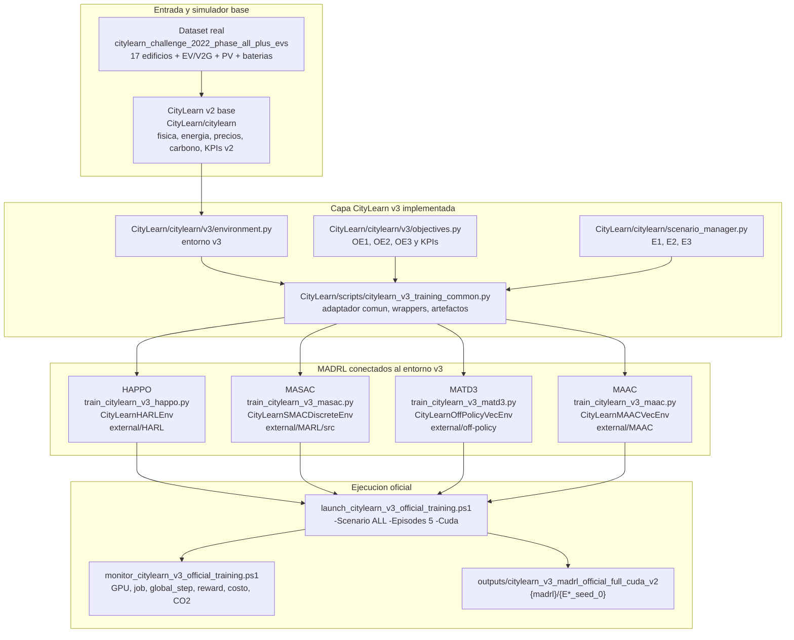
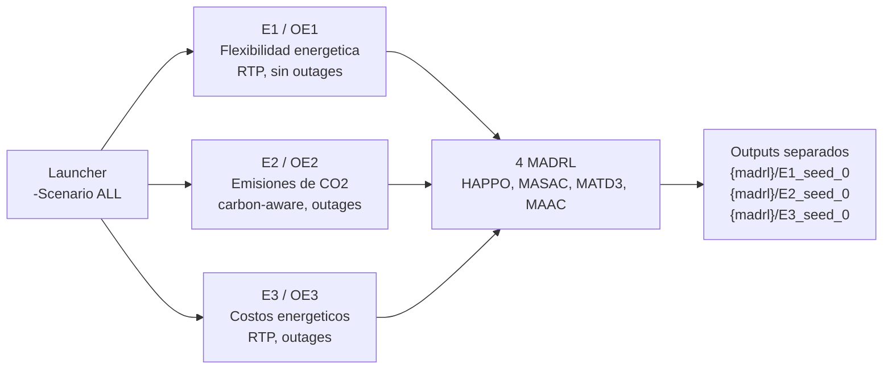
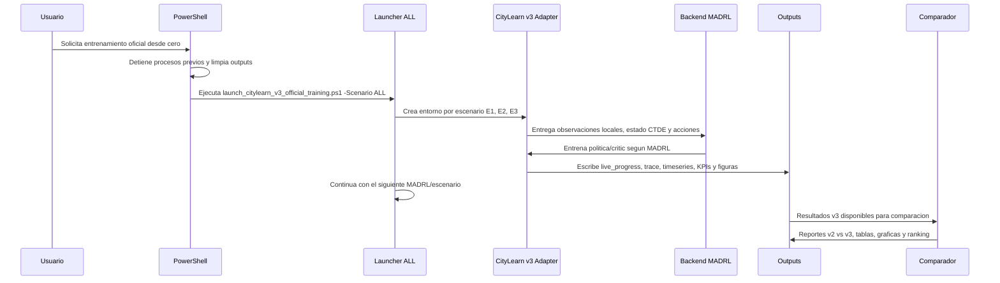
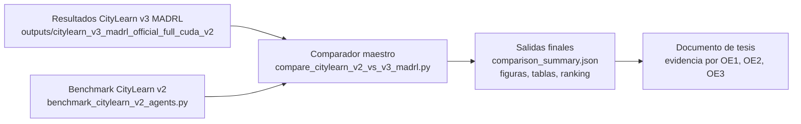
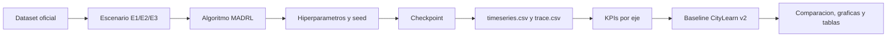

# Arquitectura profesional y flujo de trabajo CityLearn v3 MADRL

Proyecto: **Multi-agente de aprendizaje por refuerzo profundo para gestion coordinada de flexibilidad energetica, emisiones de carbono y eficiencia economica en comunidades inteligentes**.

Este documento describe la arquitectura **real implementada** en el repositorio actual. No representa una arquitectura conceptual independiente: cada bloque apunta a rutas, scripts, backends, salidas y flujos existentes en el proyecto.

## 0. Plano maestro de seguimiento del proyecto

Este plano es la lectura principal del proyecto. Se sigue de izquierda a derecha: empieza en el problema de tesis y el dataset, pasa por CityLearn v2, la capa CityLearn v3, los cuatro MADRL, los tres ejes, los artefactos de entrenamiento, la evaluacion, el benchmark CityLearn v2 y termina en los resultados comparativos para la tesis.

```mermaid
flowchart LR
    START([Inicio del proyecto<br/>problema de investigacion])
    PLAN["Plan de tesis y diagnostico<br/>Plan_Tesis_MADRL_Diagnostico_v17.pdf<br/>ESTRATEGIA_3PILARES_MADRL.md"]
    DATA["Dataset oficial<br/>citylearn_challenge_2022_phase_all_plus_evs<br/>17 edificios + EV/V2G"]
    V2["CityLearn v2 base<br/>CityLearn/citylearn<br/>simulador + KPIs v2"]
    V3["CityLearn v3 implementado<br/>CityLearn/citylearn/v3<br/>environment + objectives + config"]
    ADAPT["Adaptador MADRL comun<br/>citylearn_v3_training_common.py<br/>Dec-POMDP + CTDE + artefactos"]
    ALGS["4 MADRL conectados<br/>HAPPO, MASAC, MATD3, MAAC<br/>scripts train_citylearn_v3_*.py"]
    LAUNCH{"Launcher oficial<br/>-Scenario ALL<br/>12 corridas secuenciales"}

    E1["OE1 / E1<br/>Flexibilidad energetica<br/>KPIs: peak, ramping, load factor,<br/>PV, bateria, EV"]
    E2["OE2 / E2<br/>Emisiones CO2<br/>KPIs: carbon_emissions,<br/>control, baseline, delta"]
    E3["OE3 / E3<br/>Costos energeticos<br/>KPIs: electricity_cost,<br/>cost_peak, price deviation"]

    TRAIN["Entrenamiento GPU<br/>PyTorch CUDA<br/>episodios + checkpoints"]
    MON["Monitor vivo<br/>status, GPU, global_step,<br/>reward, costo, CO2"]
    ART["Artefactos por corrida<br/>results.json, training_summary.json,<br/>timeseries.csv, trace.csv,<br/>figures, tables, checkpoints"]
    EVAL["Evaluacion CityLearn v3<br/>KPIs por eje + figuras<br/>objective_kpis.csv"]
    B2["Benchmark CityLearn v2<br/>benchmark_citylearn_v2_agents.py<br/>agentes originales"]
    CMP["Comparador maestro<br/>compare_citylearn_v2_vs_v3_madrl.py<br/>delta, mejora %, ranking"]
    FIN([Fin del flujo<br/>evidencia para tesis<br/>tablas + graficas + conclusiones])

    START -->|1. define alcance| PLAN
    PLAN -->|2. selecciona datos| DATA
    DATA -->|3. alimenta simulador| V2
    V2 -->|4. se conserva y extiende| V3
    V3 -->|5. expone entorno multiagente| ADAPT
    ADAPT -->|6. conecta wrappers| ALGS
    ALGS -->|7. invoca scripts| LAUNCH
    LAUNCH -->|8a. ejecuta eje| E1
    LAUNCH -->|8b. ejecuta eje| E2
    LAUNCH -->|8c. ejecuta eje| E3
    E1 --> TRAIN
    E2 --> TRAIN
    E3 --> TRAIN
    TRAIN -->|9. escribe progreso| MON
    TRAIN -->|10. guarda salidas| ART
    ART -->|11. calcula KPIs| EVAL
    V2 -->|baseline comparable| B2
    B2 --> CMP
    EVAL --> CMP
    CMP -->|12. resultados finales| FIN

    classDef start fill:#ecfeff,stroke:#0891b2,color:#0f172a,stroke-width:2px;
    classDef data fill:#dbeafe,stroke:#2563eb,color:#0f172a,stroke-width:2px;
    classDef core fill:#ccfbf1,stroke:#0f766e,color:#0f172a,stroke-width:2px;
    classDef madrl fill:#ede9fe,stroke:#7c3aed,color:#0f172a,stroke-width:2px;
    classDef axis fill:#dcfce7,stroke:#15803d,color:#0f172a,stroke-width:2px;
    classDef train fill:#ffedd5,stroke:#b45309,color:#0f172a,stroke-width:2px;
    classDef eval fill:#fee2e2,stroke:#b91c1c,color:#0f172a,stroke-width:2px;
    classDef finish fill:#f1f5f9,stroke:#334155,color:#0f172a,stroke-width:2px;

    class START start;
    class FIN finish;
    class PLAN,DATA data;
    class V2,V3,ADAPT core;
    class ALGS,LAUNCH madrl;
    class E1,E2,E3 axis;
    class TRAIN,MON,ART train;
    class EVAL,B2,CMP eval;
```



### Seguimiento verificable por etapa

| Paso | Caja del flujo | Archivo o ruta que confirma la etapa | Resultado esperado |
|---|---|---|---|
| 1 | Plan y diagnostico | `Plan_Tesis_MADRL_Diagnostico_v17.pdf`, `ESTRATEGIA_3PILARES_MADRL.md` | Objetivos y tres ejes definidos. |
| 2 | Dataset oficial | `CityLearn/data/datasets/citylearn_challenge_2022_phase_all_plus_evs/schema.json` | 17 edificios + EV/V2G disponibles. |
| 3 | CityLearn v2 base | `CityLearn/citylearn` | Simulador y KPIs v2 conservados. |
| 4 | CityLearn v3 | `CityLearn/citylearn/v3/objectives.py`, `CityLearn/citylearn/v3/environment.py` | Objetivos OE1/OE2/OE3 y entorno v3. |
| 5 | Adaptador Dec-POMDP/CTDE | `CityLearn/scripts/citylearn_v3_training_common.py` | Wrappers, estado CTDE, trazas y artefactos. |
| 6 | 4 MADRL | `CityLearn/scripts/train_citylearn_v3_*.py` | HAPPO, MASAC, MATD3 y MAAC conectados. |
| 7 | Launcher ALL | `CityLearn/scripts/launch_citylearn_v3_official_training.ps1` | 12 corridas secuenciales: E1/E2/E3 x 4 MADRL. |
| 8 | Monitor vivo | `CityLearn/scripts/monitor_citylearn_v3_official_training.ps1` | GPU, `global_step`, rewards, costo, CO2 y estado por job. |
| 9 | Artefactos | `outputs/citylearn_v3_madrl_official_full_cuda_v2/{madrl}/{E*_seed_0}` | Checkpoints, JSON, CSV, figuras y tablas. |
| 10 | Benchmark v2 | `CityLearn/scripts/benchmark_citylearn_v2_agents.py` | Linea base con agentes CityLearn v2. |
| 11 | Comparador | `CityLearn/scripts/compare_citylearn_v2_vs_v3_madrl.py` | Delta, mejora porcentual y ranking v2 vs v3. |
| 12 | Fin | `docs/`, `outputs/citylearn_v2_vs_v3_comparison` | Evidencia final para tesis. |

## 1. Lectura del proyecto de inicio a fin

El proyecto inicia en el dataset oficial de CityLearn v2 con 17 edificios y EV, conserva el simulador base CityLearn v2, agrega una capa CityLearn v3 para Dec-POMDP, CTDE, objetivos y artefactos, conecta cuatro backends MADRL oficiales mediante wrappers, ejecuta los tres ejes E1/E2/E3 con `-Scenario ALL`, guarda resultados por algoritmo/eje y finaliza con evaluacion, figuras, benchmark CityLearn v2 y comparador v2 vs v3.

```mermaid
flowchart LR
    A["Inicio del estudio<br/>Problema: gestion coordinada<br/>de comunidad energetica inteligente"]
    B["Dataset oficial<br/>CityLearn/data/datasets/<br/>citylearn_challenge_2022_phase_all_plus_evs/schema.json"]
    C["Nucleo CityLearn v2<br/>CityLearn/citylearn<br/>simulador, edificios, DERs, EVs, KPIs v2"]
    D["Capa CityLearn v3<br/>CityLearn/citylearn/v3<br/>environment.py, config.py, objectives.py, backends.py"]
    E["Adaptador comun MADRL<br/>CityLearn/scripts/citylearn_v3_training_common.py"]
    F["4 scripts de entrenamiento<br/>HAPPO, MASAC, MATD3, MAAC"]
    G["Launcher oficial<br/>launch_citylearn_v3_official_training.ps1<br/>-Scenario ALL"]
    H["12 corridas secuenciales<br/>E1/E2/E3 x 4 MADRL"]
    I["Artefactos por corrida<br/>results.json, timeseries.csv,<br/>trace.csv, checkpoints, figures"]
    J["Benchmark CityLearn v2<br/>benchmark_citylearn_v2_agents.py"]
    K["Comparador v2 vs v3<br/>compare_citylearn_v2_vs_v3_madrl.py"]
    L["Fin<br/>evidencia para tesis:<br/>KPIs, tablas, graficas y ranking"]

    A --> B --> C --> D --> E --> F --> G --> H --> I --> K --> L
    C --> J --> K
```



## 2. Arquitectura activa implementada



## 3. Componentes reales por capa

| Capa | Ruta real | Funcion en el proyecto |
|---|---|---|
| Dataset | `CityLearn/data/datasets/citylearn_challenge_2022_phase_all_plus_evs/schema.json` | Entrada oficial con 17 edificios, EV/V2G, PV, baterias, precios, carbono y series necesarias. |
| Simulador base | `CityLearn/citylearn` | CityLearn v2 conservado como nucleo fisico y de evaluacion. |
| Capa v3 | `CityLearn/citylearn/v3` | Capa agregada para objetivos, entorno v3, configuracion y compatibilidad de backends. |
| Escenarios | `CityLearn/citylearn/scenario_manager.py` | Define E1, E2 y E3 usados por el launcher oficial. |
| Objetivos | `CityLearn/citylearn/v3/objectives.py` | Define OE1, OE2 y OE3, sus KPIs y metrica de proyecto por eje. |
| Adaptador comun | `CityLearn/scripts/citylearn_v3_training_common.py` | Conecta CityLearn v3 con los backends, genera trazas, figuras, tablas y reportes. |
| Launcher oficial | `CityLearn/scripts/launch_citylearn_v3_official_training.ps1` | Ejecuta los MADRL por escenario con `-Scenario ALL`. |
| Monitor | `CityLearn/scripts/monitor_citylearn_v3_official_training.ps1` | Muestra estado, matriz E1/E2/E3 x MADRL, GPU, rewards, costo, CO2 y artefactos. |
| Benchmark v2 | `CityLearn/scripts/benchmark_citylearn_v2_agents.py` | Evalua agentes originales CityLearn v2 con el mismo dataset. |
| Comparador | `CityLearn/scripts/compare_citylearn_v2_vs_v3_madrl.py` | Compara resultados CityLearn v2 vs CityLearn v3 MADRL. |

## 4. Conexion real de los 4 MADRL

| MADRL | Script activo | Wrapper CityLearn v3 | Backend activo | Salida canonica |
|---|---|---|---|---|
| HAPPO | `CityLearn/scripts/train_citylearn_v3_happo.py` | `CityLearnHARLEnv` | `external/HARL` | `outputs/.../happo/E*_seed_0` |
| MASAC | `CityLearn/scripts/train_citylearn_v3_masac.py` | `CityLearnSMACDiscreteEnv` | `external/MARL/src` | `outputs/.../masac/E*_seed_0` |
| MATD3 | `CityLearn/scripts/train_citylearn_v3_matd3.py` | `CityLearnOffPolicyVecEnv` | `external/off-policy` | `outputs/.../matd3/E*_seed_0` |
| MAAC | `CityLearn/scripts/train_citylearn_v3_maac.py` | `CityLearnMAACVecEnv` | `external/MAAC` | `outputs/.../maac/E*_seed_0` |

### Backends fijados

| Backend | Ruta | Repositorio fuente | Commit / rama |
|---|---|---|---|
| HAPPO | `external/HARL` | `https://github.com/PKU-MARL/HARL` | `b1af98b0dbab72a2eee9d160751cd09aedbb8ce2` |
| MASAC | `external/MARL` | `https://github.com/puyuan1996/MARL` | `3bda2edc73e6bc611010052c247888ad0cfc8066` |
| MATD3 fuente clonada | `external/MATD3implementation` | `https://github.com/JohannesAck/MATD3implementation` | `fd6c7d0df4fc4effd4e0fa11abdbc7d12d8f01a1` |
| MATD3 activo PyTorch | `external/off-policy` | `https://github.com/marlbenchmark/off-policy` | `release`, `41fd5eb46d12df2847e1c2e29842997ff2c24998` |
| MAAC | `external/MAAC` | `https://github.com/shariqiqbal2810/MAAC` | `6174a01251251e6778c4ada26bc8d9cd930e3856` |
| MARLlib compatibilidad | `external/MARLlib` | `https://github.com/Replicable-MARL/MARLlib` | `80e9973a430271a93c781d7422133acb1198f84b` |

Nota: `external/MARLlib` y `CityLearn/citylearn/v3/marllib_env.py` existen como compatibilidad. El launcher oficial actual de 12 corridas usa directamente los cuatro scripts `train_citylearn_v3_*.py`.

## 5. Tres ejes del proyecto

Los tres ejes estan definidos como objetivos de proyecto en `CityLearn/citylearn/v3/objectives.py` y como escenarios de ejecucion en `CityLearn/citylearn/scenario_manager.py`.

| Eje | Escenario | Objetivo | KPIs principales |
|---|---|---|---|
| OE1 | `E1` | Flexibilidad energetica: aumentar desplazamiento de cargas y aprovechar baterias, EVs y autoconsumo. | `peak_average`, `ramping_average`, `one_minus_load_factor_average`, KPIs PV, bateria y EV. |
| OE2 | `E2` | Emisiones de CO2: reducir huella ambiental y minimizar importaciones en horas de alta intensidad de carbono. | `carbon_emissions`, `carbon_emissions_control`, `carbon_emissions_baseline`, `carbon_emissions_delta`. |
| OE3 | `E3` | Costos energeticos: optimizar gasto, reducir picos y aprovechar tarifas dinamicas. | `electricity_cost`, `electricity_cost_control`, `electricity_cost_delta`, `price_signal_deviation`, KPIs de picos de costo. |



## 6. Flujo de trabajo operativo desde cero



## 7. Comando oficial de entrenamiento

El entrenamiento oficial actual debe ejecutarse con `-Scenario ALL` para cubrir los tres ejes.

```powershell
powershell -ExecutionPolicy Bypass -File CityLearn\scripts\launch_citylearn_v3_official_training.ps1 `
  -Scenario ALL `
  -Seed 0 `
  -EpisodeTimeSteps 8760 `
  -Episodes 5 `
  -OutputRoot outputs\citylearn_v3_madrl_official_full_cuda_v2 `
  -TorchThreads 12 `
  -Cuda
```

Monitor visual:

```powershell
powershell -NoProfile -ExecutionPolicy Bypass -File CityLearn\scripts\monitor_citylearn_v3_official_training.ps1 `
  -OutputRoot outputs\citylearn_v3_madrl_official_full_cuda_v2 `
  -IntervalSeconds 5 `
  -LogTail 20
```

## 8. Matriz oficial de ejecuciones

El launcher ejecuta secuencialmente 12 trabajos:

| Escenario | HAPPO | MASAC | MATD3 | MAAC |
|---|---|---|---|---|
| E1 flexibilidad | `happo/E1_seed_0` | `masac/E1_seed_0` | `matd3/E1_seed_0` | `maac/E1_seed_0` |
| E2 CO2 | `happo/E2_seed_0` | `masac/E2_seed_0` | `matd3/E2_seed_0` | `maac/E2_seed_0` |
| E3 costos | `happo/E3_seed_0` | `masac/E3_seed_0` | `matd3/E3_seed_0` | `maac/E3_seed_0` |

## 9. Estructura de salida esperada

```text
outputs/citylearn_v3_madrl_official_full_cuda_v2/
  official_full_status.json
  official_full_manifest.json
  logs/
    E1_happo.log
    E1_happo.stderr.log
    E2_happo.log
    ...
  happo/
    E1_seed_0/
      live_progress.json
      results.json
      training_summary.json
      timeseries.csv
      trace.csv
      checkpoint_manifest.json
      data/
      checkpoints/
      figures/
        tables/
    E2_seed_0/
    E3_seed_0/
  masac/
  matd3/
  maac/
```

## 10. Artefactos por corrida

| Archivo / carpeta | Funcion |
|---|---|
| `live_progress.json` | Progreso vivo durante entrenamiento: `global_step`, episodio, `reward_sum`, `reward_mean`, costo, CO2, carga neta. |
| `results.json` | Resultado consolidado de la corrida. |
| `training_summary.json` | Resumen tecnico: algoritmo, backend, escenario, hiperparametros, artefactos y KPIs. |
| `timeseries.csv` | Serie temporal distrital: rewards, carga, costo, emisiones, precio e intensidad de carbono. |
| `trace.csv` | Traza por agente: reward, acciones, observaciones y estadisticos. |
| `checkpoint_manifest.json` | Manifest de checkpoints guardados. |
| `figures/` | Figuras de entrenamiento, convergencia, rewards, KPIs y comparativas. |
| `figures/tables/` | Tablas CSV auxiliares para analisis y graficas. |

## 11. Evaluacion y comparacion final

El cierre del proyecto no termina al entrenar. El flujo final usa los resultados v3 y los compara con agentes CityLearn v2.



Comandos base:

```powershell
.\.venv39-citylearn-v3\Scripts\python.exe CityLearn\scripts\benchmark_citylearn_v2_agents.py `
  --scenario ALL `
  --output-dir outputs\citylearn_v2_benchmark
```

```powershell
.\.venv39-citylearn-v3\Scripts\python.exe CityLearn\scripts\compare_citylearn_v2_vs_v3_madrl.py `
  --v2-root outputs\citylearn_v2_benchmark `
  --v3-root outputs\citylearn_v3_madrl_official_full_cuda_v2 `
  --output-dir outputs\citylearn_v2_vs_v3_comparison
```

## 12. Trazabilidad cientifica

Cada resultado debe poder trazarse asi:



## 13. Componentes existentes pero no activos en el launcher oficial actual

Estos componentes existen en el repositorio, pero no son el camino activo del launcher oficial de las 12 corridas actuales:

| Componente | Ruta | Estado |
|---|---|---|
| MARLlib | `external/MARLlib` | Disponible como backend clonado y compatibilidad. |
| Adaptador MARLlib | `CityLearn/citylearn/v3/marllib_env.py` | Disponible, no invocado por `launch_citylearn_v3_official_training.ps1`. |
| MATD3implementation | `external/MATD3implementation` | Repositorio MATD3 clonado; la ruta activa de entrenamiento MATD3 Python 3.9 usa `external/off-policy`. |

## 14. Archivos de arquitectura renderizables ya generados

| Archivo | Uso |
|---|---|
| `docs/PLANO_REAL_IMPLEMENTADO_CITYLEARN_V3_MADRL.pdf` | Plano visual de la arquitectura real implementada. |
| `docs/PLANO_REAL_IMPLEMENTADO_CITYLEARN_V3_MADRL.png` | Imagen de alta resolucion del plano real. |
| `docs/PLANO_INTEGRADO_CITYLEARN_V3_MADRL.pdf` | Copia integrada del plano real implementado. |
| `docs/ARQUITECTURA_FLUJO_CITYLEARN_V3_MADRL.pdf` | Version previa en dos laminas. |

## 15. Renderizado del Markdown

Este archivo esta listo para renderizar porque usa Markdown estandar y bloques Mermaid.

Opciones recomendadas:

1. GitHub: abrir el `.md` en el repositorio. GitHub renderiza Mermaid automaticamente.
2. VS Code: usar Markdown Preview con soporte Mermaid.
3. Exportar a PDF con una extension como Markdown Preview Enhanced.

Archivo fuente:

```text
docs/ARQUITECTURA_Y_FLUJO_TRABAJO_CITYLEARN_V3_MADRL.md
```

## 16. Criterio de finalizacion del proyecto

El proyecto queda completo cuando existan:

1. Corridas CityLearn v3 MADRL para E1, E2 y E3 con HAPPO, MASAC, MATD3 y MAAC.
2. Artefactos por corrida: `results.json`, `training_summary.json`, `timeseries.csv`, `trace.csv`, checkpoints, figuras y tablas.
3. Benchmark CityLearn v2 con los agentes originales disponibles.
4. Comparador maestro v2 vs v3 con delta, mejora porcentual y ranking por eje.
5. Documentacion final con arquitectura, metodologia, resultados, graficas y conclusion por OE1, OE2 y OE3.
