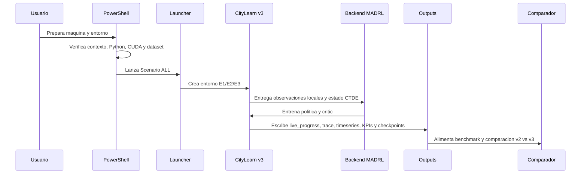

# Guia para ejecutar el entrenamiento CityLearn v3 MADRL en otra computadora

Esta guia describe como preparar una maquina local nueva para ejecutar el entrenamiento oficial del proyecto
`MADRLCitytleranflexresdr`, usando el dataset Iquitos 2023-2025, la capa CityLearn v3 y los cuatro algoritmos MADRL
integrados: HAPPO, MASAC, MATD3 y MAAC.

## 1. Reglas de proyecto

Este proyecto debe trabajarse solo desde:

```text
D:\MADRLCitytleranflexresdr
```

Repositorio esperado:

```text
https://github.com/Mac-Tapia/MADRLCitytleranflexresdr.git
```

Reglas obligatorias:

- No usar `D:\madrl_lima` para este proyecto.
- No mezclar notebooks, resultados, ramas, commits o remotos de otro proyecto.
- Antes de editar archivos o hacer operaciones Git, ejecutar:

```powershell
powershell -ExecutionPolicy Bypass -File scripts\verify_project_context.ps1
```

- No editar `CityLearn/` ni `external/` salvo que sea una tarea explicita.
- Los resultados de entrenamiento deben guardarse dentro de `outputs/`.

## 2. Requisitos de la computadora

Requisitos recomendados:

- Windows 10/11.
- PowerShell.
- Git.
- `uv` para instalar Python 3.9 y crear el entorno.
- GPU NVIDIA con driver instalado.
- CUDA funcional para PyTorch.
- Espacio libre suficiente para dependencias, logs, checkpoints y CSV de salida.

Verificaciones iniciales:

```powershell
git --version
uv --version
nvidia-smi
```

Si `nvidia-smi` no responde, revisar el driver NVIDIA antes de iniciar entrenamiento con GPU.

## 3. Clonar el proyecto

Abrir PowerShell y ejecutar:

```powershell
cd D:\
git clone https://github.com/Mac-Tapia/MADRLCitytleranflexresdr.git
cd D:\MADRLCitytleranflexresdr
```

Verificar contexto:

```powershell
powershell -ExecutionPolicy Bypass -File scripts\verify_project_context.ps1
```

Inicializar submodulos y dependencias externas:

```powershell
git submodule update --init --recursive
```

Verificar origen del repositorio:

```powershell
git remote -v
```

Debe apuntar a:

```text
https://github.com/Mac-Tapia/MADRLCitytleranflexresdr.git
```

## 4. Arquitectura del proyecto

El proyecto conserva CityLearn v2 como simulador base y agrega una capa CityLearn v3 para entrenamiento MADRL bajo
Dec-POMDP y CTDE.

```mermaid
flowchart LR
    DATA["Dataset Iquitos 2023-2025<br/>17 edificios + EV/V2G + PV + baterias"]
    V2["CityLearn v2 base<br/>CityLearn/citylearn"]
    V3["Capa CityLearn v3<br/>CityLearn/citylearn/v3"]
    REWARD["Reward v3 MADRL<br/>CityLearnV3MADRLRewardFunction"]
    COMMON["Adaptador comun<br/>CityLearn/scripts/citylearn_v3_training_common.py"]
    ALGOS["4 MADRL<br/>HAPPO, MASAC, MATD3, MAAC"]
    LAUNCH["Launcher oficial<br/>launch_citylearn_v3_official_training.ps1"]
    OUT["Artefactos<br/>outputs/..."]
    EVAL["Benchmark v2 + comparacion<br/>tablas, figuras, ranking"]

    DATA --> V2 --> V3 --> REWARD --> COMMON --> ALGOS --> LAUNCH --> OUT --> EVAL
```



Componentes principales:

| Componente | Ruta | Funcion |
|---|---|---|
| Dataset Iquitos | `CityLearn/data/datasets/citylearn_iquitos_2023_2025/schema.json` | Entrada oficial de entrenamiento. |
| Simulador base | `CityLearn/citylearn` | Fisica, edificios, energia, precios, carbono y KPIs base. |
| Capa v3 | `CityLearn/citylearn/v3` | Objetivos OE1/OE2/OE3, entorno v3 y compatibilidad MADRL. |
| Adaptador comun | `CityLearn/scripts/citylearn_v3_training_common.py` | Conecta CityLearn v3 con backends MADRL y artefactos. |
| HAPPO | `CityLearn/scripts/train_citylearn_v3_happo.py` | Backend `external/HARL`. |
| MASAC | `CityLearn/scripts/train_citylearn_v3_masac.py` | Backend `external/MARL/src`. |
| MATD3 | `CityLearn/scripts/train_citylearn_v3_matd3.py` | Backend `external/off-policy`. |
| MAAC | `CityLearn/scripts/train_citylearn_v3_maac.py` | Backend `external/MAAC`. |
| Launcher oficial | `CityLearn/scripts/launch_citylearn_v3_official_training.ps1` | Ejecuta las corridas oficiales. |
| Monitor | `CityLearn/scripts/monitor_citylearn_v3_official_training.ps1` | Muestra progreso, GPU, rewards, KPIs y logs. |

## 5. Flujo cientifico y operativo

El entrenamiento oficial cubre los tres ejes de investigacion:

| Eje | Escenario | Objetivo |
|---|---|---|
| OE1 | `E1` | Flexibilidad energetica. |
| OE2 | `E2` | Reduccion de emisiones de CO2. |
| OE3 | `E3` | Optimizacion de costos energeticos. |

El launcher ejecuta 12 corridas secuenciales:

```text
E1 x HAPPO, MASAC, MATD3, MAAC
E2 x HAPPO, MASAC, MATD3, MAAC
E3 x HAPPO, MASAC, MATD3, MAAC
```

Flujo completo:



## 6. Crear el entorno Python

Desde `D:\MADRLCitytleranflexresdr`:

```powershell
powershell -ExecutionPolicy Bypass -File scripts\verify_project_context.ps1
powershell -ExecutionPolicy Bypass -File CityLearn\scripts\setup_citylearn_v3_training_env.ps1
```

El entorno esperado queda en:

```text
.venv39-citylearn-v3
```

Verificar Python y CUDA:

```powershell
.\.venv39-citylearn-v3\Scripts\python.exe -c "import sys, torch; print(sys.version); print(torch.__version__); print(torch.cuda.is_available()); print(torch.cuda.get_device_name(0) if torch.cuda.is_available() else 'CPU')"
```

Resultado esperado para GPU:

```text
True
NOMBRE_DE_LA_GPU
```

## 7. Validaciones antes de entrenar

Validar el entorno de entrenamiento:

```powershell
.\.venv39-citylearn-v3\Scripts\python.exe -B CityLearn\scripts\check_citylearn_v3_training_ready.py `
  --strict `
  --schema-path CityLearn\data\datasets\citylearn_iquitos_2023_2025\schema.json `
  --scenario E1
```

Ejecutar smoke test corto del entorno:

```powershell
.\.venv39-citylearn-v3\Scripts\python.exe -B CityLearn\scripts\run_citylearn_v3_env_smoke.py `
  --schema-path CityLearn\data\datasets\citylearn_iquitos_2023_2025\schema.json `
  --scenario E1 `
  --episode-time-steps 4 `
  --steps 3
```

Validar contrato cooperativo Dec-POMDP/CTDE:

```powershell
.\.venv39-citylearn-v3\Scripts\python.exe -B CityLearn\scripts\validate_citylearn_v3_cooperative_ctde.py `
  --output outputs\citylearn_v3_madrl_iquitos_official_full_cuda_v1\cooperative_ctde_validation.json
```

## 8. Probar el launcher sin entrenar

Antes de gastar horas de GPU, ejecutar un dry run:

```powershell
powershell -ExecutionPolicy Bypass -File CityLearn\scripts\launch_citylearn_v3_official_training.ps1 `
  -Scenario ALL `
  -Seed 0 `
  -EpisodeTimeSteps 8760 `
  -Episodes 5 `
  -SchemaPath CityLearn\data\datasets\citylearn_iquitos_2023_2025\schema.json `
  -OutputRoot outputs\citylearn_v3_madrl_iquitos_official_full_cuda_v1 `
  -TorchThreads 12 `
  -LiveProgressInterval 250 `
  -Cuda `
  -DryRun
```

Si el dry run falla, no iniciar entrenamiento real. Revisar rutas, entorno Python y submodulos.

## 9. Ejecutar manualmente sin launcher

Esta seccion sirve para probar los cuatro backends uno por uno, sin usar el launcher PowerShell. Es util para depurar una
maquina nueva o para reproducir el mismo flujo dentro de Docker/Linux.

Primero preparar variables comunes en PowerShell:

```powershell
powershell -ExecutionPolicy Bypass -File scripts\verify_project_context.ps1

$env:VIRTUAL_ENV = (Resolve-Path .\.venv39-citylearn-v3).Path
$env:Path = "$env:VIRTUAL_ENV\Scripts;$env:Path"
$env:PYTHONPATH = "$(Get-Location);$(Join-Path (Get-Location) 'CityLearn')"

$Python = ".\.venv39-citylearn-v3\Scripts\python.exe"
$Schema = "CityLearn\data\datasets\citylearn_iquitos_2023_2025\schema.json"
$Out = "outputs\manual_citylearn_v3_madrl_smoke"
$Seed = 0
$EpisodeTimeSteps = 4
$Episodes = 1
$NumEnvSteps = $EpisodeTimeSteps * $Episodes
$TorchThreads = 2
$LiveProgressInterval = 1
```

Prueba manual corta para `E1`:

```powershell
$Scenario = "E1"

& $Python -B CityLearn\scripts\train_citylearn_v3_happo.py `
  --scenario $Scenario `
  --schema-path $Schema `
  --seed $Seed `
  --episode-time-steps $EpisodeTimeSteps `
  --episodes $Episodes `
  --num-env-steps $NumEnvSteps `
  --hidden-size 64 `
  --torch-threads $TorchThreads `
  --n-rollout-threads 1 `
  --log-interval 1 `
  --eval-interval 1 `
  --live-progress-interval $LiveProgressInterval `
  --output-dir "$Out\happo"
if ($LASTEXITCODE -ne 0) { throw "HAPPO fallo en $Scenario" }

& $Python -B CityLearn\scripts\train_citylearn_v3_masac.py `
  --scenario $Scenario `
  --schema-path $Schema `
  --seed $Seed `
  --episode-time-steps $EpisodeTimeSteps `
  --episodes $Episodes `
  --action-bins 3 `
  --discrete-action-mode axis `
  --max-replay-buffer-gib 2 `
  --buffer-size 2 `
  --critic-batch-size 1 `
  --critic-train-steps 1 `
  --actor-sample-times 5 `
  --rnn-hidden-dim 64 `
  --qmix-hidden-dim 32 `
  --hyper-hidden-dim 64 `
  --live-progress-interval $LiveProgressInterval `
  --output-dir "$Out\masac"
if ($LASTEXITCODE -ne 0) { throw "MASAC fallo en $Scenario" }

& $Python -B CityLearn\scripts\train_citylearn_v3_matd3.py `
  --scenario $Scenario `
  --schema-path $Schema `
  --seed $Seed `
  --episode-time-steps $EpisodeTimeSteps `
  --episodes $Episodes `
  --num-env-steps $NumEnvSteps `
  --batch-size 4 `
  --buffer-size 128 `
  --hidden-size 64 `
  --train-interval 1 `
  --num-random-episodes 1 `
  --live-progress-interval $LiveProgressInterval `
  --output-dir "$Out\matd3"
if ($LASTEXITCODE -ne 0) { throw "MATD3 fallo en $Scenario" }

& $Python -B CityLearn\scripts\train_citylearn_v3_maac.py `
  --scenario $Scenario `
  --schema-path $Schema `
  --seed $Seed `
  --episode-time-steps $EpisodeTimeSteps `
  --episodes $Episodes `
  --action-bins 3 `
  --discrete-action-mode axis `
  --max-discrete-actions 512 `
  --batch-size 4 `
  --buffer-length 32 `
  --steps-per-update 1 `
  --num-updates 1 `
  --hidden-size 64 `
  --attend-heads 4 `
  --pi-lr 0.0003 `
  --q-lr 0.001 `
  --tau 0.005 `
  --gamma 0.99 `
  --live-progress-interval $LiveProgressInterval `
  --output-dir "$Out\maac"
if ($LASTEXITCODE -ne 0) { throw "MAAC fallo en $Scenario" }
```

Si esta prueba corta termina bien, se puede ejecutar el orden oficial completo manualmente. Cambiar los parametros:

```powershell
$Out = "outputs\manual_citylearn_v3_madrl_iquitos_official_full_cuda_v1"
$EpisodeTimeSteps = 8760
$Episodes = 5
$NumEnvSteps = $EpisodeTimeSteps * $Episodes
$TorchThreads = 12
$LiveProgressInterval = 250
```

Orden oficial manual:

```text
1. E1 HAPPO
2. E1 MASAC
3. E1 MATD3
4. E1 MAAC
5. E2 HAPPO
6. E2 MASAC
7. E2 MATD3
8. E2 MAAC
9. E3 HAPPO
10. E3 MASAC
11. E3 MATD3
12. E3 MAAC
```

Para ejecutar ese orden sin launcher, repetir el bloque de los cuatro algoritmos cambiando:

```powershell
$Scenario = "E1"
```

luego:

```powershell
$Scenario = "E2"
```

y finalmente:

```powershell
$Scenario = "E3"
```

Para GPU, agregar `--cuda` a cada comando de algoritmo. El launcher oficial ya hace esto automaticamente cuando se usa
`-Cuda`.

## 10. Probar en contenedor Docker

El script `scripts\verify_project_context.ps1` esta fijado a la ruta Windows `D:\MADRLCitytleranflexresdr`. Dentro de un
contenedor Linux normalmente el repo se monta en `/workspace`, por lo que ese script fallara por ruta aunque el repositorio
sea correcto. En Docker se usa una verificacion equivalente de origen, dataset y submodulos.

Desde PowerShell en la maquina host:

```powershell
cd D:\MADRLCitytleranflexresdr
docker --version
docker run --rm -it --name madrl-citylearn-v3 `
  --gpus all `
  -v D:\MADRLCitytleranflexresdr:/workspace `
  -w /workspace `
  python:3.9-bullseye bash
```

Si la maquina no tiene GPU disponible para Docker, quitar `--gpus all`.

Dentro del contenedor:

```bash
set -euo pipefail

apt-get update
apt-get install -y --no-install-recommends git build-essential libgl1 libglib2.0-0
rm -rf /var/lib/apt/lists/*

git config --global --add safe.directory /workspace
test "$(git remote get-url origin)" = "https://github.com/Mac-Tapia/MADRLCitytleranflexresdr.git"
test -f CityLearn/data/datasets/citylearn_iquitos_2023_2025/schema.json
git submodule update --init --recursive

python -m venv /opt/venv-citylearn-v3
. /opt/venv-citylearn-v3/bin/activate

python -m pip install --upgrade "pip==21.3.1" "setuptools==65.5.0" "wheel==0.38.0"
python -m pip install -e CityLearn pytest dm-tree setproctitle absl-py tensorboardX matplotlib
python -m pip install --force-reinstall \
  "ray[rllib]==1.8.0" \
  "gym==0.20.0" \
  "gymnasium==0.28.1" \
  "numpy==1.23.5" \
  "protobuf==3.20.3"
python -m pip install \
  "icecream==2.1.3" \
  "supersuit==3.2.0" \
  "pettingzoo==1.12.0" \
  "importlib-metadata>=6.0,<9" \
  "sphinx==7.4.7" \
  "nbsphinx==0.9.8"
python -m pip install -e . --no-deps

export PYTHONPATH=/workspace:/workspace/CityLearn
```

Verificar Python, PyTorch y GPU dentro del contenedor:

```bash
python -c "import sys, torch; print(sys.version); print(torch.__version__); print(torch.cuda.is_available()); print(torch.cuda.get_device_name(0) if torch.cuda.is_available() else 'CPU')"
```

Si se necesita una rueda CUDA especifica de PyTorch dentro del contenedor, instalarla antes de las validaciones. Ejemplo:

```bash
python -m pip install --force-reinstall torch torchvision --index-url https://download.pytorch.org/whl/cu126
```

Validar entrenamiento dentro de Docker:

```bash
python -B CityLearn/scripts/check_citylearn_v3_training_ready.py \
  --strict \
  --schema-path CityLearn/data/datasets/citylearn_iquitos_2023_2025/schema.json \
  --scenario E1

python -B CityLearn/scripts/run_citylearn_v3_env_smoke.py \
  --schema-path CityLearn/data/datasets/citylearn_iquitos_2023_2025/schema.json \
  --scenario E1 \
  --episode-time-steps 4 \
  --steps 3
```

Probar los cuatro backends con una corrida minima dentro de Docker:

```bash
SCHEMA="CityLearn/data/datasets/citylearn_iquitos_2023_2025/schema.json"
OUT="outputs/docker_citylearn_v3_madrl_smoke"
SCENARIO="E1"
SEED=0
EPISODE_TIME_STEPS=4
EPISODES=1
NUM_ENV_STEPS=$((EPISODE_TIME_STEPS * EPISODES))
LIVE_PROGRESS_INTERVAL=1

python -B CityLearn/scripts/train_citylearn_v3_happo.py \
  --scenario "$SCENARIO" \
  --schema-path "$SCHEMA" \
  --seed "$SEED" \
  --episode-time-steps "$EPISODE_TIME_STEPS" \
  --episodes "$EPISODES" \
  --num-env-steps "$NUM_ENV_STEPS" \
  --hidden-size 64 \
  --torch-threads 2 \
  --n-rollout-threads 1 \
  --log-interval 1 \
  --eval-interval 1 \
  --live-progress-interval "$LIVE_PROGRESS_INTERVAL" \
  --output-dir "$OUT/happo"

python -B CityLearn/scripts/train_citylearn_v3_masac.py \
  --scenario "$SCENARIO" \
  --schema-path "$SCHEMA" \
  --seed "$SEED" \
  --episode-time-steps "$EPISODE_TIME_STEPS" \
  --episodes "$EPISODES" \
  --action-bins 3 \
  --discrete-action-mode axis \
  --max-replay-buffer-gib 2 \
  --buffer-size 2 \
  --critic-batch-size 1 \
  --critic-train-steps 1 \
  --actor-sample-times 5 \
  --rnn-hidden-dim 64 \
  --qmix-hidden-dim 32 \
  --hyper-hidden-dim 64 \
  --live-progress-interval "$LIVE_PROGRESS_INTERVAL" \
  --output-dir "$OUT/masac"

python -B CityLearn/scripts/train_citylearn_v3_matd3.py \
  --scenario "$SCENARIO" \
  --schema-path "$SCHEMA" \
  --seed "$SEED" \
  --episode-time-steps "$EPISODE_TIME_STEPS" \
  --episodes "$EPISODES" \
  --num-env-steps "$NUM_ENV_STEPS" \
  --batch-size 4 \
  --buffer-size 128 \
  --hidden-size 64 \
  --train-interval 1 \
  --num-random-episodes 1 \
  --live-progress-interval "$LIVE_PROGRESS_INTERVAL" \
  --output-dir "$OUT/matd3"

python -B CityLearn/scripts/train_citylearn_v3_maac.py \
  --scenario "$SCENARIO" \
  --schema-path "$SCHEMA" \
  --seed "$SEED" \
  --episode-time-steps "$EPISODE_TIME_STEPS" \
  --episodes "$EPISODES" \
  --action-bins 3 \
  --discrete-action-mode axis \
  --max-discrete-actions 512 \
  --batch-size 4 \
  --buffer-length 32 \
  --steps-per-update 1 \
  --num-updates 1 \
  --hidden-size 64 \
  --attend-heads 4 \
  --pi-lr 0.0003 \
  --q-lr 0.001 \
  --tau 0.005 \
  --gamma 0.99 \
  --live-progress-interval "$LIVE_PROGRESS_INTERVAL" \
  --output-dir "$OUT/maac"
```

### Cadena automatica completa dentro de Docker

Este bloque ejecuta la cadena en el mismo orden que el launcher oficial:

```text
E1: HAPPO -> MASAC -> MATD3 -> MAAC
E2: HAPPO -> MASAC -> MATD3 -> MAAC
E3: HAPPO -> MASAC -> MATD3 -> MAAC
```

Tiene dos modos:

- `MODE=smoke`: ejecuta las 12 corridas con 4 pasos por episodio y 1 episodio. Sirve para probar rapido el contenedor.
- `MODE=official`: ejecuta las 12 corridas oficiales con 8760 pasos por episodio y 5 episodios.

Copiar dentro del contenedor, despues de instalar dependencias y exportar `PYTHONPATH`:

```bash
set -euo pipefail

MODE="${MODE:-smoke}"   # smoke | official
SEED="${SEED:-0}"
SCHEMA="CityLearn/data/datasets/citylearn_iquitos_2023_2025/schema.json"

case "$MODE" in
  smoke)
    OUT="outputs/docker_citylearn_v3_madrl_chain_smoke"
    EPISODE_TIME_STEPS=4
    EPISODES=1
    LIVE_PROGRESS_INTERVAL=1
    TORCH_THREADS=2
    HAPPO_HIDDEN_SIZE=64
    MASAC_MAX_REPLAY_GIB=2
    MATD3_BATCH_SIZE=4
    MATD3_BUFFER_SIZE=128
    MATD3_HIDDEN_SIZE=64
    MATD3_TRAIN_INTERVAL=1
    MAAC_BATCH_SIZE=4
    MAAC_BUFFER_LENGTH=32
    MAAC_HIDDEN_SIZE=64
    MAAC_STEPS_PER_UPDATE=1
    MAAC_NUM_UPDATES=1
    ;;
  official)
    OUT="outputs/docker_citylearn_v3_madrl_iquitos_official_full_cuda_v1"
    EPISODE_TIME_STEPS=8760
    EPISODES=5
    LIVE_PROGRESS_INTERVAL=250
    TORCH_THREADS=12
    HAPPO_HIDDEN_SIZE=384
    MASAC_MAX_REPLAY_GIB=8
    MATD3_BATCH_SIZE=256
    MATD3_BUFFER_SIZE=4096
    MATD3_HIDDEN_SIZE=256
    MATD3_TRAIN_INTERVAL=100
    MAAC_BATCH_SIZE=64
    MAAC_BUFFER_LENGTH=256
    MAAC_HIDDEN_SIZE=128
    MAAC_STEPS_PER_UPDATE=250
    MAAC_NUM_UPDATES=8
    ;;
  *)
    echo "MODE invalido: $MODE. Usar smoke u official." >&2
    exit 2
    ;;
esac

NUM_ENV_STEPS=$((EPISODE_TIME_STEPS * EPISODES))
mkdir -p "$OUT/logs"

CUDA_ARGS=()
if python - <<'PY'
import torch
raise SystemExit(0 if torch.cuda.is_available() else 1)
PY
then
  CUDA_ARGS=(--cuda)
  echo "[OK] CUDA disponible dentro del contenedor. Se usara --cuda."
else
  echo "[AVISO] CUDA no disponible dentro del contenedor. Se ejecutara sin --cuda."
fi

run_happo() {
  local SCENARIO="$1"
  python -B CityLearn/scripts/train_citylearn_v3_happo.py \
    --scenario "$SCENARIO" \
    --schema-path "$SCHEMA" \
    --seed "$SEED" \
    --episode-time-steps "$EPISODE_TIME_STEPS" \
    --episodes "$EPISODES" \
    --num-env-steps "$NUM_ENV_STEPS" \
    --hidden-size "$HAPPO_HIDDEN_SIZE" \
    --torch-threads "$TORCH_THREADS" \
    --n-rollout-threads 1 \
    --log-interval 1 \
    --eval-interval 1 \
    --live-progress-interval "$LIVE_PROGRESS_INTERVAL" \
    "${CUDA_ARGS[@]}" \
    --output-dir "$OUT/happo"
}

run_masac() {
  local SCENARIO="$1"
  python -B CityLearn/scripts/train_citylearn_v3_masac.py \
    --scenario "$SCENARIO" \
    --schema-path "$SCHEMA" \
    --seed "$SEED" \
    --episode-time-steps "$EPISODE_TIME_STEPS" \
    --episodes "$EPISODES" \
    --action-bins 3 \
    --discrete-action-mode axis \
    --max-replay-buffer-gib "$MASAC_MAX_REPLAY_GIB" \
    --buffer-size 2 \
    --critic-batch-size 1 \
    --critic-train-steps 1 \
    --actor-sample-times 5 \
    --rnn-hidden-dim 64 \
    --qmix-hidden-dim 32 \
    --hyper-hidden-dim 64 \
    --live-progress-interval "$LIVE_PROGRESS_INTERVAL" \
    "${CUDA_ARGS[@]}" \
    --output-dir "$OUT/masac"
}

run_matd3() {
  local SCENARIO="$1"
  python -B CityLearn/scripts/train_citylearn_v3_matd3.py \
    --scenario "$SCENARIO" \
    --schema-path "$SCHEMA" \
    --seed "$SEED" \
    --episode-time-steps "$EPISODE_TIME_STEPS" \
    --episodes "$EPISODES" \
    --num-env-steps "$NUM_ENV_STEPS" \
    --batch-size "$MATD3_BATCH_SIZE" \
    --buffer-size "$MATD3_BUFFER_SIZE" \
    --hidden-size "$MATD3_HIDDEN_SIZE" \
    --train-interval "$MATD3_TRAIN_INTERVAL" \
    --num-random-episodes 1 \
    --live-progress-interval "$LIVE_PROGRESS_INTERVAL" \
    "${CUDA_ARGS[@]}" \
    --output-dir "$OUT/matd3"
}

run_maac() {
  local SCENARIO="$1"
  python -B CityLearn/scripts/train_citylearn_v3_maac.py \
    --scenario "$SCENARIO" \
    --schema-path "$SCHEMA" \
    --seed "$SEED" \
    --episode-time-steps "$EPISODE_TIME_STEPS" \
    --episodes "$EPISODES" \
    --action-bins 3 \
    --discrete-action-mode axis \
    --max-discrete-actions 512 \
    --batch-size "$MAAC_BATCH_SIZE" \
    --buffer-length "$MAAC_BUFFER_LENGTH" \
    --steps-per-update "$MAAC_STEPS_PER_UPDATE" \
    --num-updates "$MAAC_NUM_UPDATES" \
    --hidden-size "$MAAC_HIDDEN_SIZE" \
    --attend-heads 4 \
    --pi-lr 0.0003 \
    --q-lr 0.001 \
    --tau 0.005 \
    --gamma 0.99 \
    --live-progress-interval "$LIVE_PROGRESS_INTERVAL" \
    "${CUDA_ARGS[@]}" \
    --output-dir "$OUT/maac"
}

echo "[INFO] Modo: $MODE"
echo "[INFO] Salida: $OUT"
echo "[INFO] Episodios: $EPISODES | pasos/episodio: $EPISODE_TIME_STEPS | seed: $SEED"

for SCENARIO in E1 E2 E3; do
  for ALGORITHM in happo masac matd3 maac; do
    echo ""
    echo "================================================================"
    echo "CityLearn v3 MADRL Docker | $MODE | $SCENARIO | ${ALGORITHM^^}"
    echo "================================================================"
    "run_${ALGORITHM}" "$SCENARIO" 2>&1 | tee "$OUT/logs/${SCENARIO}_${ALGORITHM}.log"
  done
done

echo ""
echo "[OK] Cadena Docker completada."
find "$OUT" -maxdepth 3 \( -name results.json -o -name training_summary.json -o -name live_progress.json \) | sort
```

Para ejecutar solo la prueba rapida, no cambiar nada. El valor por defecto es `MODE=smoke`.

Para ejecutar el entrenamiento oficial completo dentro de Docker:

```bash
MODE=official
```

y despues copiar el bloque anterior. En modo oficial, el contenedor ejecutara las 12 corridas largas y escribira resultados
en:

```text
outputs/docker_citylearn_v3_madrl_iquitos_official_full_cuda_v1
```

Si el contenedor se detiene o falla, revisar el log del ultimo job en:

```text
outputs/docker_citylearn_v3_madrl_iquitos_official_full_cuda_v1/logs/
```

## 11. Lanzamiento en AWS EC2 sin alterar el proyecto

Esta seccion permite lanzar en AWS la cadena oficial de los cuatro MADRL sin modificar el codigo del repositorio. El flujo
usa una instancia EC2 con GPU NVIDIA, Docker y el mismo montaje de proyecto usado en la prueba Docker local.

El orden de entrenamiento es el mismo del launcher oficial:

```text
E1: HAPPO -> MASAC -> MATD3 -> MAAC
E2: HAPPO -> MASAC -> MATD3 -> MAAC
E3: HAPPO -> MASAC -> MATD3 -> MAAC
```

Caracteristicas preservadas del proyecto:

- Dataset: `CityLearn/data/datasets/citylearn_iquitos_2023_2025/schema.json`.
- 17 edificios reales: Municipalidad San Juan Bautista, Aeropuerto, Tottus, Hotel Plaza, Mall Aventura, UNAP Biologia, PNP Escuela, GRL COER, Gobierno Regional, Hospital Regional, EsSalud, UNAP Economia, Autoridad Portuaria, DREL Colegio, SIMA Iquitos, Selva Amazonica Lab.
- 50 cargadores EV (mototaxi 4kW, motolineal 3kW, V2G 7.4kW).
- Factor CO2: 0.671-0.790 kgCO2/kWh (diesel Electro Oriente + solar).
- Tarifas: punta $0.38/kWh (18-22h), fuera punta $0.26/kWh.
- Escenarios: `E1` (OE1 flex), `E2` (OE2 CO2), `E3` (OE3 costos).
- Algoritmos: `HAPPO`, `MASAC`, `MATD3`, `MAAC`.
- Episodios oficiales locales: `5`.
- Episodios objetivo AWS/Colab: `50`.
- Pasos por episodio: `8760`.
- Seed: `0`, salvo que se cambie explicitamente.
- Reward activa: `CityLearnV3MADRLRewardFunction`.
- Pesos: E1={flex:0.70, co2:0.15, cost:0.15}, E2={flex:0.15, co2:0.70, cost:0.15}, E3={flex:0.25, co2:0.15, cost:0.60}.
- Agregacion cooperativa: `team_mean`.
- Salida AWS: `outputs/aws_citylearn_v3_madrl_iquitos_50ep_cuda_v1`.

### Recomendacion AWS para 50 episodios

Para 50 episodios, cada corrida sube de `43 800` pasos a:

```text
50 episodios x 8760 pasos = 438 000 pasos por corrida
12 corridas = 5 256 000 pasos de entorno
```

Esto multiplica por 10 el trabajo del entrenamiento oficial local de 5 episodios. Para reducir tiempo en AWS, hay que
distinguir dos modos:

| Modo | Usa varios GPUs al mismo tiempo | Recomendacion |
|---|---:|---|
| Cadena secuencial estricta `E1/E2/E3 x HAPPO/MASAC/MATD3/MAAC` | No, normalmente usa 1 GPU por proceso activo | Usar una instancia de 1 GPU potente con bastante CPU/RAM. |
| Cadena paralelizada por trabajos independientes | Si, asignando un GPU por proceso con `CUDA_VISIBLE_DEVICES` | Usar una instancia de 4 u 8 GPUs y lanzar varios escenarios/algoritmos en paralelo. |

El launcher del proyecto ejecuta la cadena de forma secuencial. Por eso, una instancia con muchos GPUs solo reduce tiempo
si se lanzan procesos independientes en paralelo sin modificar codigo fuente. Si se mantiene una sola cadena secuencial,
los GPUs extra quedaran mayormente sin uso.

Perfil recomendado para **cadena secuencial de 50 episodios**:

| Prioridad | Instancia AWS | Uso recomendado | Motivo |
|---|---|---|---|
| Recomendado costo/rendimiento | `g6.16xlarge` | 1 cadena secuencial larga | 1 NVIDIA L4 de 24 GB, 64 vCPU, 256 GiB RAM, buen margen CPU/RAM para 50 episodios. |
| Alternativa estable | `g5.16xlarge` | 1 cadena secuencial larga | 1 NVIDIA A10G de 24 GB, 64 vCPU, 256 GiB RAM y NVMe local. |
| Mas economico, mas lento | `g6.8xlarge` o `g5.8xlarge` | Pruebas largas o presupuesto limitado | 1 GPU de 24 GB, 32 vCPU, 128 GiB RAM. |

Perfil recomendado para **entrenar en menos tiempo con paralelizacion por trabajos**:

| Prioridad | Instancia AWS | Uso recomendado | Motivo |
|---|---|---|---|
| Recomendado para 4 trabajos paralelos | `g6.12xlarge` o `g5.12xlarge` | 4 GPUs, por ejemplo un escenario o algoritmo por GPU | Reduce tiempo de pared si se asigna un proceso por GPU. |
| Mayor margen | `g6.24xlarge` o `g5.24xlarge` | 4 GPUs con mas CPU/RAM | Mejor si MAAC/MATD3 consumen mas RAM o se corre benchmark en paralelo. |
| Alto rendimiento, costo alto | `p4d.24xlarge` | 8 GPUs A100 para muchos jobs/seeds | Util si se paralelizan 8 procesos o varios seeds. Excesivo para una sola cadena secuencial. |
| Maximo rendimiento, costo muy alto | `p5.48xlarge` | 8 GPUs H100 para campanas amplias | Solo recomendable si se ejecutan muchos jobs en paralelo y hay presupuesto/cuota. |

Datos de referencia oficiales:

- G6: AWS indica GPUs NVIDIA L4 con 24 GB por GPU; `g6.16xlarge` tiene 1 GPU, 64 vCPU, 256 GiB RAM y `g6.12xlarge`
  tiene 4 GPUs, 48 vCPU, 192 GiB RAM.
- G5: AWS indica GPUs NVIDIA A10G de 24 GB; `g5.8xlarge` tiene 32 vCPU y 128 GiB RAM, `g5.12xlarge` tiene 4 GPUs,
  48 vCPU y 192 GiB RAM, y `g5.16xlarge` tiene 1 GPU, 64 vCPU y 256 GiB RAM.
- P4d: AWS indica `p4d.24xlarge` con 96 vCPU, 1152 GiB RAM, 8 GPUs A100 y 8 x 1000 GB NVMe.
- P5: AWS indica hasta 8 GPUs H100 con hasta 640 GB de memoria GPU agregada por instancia.

Ajustes recomendados del proyecto para 50 episodios en AWS:

| Parametro | Valor local 5 ep | Recomendado AWS 50 ep | Razon |
|---|---:|---:|---|
| `EPISODES` | `5` | `50` | Horizonte de entrenamiento solicitado. |
| `NUM_ENV_STEPS` | `43 800` | `438 000` por corrida | Coherente con `8760 x 50`. |
| `LIVE_PROGRESS_INTERVAL` | `250` | `1000` o `2000` | Menos escritura de JSON/log en corridas largas. |
| `TORCH_THREADS` | `12` | `24` en 48 vCPU, `32` en 64+ vCPU | Mayor CPU disponible sin saturar toda la maquina. |
| `HAPPO_HIDDEN_SIZE` | `384` | `512` | Mayor capacidad con GPU/RAM AWS. |
| `MATD3_BATCH_SIZE` | `256` | `512` | Mejor uso de GPU con mas memoria. |
| `MATD3_BUFFER_SIZE` | `4096` | `50000` | Replay buffer mas util para 50 episodios. |
| `MATD3_HIDDEN_SIZE` | `256` | `384` | Mayor capacidad del modelo. |
| `MAAC_BATCH_SIZE` | `64` | `256` | Mejor throughput en GPU AWS. |
| `MAAC_BUFFER_LENGTH` | `256` | `50000` | Buffer mas consistente con corridas largas. |
| `MAAC_HIDDEN_SIZE` | `128` | `256` | Mayor capacidad sin ir al maximo. |
| `MASAC_BUFFER_SIZE` | `2` | `2` inicialmente | MASAC puede crecer mucho en RAM; subir solo despues de smoke. |

Recomendacion practica:

1. Primero ejecutar `MODE=smoke` en Docker local o AWS.
2. Luego ejecutar una sola corrida de prueba con `EPISODES=2` y salida separada.
3. Si no hay errores de memoria, lanzar `EPISODES=50`.
4. Si se usa una instancia multi-GPU, paralelizar procesos independientes con `CUDA_VISIBLE_DEVICES`; no esperar que una
   unica cadena secuencial use todos los GPUs.

Almacenamiento recomendado:

- EBS `gp3` de 500 GB como minimo para una sola campana de 50 episodios.
- EBS `gp3` de 1 TB si se guardan varios seeds, benchmarks o comparaciones.
- Usar NVMe local de la instancia si esta disponible para salidas temporales de alto volumen; copiar resultados finales a
  EBS o S3 antes de detener la instancia.
- AWS documenta `gp3` como la generacion actual de SSD de proposito general con rendimiento mas predecible que `gp2`.

Spot vs On-Demand:

- Para una tesis y una corrida de 50 episodios, preferir On-Demand o Capacity Reservation si el presupuesto lo permite.
- Spot puede reducir costo, pero AWS emite avisos de interrupcion con dos minutos de anticipacion; si el proceso no guarda
  checkpoint util antes de la interrupcion, se puede perder trabajo.

### Preparar EC2

Recomendacion operativa:

- Usar una AMI GPU con driver NVIDIA, Docker y NVIDIA Container Toolkit ya instalados, por ejemplo una AMI GPU optimizada
  de NVIDIA o una AWS Deep Learning AMI GPU.
- Usar una instancia EC2 GPU con memoria suficiente. Como punto de partida practico, usar `g5.xlarge` o superior. Si se
  usa una GPU con menos memoria, usar la seccion de bajo VRAM de esta guia.
- Asignar almacenamiento EBS suficiente para dependencias, checkpoints y salidas. Un punto inicial razonable es 200 GB.
- Abrir solo SSH en el Security Group para tu IP.

Referencias oficiales:

- AWS ECS documenta familias EC2 GPU como `p2`, `p3`, `p5`, `g3`, `g4` y `g5` para workloads con GPU:
  `https://docs.aws.amazon.com/AmazonECS/latest/developerguide/ecs-gpu.html`
- AWS Deep Learning Containers requieren que la AMI base tenga drivers GPU apropiados:
  `https://aws.amazon.com/ai/machine-learning/containers/faqs/`
- NVIDIA publica AMIs GPU con Ubuntu, driver GPU, Docker y NVIDIA Container Toolkit preinstalados:
  `https://docs.nvidia.com/ngc/ngc-deploy-public-cloud/ngc-aws/index.html`

### Conectarse a la instancia

Desde la computadora local:

```powershell
$AwsKey = "$env:USERPROFILE\.ssh\madrl-aws.pem"
$AwsHost = "ubuntu@EC2_PUBLIC_DNS_O_IP"

ssh -i $AwsKey $AwsHost
```

Dentro de EC2, verificar GPU y Docker:

```bash
set -euo pipefail

nvidia-smi
docker --version
docker run --rm --gpus all nvidia/cuda:12.6.0-base-ubuntu22.04 nvidia-smi
```

Si el ultimo comando falla, no iniciar entrenamiento. Corregir primero el runtime NVIDIA de Docker o cambiar a una AMI GPU
que ya lo tenga configurado.

### Clonar el proyecto en AWS

Dentro de EC2:

```bash
set -euo pipefail

cd "$HOME"
git clone --recurse-submodules https://github.com/Mac-Tapia/MADRLCitytleranflexresdr.git
cd "$HOME/MADRLCitytleranflexresdr"

test "$(git remote get-url origin)" = "https://github.com/Mac-Tapia/MADRLCitytleranflexresdr.git"
test -f CityLearn/data/datasets/citylearn_iquitos_2023_2025/schema.json
git submodule update --init --recursive
git status --short
```

No editar archivos del repositorio en AWS. Solo se generaran artefactos dentro de `outputs/`.

### Abrir contenedor persistente

Usar `tmux` para que el entrenamiento continue si se corta SSH:

```bash
tmux new -s madrl-aws
```

Dentro de la sesion `tmux`:

```bash
cd "$HOME/MADRLCitytleranflexresdr"

docker run --rm -it --name madrl-citylearn-v3-aws \
  --gpus all \
  -v "$PWD":/workspace \
  -w /workspace \
  python:3.9-bullseye bash
```

Si la instancia AWS no expone GPU al contenedor, quitar `--gpus all` solo para pruebas CPU. Para entrenamiento oficial se
recomienda GPU.

### Instalar entorno dentro del contenedor AWS

Dentro del contenedor:

```bash
set -euo pipefail

apt-get update
apt-get install -y --no-install-recommends git build-essential libgl1 libglib2.0-0
rm -rf /var/lib/apt/lists/*

git config --global --add safe.directory /workspace
test "$(git remote get-url origin)" = "https://github.com/Mac-Tapia/MADRLCitytleranflexresdr.git"
test -f CityLearn/data/datasets/citylearn_iquitos_2023_2025/schema.json
git submodule update --init --recursive

python -m venv /opt/venv-citylearn-v3
. /opt/venv-citylearn-v3/bin/activate

python -m pip install --upgrade "pip==21.3.1" "setuptools==65.5.0" "wheel==0.38.0"
python -m pip install -e CityLearn pytest dm-tree setproctitle absl-py tensorboardX matplotlib
python -m pip install --force-reinstall \
  "ray[rllib]==1.8.0" \
  "gym==0.20.0" \
  "gymnasium==0.28.1" \
  "numpy==1.23.5" \
  "protobuf==3.20.3"
python -m pip install \
  "icecream==2.1.3" \
  "supersuit==3.2.0" \
  "pettingzoo==1.12.0" \
  "importlib-metadata>=6.0,<9" \
  "sphinx==7.4.7" \
  "nbsphinx==0.9.8"
python -m pip install -e . --no-deps

python -m pip install --force-reinstall torch torchvision --index-url https://download.pytorch.org/whl/cu126

export PYTHONPATH=/workspace:/workspace/CityLearn
python -c "import sys, torch; print(sys.version); print(torch.__version__); print(torch.cuda.is_available()); print(torch.cuda.get_device_name(0) if torch.cuda.is_available() else 'CPU')"
```

Validar antes de lanzar la cadena larga:

```bash
python -B CityLearn/scripts/check_citylearn_v3_training_ready.py \
  --strict \
  --schema-path CityLearn/data/datasets/citylearn_iquitos_2023_2025/schema.json \
  --scenario E1

python -B CityLearn/scripts/run_citylearn_v3_env_smoke.py \
  --schema-path CityLearn/data/datasets/citylearn_iquitos_2023_2025/schema.json \
  --scenario E1 \
  --episode-time-steps 4 \
  --steps 3
```

### Lanzar cadena oficial AWS

Crear un script temporal fuera del repositorio:

```bash
cat >/tmp/run_citylearn_v3_madrl_aws_chain.sh <<'EOF'
#!/usr/bin/env bash
set -euo pipefail

SCHEMA="${SCHEMA:-CityLearn/data/datasets/citylearn_iquitos_2023_2025/schema.json}"
OUT="${OUT:-outputs/aws_citylearn_v3_madrl_iquitos_official_full_cuda_v1}"
SEED="${SEED:-0}"
SCENARIOS="${SCENARIOS:-E1 E2 E3}"
ALGORITHMS="${ALGORITHMS:-happo masac matd3 maac}"
EPISODE_TIME_STEPS="${EPISODE_TIME_STEPS:-8760}"
EPISODES="${EPISODES:-5}"
NUM_ENV_STEPS=$((EPISODE_TIME_STEPS * EPISODES))
LIVE_PROGRESS_INTERVAL="${LIVE_PROGRESS_INTERVAL:-250}"
TORCH_THREADS="${TORCH_THREADS:-12}"

HAPPO_HIDDEN_SIZE="${HAPPO_HIDDEN_SIZE:-384}"

MASAC_MAX_REPLAY_GIB="${MASAC_MAX_REPLAY_GIB:-8}"
MASAC_BUFFER_SIZE="${MASAC_BUFFER_SIZE:-2}"
MASAC_CRITIC_BATCH_SIZE="${MASAC_CRITIC_BATCH_SIZE:-1}"
MASAC_CRITIC_TRAIN_STEPS="${MASAC_CRITIC_TRAIN_STEPS:-1}"
MASAC_ACTOR_SAMPLE_TIMES="${MASAC_ACTOR_SAMPLE_TIMES:-5}"
MASAC_RNN_HIDDEN_DIM="${MASAC_RNN_HIDDEN_DIM:-64}"
MASAC_QMIX_HIDDEN_DIM="${MASAC_QMIX_HIDDEN_DIM:-32}"
MASAC_HYPER_HIDDEN_DIM="${MASAC_HYPER_HIDDEN_DIM:-64}"

MATD3_BATCH_SIZE="${MATD3_BATCH_SIZE:-256}"
MATD3_BUFFER_SIZE="${MATD3_BUFFER_SIZE:-4096}"
MATD3_HIDDEN_SIZE="${MATD3_HIDDEN_SIZE:-256}"
MATD3_TRAIN_INTERVAL="${MATD3_TRAIN_INTERVAL:-100}"

MAAC_BATCH_SIZE="${MAAC_BATCH_SIZE:-64}"
MAAC_BUFFER_LENGTH="${MAAC_BUFFER_LENGTH:-256}"
MAAC_HIDDEN_SIZE="${MAAC_HIDDEN_SIZE:-128}"
MAAC_STEPS_PER_UPDATE="${MAAC_STEPS_PER_UPDATE:-250}"
MAAC_NUM_UPDATES="${MAAC_NUM_UPDATES:-8}"

mkdir -p "$OUT/logs"

cat >"$OUT/aws_chain_manifest.txt" <<MANIFEST
project=MADRLCitytleranflexresdr
origin=$(git remote get-url origin)
commit=$(git rev-parse HEAD)
schema=$SCHEMA
output=$OUT
seed=$SEED
episode_time_steps=$EPISODE_TIME_STEPS
episodes=$EPISODES
num_env_steps=$NUM_ENV_STEPS
algorithms=HAPPO,MASAC,MATD3,MAAC
scenarios=E1,E2,E3
reward=CityLearnV3MADRLRewardFunction
reward_aggregation=team_mean
MANIFEST

CUDA_ARGS=()
if python - <<'PY'
import torch
raise SystemExit(0 if torch.cuda.is_available() else 1)
PY
then
  CUDA_ARGS=(--cuda)
  echo "[OK] CUDA disponible. Se usara --cuda."
else
  echo "[AVISO] CUDA no disponible. La cadena seguira en CPU, pero no es recomendado para entrenamiento oficial."
fi

run_happo() {
  local SCENARIO="$1"
  python -B CityLearn/scripts/train_citylearn_v3_happo.py \
    --scenario "$SCENARIO" \
    --schema-path "$SCHEMA" \
    --seed "$SEED" \
    --episode-time-steps "$EPISODE_TIME_STEPS" \
    --episodes "$EPISODES" \
    --num-env-steps "$NUM_ENV_STEPS" \
    --hidden-size "$HAPPO_HIDDEN_SIZE" \
    --torch-threads "$TORCH_THREADS" \
    --n-rollout-threads 1 \
    --log-interval 1 \
    --eval-interval 1 \
    --live-progress-interval "$LIVE_PROGRESS_INTERVAL" \
    "${CUDA_ARGS[@]}" \
    --output-dir "$OUT/happo"
}

run_masac() {
  local SCENARIO="$1"
  python -B CityLearn/scripts/train_citylearn_v3_masac.py \
    --scenario "$SCENARIO" \
    --schema-path "$SCHEMA" \
    --seed "$SEED" \
    --episode-time-steps "$EPISODE_TIME_STEPS" \
    --episodes "$EPISODES" \
    --action-bins 3 \
    --discrete-action-mode axis \
    --max-replay-buffer-gib "$MASAC_MAX_REPLAY_GIB" \
    --buffer-size "$MASAC_BUFFER_SIZE" \
    --critic-batch-size "$MASAC_CRITIC_BATCH_SIZE" \
    --critic-train-steps "$MASAC_CRITIC_TRAIN_STEPS" \
    --actor-sample-times "$MASAC_ACTOR_SAMPLE_TIMES" \
    --rnn-hidden-dim "$MASAC_RNN_HIDDEN_DIM" \
    --qmix-hidden-dim "$MASAC_QMIX_HIDDEN_DIM" \
    --hyper-hidden-dim "$MASAC_HYPER_HIDDEN_DIM" \
    --live-progress-interval "$LIVE_PROGRESS_INTERVAL" \
    "${CUDA_ARGS[@]}" \
    --output-dir "$OUT/masac"
}

run_matd3() {
  local SCENARIO="$1"
  python -B CityLearn/scripts/train_citylearn_v3_matd3.py \
    --scenario "$SCENARIO" \
    --schema-path "$SCHEMA" \
    --seed "$SEED" \
    --episode-time-steps "$EPISODE_TIME_STEPS" \
    --episodes "$EPISODES" \
    --num-env-steps "$NUM_ENV_STEPS" \
    --batch-size "$MATD3_BATCH_SIZE" \
    --buffer-size "$MATD3_BUFFER_SIZE" \
    --hidden-size "$MATD3_HIDDEN_SIZE" \
    --train-interval "$MATD3_TRAIN_INTERVAL" \
    --num-random-episodes 1 \
    --live-progress-interval "$LIVE_PROGRESS_INTERVAL" \
    "${CUDA_ARGS[@]}" \
    --output-dir "$OUT/matd3"
}

run_maac() {
  local SCENARIO="$1"
  python -B CityLearn/scripts/train_citylearn_v3_maac.py \
    --scenario "$SCENARIO" \
    --schema-path "$SCHEMA" \
    --seed "$SEED" \
    --episode-time-steps "$EPISODE_TIME_STEPS" \
    --episodes "$EPISODES" \
    --action-bins 3 \
    --discrete-action-mode axis \
    --max-discrete-actions 512 \
    --batch-size "$MAAC_BATCH_SIZE" \
    --buffer-length "$MAAC_BUFFER_LENGTH" \
    --steps-per-update "$MAAC_STEPS_PER_UPDATE" \
    --num-updates "$MAAC_NUM_UPDATES" \
    --hidden-size "$MAAC_HIDDEN_SIZE" \
    --attend-heads 4 \
    --pi-lr 0.0003 \
    --q-lr 0.001 \
    --tau 0.005 \
    --gamma 0.99 \
    --live-progress-interval "$LIVE_PROGRESS_INTERVAL" \
    "${CUDA_ARGS[@]}" \
    --output-dir "$OUT/maac"
}

echo "[INFO] Lanzamiento AWS oficial"
echo "[INFO] Output: $OUT"
echo "[INFO] Seed=$SEED | Episodes=$EPISODES | EpisodeTimeSteps=$EPISODE_TIME_STEPS | NumEnvSteps=$NUM_ENV_STEPS"
echo "[INFO] Scenarios=$SCENARIOS | Algorithms=$ALGORITHMS"

for SCENARIO in $SCENARIOS; do
  for ALGORITHM in $ALGORITHMS; do
    echo ""
    echo "================================================================"
    echo "AWS CityLearn v3 MADRL | $SCENARIO | ${ALGORITHM^^}"
    echo "================================================================"
    "run_${ALGORITHM}" "$SCENARIO" 2>&1 | tee "$OUT/logs/${SCENARIO}_${ALGORITHM}.log"
  done
done

SCENARIO_COUNT="$(wc -w <<<"$SCENARIOS" | tr -d ' ')"
ALGORITHM_COUNT="$(wc -w <<<"$ALGORITHMS" | tr -d ' ')"
EXPECTED_COUNT=$((SCENARIO_COUNT * ALGORITHM_COUNT))
RESULTS_COUNT="$(find "$OUT" -path "*/results.json" | wc -l | tr -d ' ')"
SUMMARY_COUNT="$(find "$OUT" -path "*/training_summary.json" | wc -l | tr -d ' ')"

echo "[OK] Cadena AWS completada."
echo "[INFO] results.json encontrados: $RESULTS_COUNT / $EXPECTED_COUNT"
echo "[INFO] training_summary.json encontrados: $SUMMARY_COUNT / $EXPECTED_COUNT"

if [ "$RESULTS_COUNT" -lt "$EXPECTED_COUNT" ] || [ "$SUMMARY_COUNT" -lt "$EXPECTED_COUNT" ]; then
  echo "[AVISO] No se encontraron todos los artefactos esperados. Revisar logs en $OUT/logs." >&2
  exit 1
fi
EOF

chmod +x /tmp/run_citylearn_v3_madrl_aws_chain.sh
```

Ejecutar la cadena oficial:

```bash
. /opt/venv-citylearn-v3/bin/activate
export PYTHONPATH=/workspace:/workspace/CityLearn
/tmp/run_citylearn_v3_madrl_aws_chain.sh
```

Ejecutar la cadena AWS de **50 episodios** con mayores recursos:

```bash
. /opt/venv-citylearn-v3/bin/activate
export PYTHONPATH=/workspace:/workspace/CityLearn

OUT="outputs/aws_citylearn_v3_madrl_iquitos_50ep_cuda_v1" \
EPISODES=50 \
EPISODE_TIME_STEPS=8760 \
LIVE_PROGRESS_INTERVAL=1000 \
TORCH_THREADS=24 \
HAPPO_HIDDEN_SIZE=512 \
MATD3_BATCH_SIZE=512 \
MATD3_BUFFER_SIZE=50000 \
MATD3_HIDDEN_SIZE=384 \
MATD3_TRAIN_INTERVAL=100 \
MAAC_BATCH_SIZE=256 \
MAAC_BUFFER_LENGTH=50000 \
MAAC_HIDDEN_SIZE=256 \
MAAC_STEPS_PER_UPDATE=250 \
MAAC_NUM_UPDATES=8 \
/tmp/run_citylearn_v3_madrl_aws_chain.sh
```

Si la instancia tiene 64 vCPU o mas y se ejecuta una sola cadena secuencial, se puede probar:

```bash
TORCH_THREADS=32
```

Si se ejecutan varios procesos en paralelo en una instancia multi-GPU, mantener `TORCH_THREADS` entre `8` y `12` por
proceso para evitar saturar CPU y memoria.

Reducir tiempo usando 4 GPUs sin cambiar codigo fuente:

En una instancia como `g6.12xlarge`, `g5.12xlarge`, `g6.24xlarge` o `g5.24xlarge`, se pueden ejecutar los tres escenarios
en paralelo. Cada escenario mantiene la cadena de 4 MADRL en orden, pero `E1`, `E2` y `E3` corren simultaneamente en GPUs
distintas:

```bash
. /opt/venv-citylearn-v3/bin/activate
export PYTHONPATH=/workspace:/workspace/CityLearn

COMMON_OUT="outputs/aws_citylearn_v3_madrl_iquitos_50ep_parallel_cuda_v1"
mkdir -p "$COMMON_OUT/logs"

CUDA_VISIBLE_DEVICES=0 \
OUT="$COMMON_OUT" \
SCENARIOS="E1" \
EPISODES=50 \
LIVE_PROGRESS_INTERVAL=1000 \
TORCH_THREADS=10 \
HAPPO_HIDDEN_SIZE=512 \
MATD3_BATCH_SIZE=512 \
MATD3_BUFFER_SIZE=50000 \
MATD3_HIDDEN_SIZE=384 \
MAAC_BATCH_SIZE=256 \
MAAC_BUFFER_LENGTH=50000 \
MAAC_HIDDEN_SIZE=256 \
/tmp/run_citylearn_v3_madrl_aws_chain.sh >"$COMMON_OUT/logs/E1_chain.stdout.log" 2>&1 &

CUDA_VISIBLE_DEVICES=1 \
OUT="$COMMON_OUT" \
SCENARIOS="E2" \
EPISODES=50 \
LIVE_PROGRESS_INTERVAL=1000 \
TORCH_THREADS=10 \
HAPPO_HIDDEN_SIZE=512 \
MATD3_BATCH_SIZE=512 \
MATD3_BUFFER_SIZE=50000 \
MATD3_HIDDEN_SIZE=384 \
MAAC_BATCH_SIZE=256 \
MAAC_BUFFER_LENGTH=50000 \
MAAC_HIDDEN_SIZE=256 \
/tmp/run_citylearn_v3_madrl_aws_chain.sh >"$COMMON_OUT/logs/E2_chain.stdout.log" 2>&1 &

CUDA_VISIBLE_DEVICES=2 \
OUT="$COMMON_OUT" \
SCENARIOS="E3" \
EPISODES=50 \
LIVE_PROGRESS_INTERVAL=1000 \
TORCH_THREADS=10 \
HAPPO_HIDDEN_SIZE=512 \
MATD3_BATCH_SIZE=512 \
MATD3_BUFFER_SIZE=50000 \
MATD3_HIDDEN_SIZE=384 \
MAAC_BATCH_SIZE=256 \
MAAC_BUFFER_LENGTH=50000 \
MAAC_HIDDEN_SIZE=256 \
/tmp/run_citylearn_v3_madrl_aws_chain.sh >"$COMMON_OUT/logs/E3_chain.stdout.log" 2>&1 &

wait

find "$COMMON_OUT" -path "*/results.json" | sort | wc -l
find "$COMMON_OUT" -path "*/training_summary.json" | sort | wc -l
```

El resultado esperado es `12` archivos `results.json` y `12` archivos `training_summary.json`. Esta opcion reduce el
tiempo de pared porque los tres ejes se entrenan en paralelo, pero conserva la cadena de 4 MADRL dentro de cada eje.

Para cerrar la terminal sin detener el entrenamiento, presionar:

```text
Ctrl+B, luego D
```

Para volver a la sesion:

```bash
tmux attach -t madrl-aws
```

### Monitorear en AWS

En otra conexion SSH a la misma instancia:

```bash
cd "$HOME/MADRLCitytleranflexresdr"

watch -n 10 '
echo "Procesos Python:";
docker exec madrl-citylearn-v3-aws bash -lc "ps aux | grep train_citylearn_v3 | grep -v grep || true";
echo "";
echo "Artefactos recientes:";
find outputs/aws_citylearn_v3_madrl_iquitos_official_full_cuda_v1 -name live_progress.json -printf "%TY-%Tm-%Td %TH:%TM %p\n" 2>/dev/null | sort | tail -5
'
```

Ver logs:

```bash
docker exec -it madrl-citylearn-v3-aws bash -lc \
  'tail -n 80 outputs/aws_citylearn_v3_madrl_iquitos_official_full_cuda_v1/logs/E1_happo.log'
```

Verificar que el codigo no fue alterado, excluyendo resultados:

```bash
git diff --exit-code
git status --short -- . ':(exclude)outputs'
```

### Descargar resultados desde AWS

Desde la computadora local:

```powershell
$AwsKey = "$env:USERPROFILE\.ssh\madrl-aws.pem"
$AwsHost = "ubuntu@EC2_PUBLIC_DNS_O_IP"

scp -i $AwsKey -r `
  "${AwsHost}:~/MADRLCitytleranflexresdr/outputs/aws_citylearn_v3_madrl_iquitos_official_full_cuda_v1" `
  ".\outputs\"
```

Despues de descargar, apagar o detener la instancia EC2 para evitar costo innecesario.

## 12. Ejecutar entrenamiento oficial con launcher

### Opcion rapida (recomendada)

Doble clic en:

```text
relanzar_entrenamiento_madrl.bat
```

Genera timestamp automatico y lanza la cadena completa. No cerrar la ventana mientras el entrenamiento este activo.

### Comando manual desde PowerShell

```powershell
$ts = Get-Date -Format 'yyyyMMdd_HHmmss'
$root = "outputs\citylearn_v3_madrl_full_$ts"
Set-Content outputs\latest_visible_training_output_root.txt $root
& scripts\run_citylearn_v3_full_training_visible.ps1 `
  -OutputRoot $root `
  -Scenario ALL `
  -Seed 0 `
  -EpisodeTimeSteps 8760 `
  -Episodes 5 `
  -TorchThreads 12 `
  -LiveProgressInterval 250 `
  -Cuda `
  -LiveOutput
```

Este comando:

- Verifica el contexto del proyecto.
- Crea la carpeta de salida con timestamp.
- Lanza el monitor en ventana separada.
- Ejecuta el launcher oficial con fixes aplicados:
  - `FOR_DISABLE_CONSOLE_CTRL_HANDLER=1`: previene forrtl error (200) al cerrar ventana.
  - `PYTHONUNBUFFERED=1`: flush inmediato de stdout a los logs.
- Corre las 12 combinaciones en orden: `E1: HAPPO/MASAC/MATD3/MAAC → E2 → E3`.

**IMPORTANTE:** No cerrar la ventana de entrenamiento mientras haya un proceso activo. El error `forrtl: error (200)` ocurre cuando se cierra la consola que contiene el proceso Python.

## 13. Monitor de entrenamiento

Abrir el monitor manualmente en una segunda ventana PowerShell:

```powershell
$root = Get-Content outputs\latest_visible_training_output_root.txt
powershell -NoProfile -ExecutionPolicy Bypass `
  -File CityLearn\scripts\monitor_citylearn_v3_official_training.ps1 `
  -OutputRoot $root `
  -IntervalSeconds 5 `
  -LogTail 12
```

O con ruta directa:

```powershell
powershell -NoProfile -ExecutionPolicy Bypass `
  -File CityLearn\scripts\monitor_citylearn_v3_official_training.ps1 `
  -OutputRoot outputs\citylearn_v3_madrl_full_YYYYMMDD_HHMMSS `
  -IntervalSeconds 5 `
  -LogTail 12
```

El monitor muestra cada 5 segundos:

- Estado global y jobs completados/en cola.
- Job activo: algoritmo, escenario, episodio, paso global.
- Pesos multiobjetivo OE1 (flex) / OE2 (CO2) / OE3 (cost).
- Retorno acumulado, reward medio, reward instantaneo.
- CO2 intensidad, precio electricidad, carga neta del distrito.
- GPU: utilizacion, memoria, temperatura.
- Logs recientes filtrados (sin ruido de arrays Box de inicializacion).
- Checkpoints y artefactos guardados.

Herramientas adicionales de diagnostico:

```powershell
# Verificar integridad del dataset (17 edificios, filas, columnas, chargers)
.\.venv39-citylearn-v3\Scripts\python.exe -B diagnostico_dataset.py

# Ver metricas del ultimo entrenamiento completado
.\.venv39-citylearn-v3\Scripts\python.exe -B ver_metricas_madrl.py

# Ver todos los runs disponibles
.\.venv39-citylearn-v3\Scripts\python.exe -B ver_metricas_madrl.py --todos
```

## 14. Estructura de salida esperada

Salida principal:

```text
outputs/citylearn_v3_madrl_iquitos_official_full_cuda_v1/
```

Estructura esperada:

```text
outputs/citylearn_v3_madrl_iquitos_official_full_cuda_v1/
  official_full_status.json
  official_full_manifest.json
  logs/
    E1_happo.log
    E1_happo.stderr.log
    E1_masac.log
    ...
  happo/
    E1_seed_0/
    E2_seed_0/
    E3_seed_0/
  masac/
    E1_seed_0/
    E2_seed_0/
    E3_seed_0/
  matd3/
    E1_seed_0/
    E2_seed_0/
    E3_seed_0/
  maac/
    E1_seed_0/
    E2_seed_0/
    E3_seed_0/
```

Cada corrida debe contener:

```text
live_progress.json
results.json
training_summary.json
timeseries.csv
trace.csv
checkpoint_manifest.json
building_behavior_summary.csv
building_kpis.csv
figures/
figures/tables/
```

Verificar estado final:

```powershell
Get-Content outputs\citylearn_v3_madrl_iquitos_official_full_cuda_v1\official_full_status.json -Raw
```

El campo esperado es:

```text
"status": "completed"
```

## 15. Si la GPU tiene menos memoria

El launcher oficial ya usa parametros conservadores para una RTX 4060 Laptop de 8 GB. Si la nueva maquina tiene menos
memoria, reducir hilos y frecuencia de escritura:

```powershell
powershell -ExecutionPolicy Bypass -File scripts\run_citylearn_v3_full_training_visible.ps1 `
  -OutputRoot outputs\citylearn_v3_madrl_iquitos_low_vram `
  -Scenario ALL `
  -Seed 0 `
  -EpisodeTimeSteps 8760 `
  -Episodes 5 `
  -TorchThreads 6 `
  -LiveProgressInterval 500 `
  -Cuda
```

Si no hay GPU NVIDIA, se puede probar CPU omitiendo `-Cuda`, pero el entrenamiento completo puede tardar demasiado para
uso practico.

## 16. Reanudar o repetir corridas

Para repetir con otro seed:

```powershell
powershell -ExecutionPolicy Bypass -File scripts\run_citylearn_v3_full_training_visible.ps1 `
  -OutputRoot outputs\citylearn_v3_madrl_iquitos_seed_1 `
  -Scenario ALL `
  -Seed 1 `
  -EpisodeTimeSteps 8760 `
  -Episodes 5 `
  -TorchThreads 12 `
  -LiveProgressInterval 250 `
  -Cuda
```

Para ejecutar solo un eje:

```powershell
powershell -ExecutionPolicy Bypass -File scripts\run_citylearn_v3_full_training_visible.ps1 `
  -OutputRoot outputs\citylearn_v3_madrl_iquitos_E1_only `
  -Scenario E1 `
  -Seed 0 `
  -EpisodeTimeSteps 8760 `
  -Episodes 5 `
  -TorchThreads 12 `
  -LiveProgressInterval 250 `
  -Cuda
```

Escenarios validos:

```text
E1
E2
E3
ALL
```

## 17. Benchmark CityLearn v2

Despues de terminar las corridas v3, ejecutar linea base CityLearn v2 por eje. El script de benchmark acepta un escenario
por ejecucion, por eso se recomienda lanzar E1, E2 y E3 por separado:

```powershell
.\.venv39-citylearn-v3\Scripts\python.exe CityLearn\scripts\benchmark_citylearn_v2_agents.py `
  --scenario E1 `
  --output-dir outputs\citylearn_v2_benchmark

.\.venv39-citylearn-v3\Scripts\python.exe CityLearn\scripts\benchmark_citylearn_v2_agents.py `
  --scenario E2 `
  --output-dir outputs\citylearn_v2_benchmark

.\.venv39-citylearn-v3\Scripts\python.exe CityLearn\scripts\benchmark_citylearn_v2_agents.py `
  --scenario E3 `
  --output-dir outputs\citylearn_v2_benchmark
```

Por defecto corre agentes v2 rapidos (`baseline`, `hour_rbc`). Para incluir agentes mas lentos, revisar las opciones del
script antes de lanzarlos.

## 18. Comparar CityLearn v2 vs CityLearn v3 MADRL

El comparador trabaja por escenario. Ejecutar una comparacion por eje:

```powershell
.\.venv39-citylearn-v3\Scripts\python.exe CityLearn\scripts\compare_citylearn_v2_vs_v3_madrl.py `
  --scenario E1 `
  --v2-root outputs\citylearn_v2_benchmark `
  --v3-root outputs\citylearn_v3_madrl_iquitos_official_full_cuda_v1 `
  --output-dir outputs\citylearn_v2_vs_v3_comparison\E1

.\.venv39-citylearn-v3\Scripts\python.exe CityLearn\scripts\compare_citylearn_v2_vs_v3_madrl.py `
  --scenario E2 `
  --v2-root outputs\citylearn_v2_benchmark `
  --v3-root outputs\citylearn_v3_madrl_iquitos_official_full_cuda_v1 `
  --output-dir outputs\citylearn_v2_vs_v3_comparison\E2

.\.venv39-citylearn-v3\Scripts\python.exe CityLearn\scripts\compare_citylearn_v2_vs_v3_madrl.py `
  --scenario E3 `
  --v2-root outputs\citylearn_v2_benchmark `
  --v3-root outputs\citylearn_v3_madrl_iquitos_official_full_cuda_v1 `
  --output-dir outputs\citylearn_v2_vs_v3_comparison\E3
```

Archivos esperados por eje:

```text
comparison_summary.json
master_kpi_comparison.csv
master_kpi_comparison_scored.csv
ranking_by_axis.csv
ranking_global_weighted.csv
*.png
```

## 19. Generar evidencia para tesis

Con las corridas completadas, generar el paquete de evidencia:

```powershell
.\.venv39-citylearn-v3\Scripts\python.exe -B CityLearn\scripts\generate_thesis_objective_evidence.py `
  --output-root official_local_5ep=outputs\citylearn_v3_madrl_iquitos_official_full_cuda_v1 `
  --output-dir outputs\thesis_objective_evidence
```

Salida principal:

```text
outputs/thesis_objective_evidence/
```

Contiene matrices, tablas, pruebas estadisticas y resumen de evidencia para OE1, OE2 y OE3.

## 20. Diagnostico rapido de errores comunes

### Error: ruta incorrecta

Ejecutar:

```powershell
powershell -ExecutionPolicy Bypass -File scripts\verify_project_context.ps1
```

Si falla, detenerse y corregir la ruta. No ejecutar desde `D:\madrl_lima`.

### Error: no existe `.venv39-citylearn-v3`

Crear entorno otra vez:

```powershell
powershell -ExecutionPolicy Bypass -File CityLearn\scripts\setup_citylearn_v3_training_env.ps1
```

### Error: no hay CUDA

Verificar:

```powershell
nvidia-smi
.\.venv39-citylearn-v3\Scripts\python.exe -c "import torch; print(torch.cuda.is_available())"
```

Si `torch.cuda.is_available()` devuelve `False`, revisar driver NVIDIA o instalar una version de PyTorch compatible con
CUDA en ese entorno.

### Error: faltan submodulos

Ejecutar:

```powershell
git submodule update --init --recursive
```

Verificar rutas clave:

```powershell
Test-Path external\HARL
Test-Path external\MARL
Test-Path external\MAAC
Test-Path external\off-policy
```

### Error: entrenamiento falla en un MADRL

Revisar logs:

```powershell
Get-ChildItem outputs\citylearn_v3_madrl_iquitos_official_full_cuda_v1\logs
Get-Content outputs\citylearn_v3_madrl_iquitos_official_full_cuda_v1\logs\E1_happo.stderr.log -Tail 80
```

Cambiar el archivo segun el escenario y algoritmo que fallo.

## 21. Checklist final

Antes de entrenar:

- `D:\MADRLCitytleranflexresdr` existe.
- `verify_project_context.ps1` devuelve OK.
- `git remote -v` apunta al repositorio correcto.
- Submodulos inicializados.
- `.venv39-citylearn-v3` creado.
- `torch.cuda.is_available()` devuelve `True`.
- `check_citylearn_v3_training_ready.py --strict` pasa.
- `run_citylearn_v3_env_smoke.py` pasa.
- Dry run del launcher pasa.

Despues de entrenar:

- `official_full_status.json` tiene `status = completed`.
- Existen 12 carpetas de corrida.
- Cada corrida tiene `results.json`, `training_summary.json`, `timeseries.csv`, `trace.csv` y checkpoints.
- Benchmark v2 ejecutado para E1, E2 y E3.
- Comparacion v2 vs v3 generada para E1, E2 y E3.
- Evidencia de tesis generada en `outputs/thesis_objective_evidence`.
