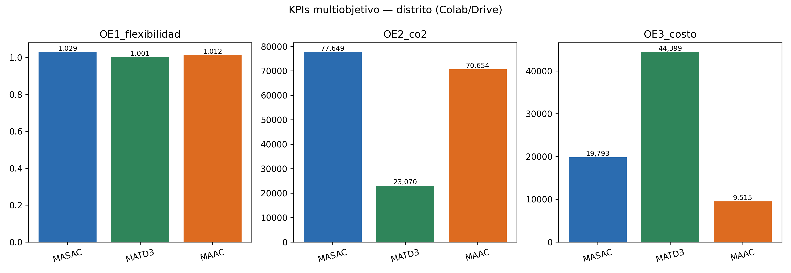
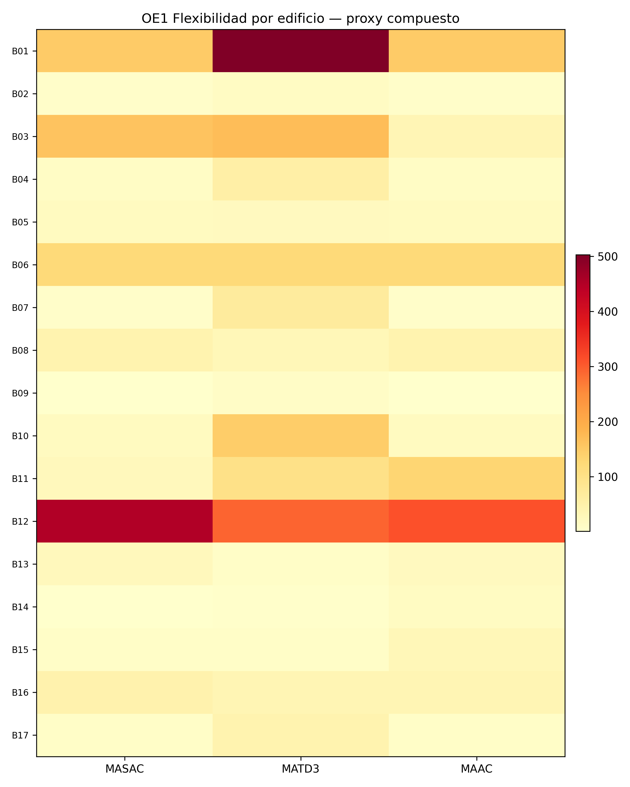
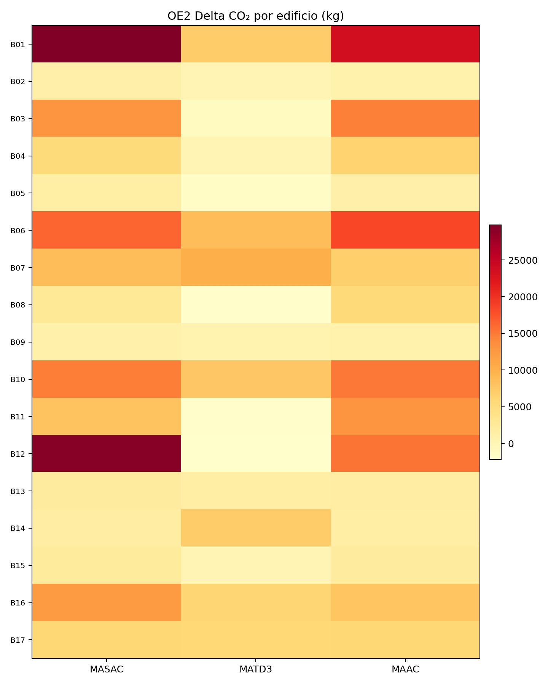
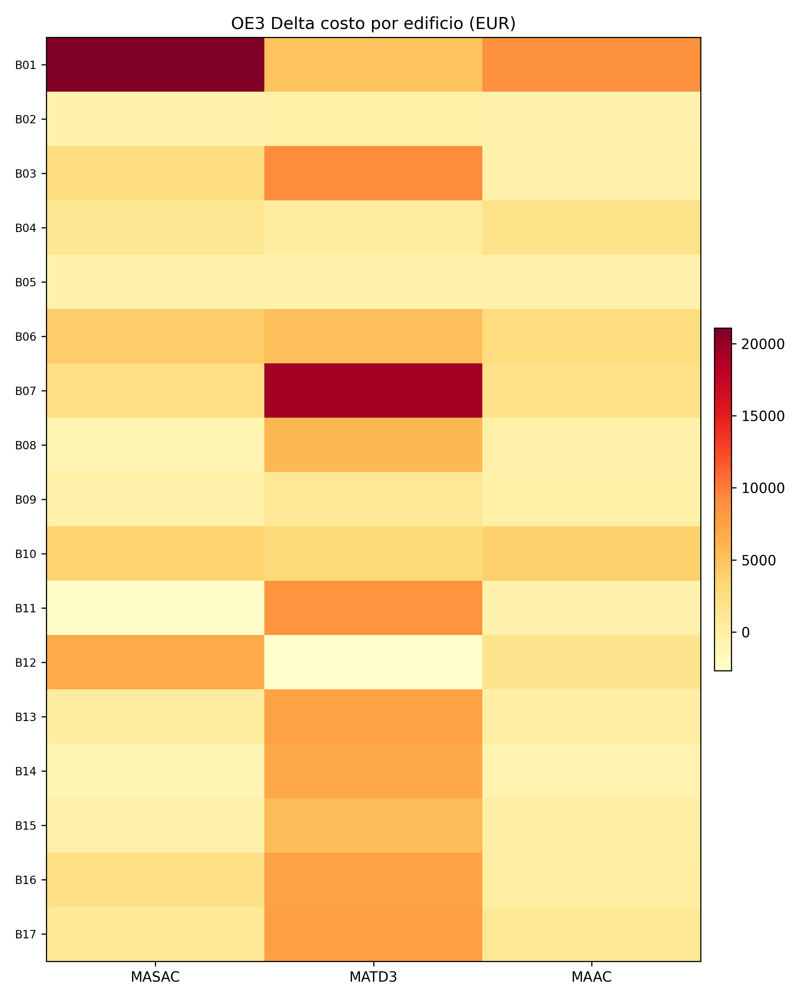
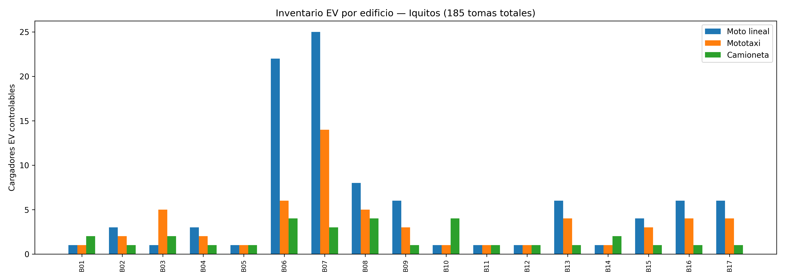
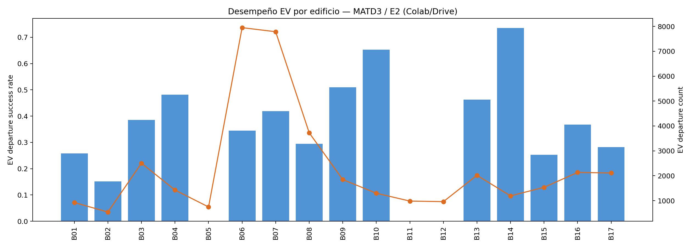

# MULTI-AGENTE DE APRENDIZAJE POR REFUERZO PROFUNDO PARA LA GESTION COORDINADA DE FLEXIBILIDAD ENERGETICA, EMISIONES DE CARBONO Y COSTOS ENERGETICOS EN COMUNIDADES INTELIGENTES

Borrador Guia N.02 generado con informacion disponible.

## Evidencia disponible (actualizada — Colab/Drive)

- **Dataset:** `citylearn_iquitos_2023_2025` (17 edificios institucionales/comerciales reales).
- **Corrida canónica:** `madrl_v3_20260627_164047` (Google Drive Colab).
- **Algoritmos evaluados:** MASAC, MATD3, MAAC (3 escenarios multiobjetivo cada uno).
- **Artefactos por job:** `results.json`, `timeseries.csv`, `trace.csv`, `building_kpis.csv`, `building_behavior_summary.csv`.
- **Inventario EV:** 185 cargadores controlables (96 equipos Modo 3 doble toma).
- **HAPPO:** 49/50 episodios; excluido del ranking por KPIs incompletos.

## Capítulo — Resultados multiobjetivo (Colab/Drive)

### Alcance del análisis

El análisis desagrega KPIs en dos niveles:

1. **Distrito:** métricas agregadas desde `citylearn_v3_report.all_values` (`outputs/_drive_madrl/kpis/*_results.json`).
2. **Edificio:** 17 agentes con nombre, tipo de uso, elementos controlados/no controlados y desempeño por escenario (`building_behavior_summary.csv`).

**Objetivos:**

| Escenario | Objetivo | KPI distrito | KPI edificio |
|-----------|----------|--------------|--------------|
| E1 | OE1 Flexibilidad | flex_composite | flex_composite_proxy |
| E2 | OE2 Emisiones CO₂ | carbon_emissions_delta_kg | carbon_emissions_delta_kgco2 |
| E3 | OE3 Costo energético | electricity_cost_delta_eur | electricity_cost_delta_eur |

**Elementos por edificio:**

- *Controlados (acciones MADRL):* BESS (`electrical_storage`), cargadores EV (`electric_vehicle_storage_*`), carga desplazable (`washing_machine_*`).
- *No controlados:* `non_shiftable_load`, refrigeración/ACS modeladas, generación FV fija.

### Mejor algoritmo por objetivo (distrito)

| Objetivo | Escenario | Mejor | Valor principal |
|----------|-----------|-------|-----------------|
| OE1 Flexibilidad | E1 | **MATD3** | flex_composite = 1.001 |
| OE2 Emisiones CO₂ | E2 | **MATD3** | ΔCO₂ = 23,070 kg |
| OE3 Costo energético | E3 | **MAAC** | Δcosto = 9,515 EUR |

MATD3 obtiene el mejor desempeño global (score 0.667) y domina flexibilidad y emisiones. MAAC es competitivo en costo energético del distrito.

### Tabla distrito — todos los algoritmos

| Algoritmo | E1 flex | E2 ΔCO₂ (kg) | E3 Δcosto (EUR) | EV éxito E2 |
|-----------|---------|--------------|-----------------|-------------|
| MASAC | 1.029 | 77,649 | 19,793 | 4.1 % |
| MATD3 | **1.001** | **23,070** | 44,399 | **36.4 %** |
| MAAC | 1.012 | 70,654 | **9,515** | 4.1 % |

Fuente: `../outputs/madrl_v3_20260627_164047/resumen_comparativo/multiobjetivo/district_objectives_by_algorithm.csv`

### Figuras para la tesis













Figuras individuales B01–B17: `../outputs/madrl_v3_20260627_164047/resumen_comparativo/multiobjetivo/por_edificio/`

### Inventario de edificios (resumen)

| ID | Edificio | Tipo | EV | Controlados |
|----|----------|------|----|-------------|
| B01 | ELECTRO ORIENTE S.A. | Office | 4 | BESS×1, EV×4, washing×1 |
| B02 | MUNICIPALIDAD DISTRITAL SAN JUAN BAUTISTA | Office | 6 | BESS×1, EV×6, washing×1 |
| B03 | AEROPUERTO INTERNACIONAL | Assembly | 8 | BESS×1, EV×8, washing×1 |
| B04 | HIPERMERCADOS TOTTUS ORIENTE SAC | Retail | 6 | BESS×1, EV×6, washing×1 |
| B05 | HOTEL PLAZA S.A. | MultiFamily_Hotel | 3 | BESS×1, EV×3, washing×1 |
| B06 | MALL AVENTURA S.A. | Commercial_Mall | 32 | BESS×1, EV×32, washing×1 |
| B07 | UNAP-FACULTAD DE BIOLOGIA | Education | 42 | BESS×1, EV×42, washing×1 |
| B08 | PNP ESCUELA TECNICA SUPERIOR | Assembly_Military | 17 | BESS×1, EV×17, washing×1 |
| B09 | GOBIERNO REGIONAL LORETO - COER | Office_Critical | 10 | BESS×1, EV×10, washing×1 |
| B10 | GOBIERNO REGIONAL DE LORETO | Office | 6 | BESS×1, EV×6, washing×1 |
| B11 | HOSPITAL REGIONAL DE LORETO | Healthcare_Hospital | 3 | BESS×1, EV×3, washing×1 |
| B12 | ESSALUD | Healthcare | 3 | BESS×1, EV×3, washing×1 |
| B13 | UNAP CIENCIAS CONTABLES | Education | 11 | BESS×1, EV×11, washing×1 |
| B14 | AUTORIDAD PORTUARIA NACIONAL | Industrial_Port | 4 | BESS×1, EV×4, washing×1 |
| B15 | DREL COLEGIO NACIONAL IQUITOS | Education | 8 | BESS×1, EV×8, washing×1 |
| B16 | SIMA IQUITOS S.R.LTDA | Industrial | 11 | BESS×1, EV×11, washing×1 |
| B17 | ASOCIACION CIVIL SELVA AMAZONICA | Laboratory | 11 | BESS×1, EV×11, washing×1 |

Detalle completo por algoritmo y escenario:

- `../outputs/madrl_v3_20260627_164047/resumen_comparativo/multiobjetivo/building_detail_masac_by_scenario.md`
- `../outputs/madrl_v3_20260627_164047/resumen_comparativo/multiobjetivo/building_detail_matd3_by_scenario.md`
- `../outputs/madrl_v3_20260627_164047/resumen_comparativo/multiobjetivo/building_detail_maac_by_scenario.md`

### PDF y Word resumen

Documentos compilados para defensa/anexo:

- Word: `../outputs/madrl_v3_20260627_164047/resumen_comparativo/multiobjetivo/RESUMEN_MULTIOBJETIVO_TESIS.docx`
- PDF: `../outputs/madrl_v3_20260627_164047/resumen_comparativo/multiobjetivo/RESUMEN_MULTIOBJETIVO_TESIS.pdf`

Regenerar tesis doctoral final:

```powershell
.\.venv39-citylearn-v3\Scripts\python.exe scripts\generate_tesis_doctoral_final_docx.py
.\.venv39-citylearn-v3\Scripts\python.exe scripts\verify_tesis_doctoral_docx.py
```

Salida canónica: `docs/Tesis_Doctoral_MADRL_CityLearn_Iquitos.docx` (verificado: dedicatoria, 6 capítulos, tablas, figuras Colab/multiobjetivo).

## Regla (histórica)

Los KPIs y conclusiones finales deben quedar respaldados por `results.json`, `timeseries.csv` y `trace.csv` por algoritmo/escenario. **Estado actual:** cumplido para MASAC/MATD3/MAAC en corrida `madrl_v3_20260627_164047`.
