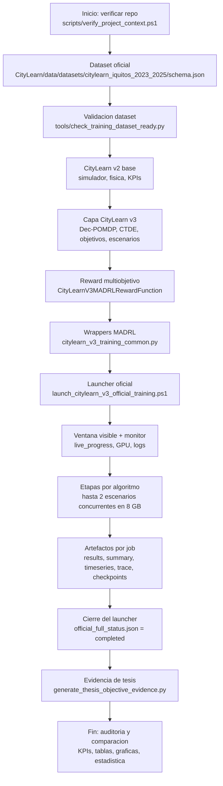

# Arquitectura operativa del entrenamiento visible CityLearn v3 MADRL

Actualizado: 2026-06-17

Este documento explica el flujo completo del entrenamiento oficial de CityLearn v3 MADRL en este repositorio: desde la preparacion del proyecto hasta el cierre, auditoria y continuacion de una corrida interrumpida. Describe la arquitectura real implementada, con rutas y comandos verificables.

Fuente operativa vigente: `docs/architecture/FLUJO_OPERATIVO_ACTUAL_CITYLEARN_V3_MADRL.md` y `docs/workflow_manifest.json`. En este documento, `<OutputRoot>` es la ruta guardada en `outputs/latest_visible_training_output_root.txt`.

**Corrida definitiva (2026-06-17):** `outputs/citylearn_v3_madrl_full_20260615_074011_v4` — COMPLETADA 12/12 (v4 re-run definitivo con BESS penalty + EV urgency).  
**Corrida completa de referencia:** `outputs/citylearn_v3_madrl_full_20260613_010234` — COMPLETADA (12/12 jobs, exit_code=0).

## 1. Objetivo del flujo

El flujo entrena cuatro algoritmos MADRL sobre el dataset Iquitos 2023-2025 para evaluar tres objetivos de tesis:

| Objetivo | Escenario | Enfoque |
|---|---|---|
| OE1 | E1 | Flexibilidad energetica, desplazamiento de carga, baterias, EV/V2G y autoconsumo. |
| OE2 | E2 | Reduccion de emisiones de CO2 y gestion carbon-aware. |
| OE3 | E3 | Reduccion de costos energeticos y respuesta a tarifas dinamicas. |

La corrida oficial produce artefactos reproducibles por algoritmo, escenario y seed: checkpoints, `data/results.json`, `data/training_summary.json`, `data/timeseries.csv`, `data/trace.csv`, tablas, figuras y logs.

## 2. Vista general de inicio a cierre



## 3. Capas de la arquitectura

| Capa | Ruta | Responsabilidad |
|---|---|---|
| Verificacion del proyecto | `scripts/verify_project_context.ps1` | Evita ejecutar desde un repo equivocado o mezclar con `D:\madrl_lima`. |
| Dataset oficial | `CityLearn/data/datasets/citylearn_iquitos_2023_2025/` | Contiene el `schema.json`, series horarias, edificios, PV, baterias, EV, precios y CO2. |
| Gate de dataset | `tools/check_training_dataset_ready.py` | Valida que el dataset crudo este listo antes de normalizar y entrenar. |
| Simulador base | `CityLearn/` | Mantiene CityLearn v2 como base fisica, energetica y de KPIs. |
| Capa v3 | `CityLearn/citylearn/v3/` | Agrega objetivos, entorno v3, configuracion y compatibilidad multiagente. |
| Escenarios | `CityLearn/citylearn/scenario_manager.py` | Aplica E1, E2 y E3 al entorno. |
| Reward | `CityLearn/citylearn/reward_function.py` | Implementa `CityLearnV3MADRLRewardFunction` y pesos por eje. |
| Adaptador comun | `CityLearn/scripts/citylearn_v3_training_common.py` | Normaliza salida, KPIs, trazas, figuras, tablas y metadatos. |
| Entrenadores | `CityLearn/scripts/train_citylearn_v3_*.py` | Ejecutan cada backend MADRL. |
| Launcher oficial | `CityLearn/scripts/launch_citylearn_v3_official_training.ps1` | Orquesta la cadena completa y escribe manifiestos. |
| Monitor | `CityLearn/scripts/monitor_citylearn_v3_official_training.ps1` | Observa progreso, GPU, rewards, KPIs y logs. |

## 4. Orden real de ejecucion

El launcher oficial construye 12 jobs y, en la ruta operativa normal, los agrupa por algoritmo para comparar E1/E2/E3 bajo el mismo backend. En RTX 4060 Laptop 8 GB usa hasta 2 escenarios concurrentes para HAPPO/MATD3 y conserva MASAC/MAAC en 1 por su mayor uso de memoria.

```text
HAPPO: E1/E2/E3, hasta 2 concurrentes
MASAC: E1/E2/E3, 1 concurrente
MATD3: E1/E2/E3, hasta 2 concurrentes
MAAC : E1/E2/E3, 1 concurrente
```

Si se activa `-LiveOutput $true`, el mismo launcher cambia a modo secuencial para mostrar una vista rica de un solo job en pantalla.

Cada job usa:

```text
episodes = 50
episode_time_steps = 8760
num_env_steps = 438000
seed = 0
dataset = citylearn_iquitos_2023_2025
```

## 5. Algoritmos y backends

| Algoritmo | Script | Wrapper | Backend | Tipo |
|---|---|---|---|---|
| HAPPO | `CityLearn/scripts/train_citylearn_v3_happo.py` | `CityLearnHARLEnv` | `external/HARL` | On-policy CTDE. |
| MASAC | `CityLearn/scripts/train_citylearn_v3_masac.py` | `CityLearnSMACDiscreteEnv` | `external/MARL/src` | Off-policy discreto con QMIX/MSAC. |
| MATD3 | `CityLearn/scripts/train_citylearn_v3_matd3.py` | `CityLearnOffPolicyVecEnv` | `external/off-policy` | Off-policy actor-critic. |
| MAAC | `CityLearn/scripts/train_citylearn_v3_maac.py` | `CityLearnMAACVecEnv` | `external/MAAC` | Attention actor-critic. |

## 6. Comando de lanzamiento visible

Antes de entrenar se debe verificar el contexto:

```powershell
powershell -ExecutionPolicy Bypass -File scripts\verify_project_context.ps1
```

Lanzamiento visible sobre el output oficial. Usar `pwsh.exe` (PowerShell 7) para esta ruta operativa; es el shell con el que el launcher visible fue validado y relanzado correctamente.

```powershell
$ts = Get-Date -Format 'yyyyMMdd_HHmmss'
$root = "outputs\citylearn_v3_madrl_full_$ts"
Set-Content outputs\latest_visible_training_output_root.txt $root -Encoding UTF8

pwsh.exe -NoProfile -ExecutionPolicy Bypass `
  -File scripts\run_citylearn_v3_full_training_visible.ps1 `
  -OutputRoot $root `
  -Scenario ALL `
  -Seed 0 `
  -EpisodeTimeSteps 8760 `
  -Episodes 50 `
  -TorchThreads 8 `
  -GpuProfile local4060_fast `
  -LiveProgressInterval 1000 `
  -ArtifactProfile efficient `
  -TraceRecordInterval 10 `
  -TraceDetail compact `
  -Cuda
```

El script `scripts\run_citylearn_v3_full_training_visible.ps1` es el wrapper raiz visible. Internamente invoca `CityLearn\scripts\launch_citylearn_v3_official_training.ps1`. El launcher escribe `official_full_manifest.json` y `official_full_status.json` en el `OutputRoot`. El monitor visible lee `live_progress.json`, logs y `official_full_status.json`; no se necesita `-LiveOutput` para observar la corrida en tiempo real.

Parametros validados en corridas v3 y v4 (RTX 4060 Laptop, Torch 2.8.0+cu126):

| Parametro | Valor usado |
|---|---|
| `GpuProfile` | `local4060_fast` |
| `cuda_memory_fraction` | 0.812 (efectivo, calculado por launcher) |
| `TorchThreads` | 8 |
| `ArtifactProfile` | `efficient` |
| `TraceRecordInterval` | 10 |
| `TraceDetail` | `compact` |
| `LiveProgressInterval` | 1000 pasos |

## 7. Monitor visible

Para observar una corrida existente:

```powershell
pwsh.exe -NoProfile -ExecutionPolicy Bypass `
  -File CityLearn\scripts\monitor_citylearn_v3_official_training.ps1 `
  -OutputRoot $root `
  -IntervalSeconds 5 `
  -LogTail 12
```

El monitor muestra:

- estado global del launcher;
- jobs completados, activos y pendientes;
- algoritmo y escenario actual;
- `global_step`, episodio y paso dentro del episodio;
- pesos de recompensa OE1/OE2/OE3;
- reward instantaneo y acumulado;
- KPIs energeticos basicos del distrito;
- uso de GPU;
- ultimas lineas filtradas del log.

## 8. Artefactos esperados por job

Cada job completo debe tener esta estructura:

```text
<OutputRoot>/{algoritmo}/{escenario}_seed_0/
  data/results.json
  data/training_summary.json
  data/timeseries.csv
  data/trace.csv
  data/checkpoint_manifest.json
  data/artifact_audit.json
  data/building_behavior_summary.csv
  data/building_kpis.csv
  data/building_observation_action_schema.csv
  data/building_trace_sample.csv
  checkpoints/
  figures/
  figures/tables/
```

`live_progress.json` existe solo durante entrenamiento activo y se elimina al completar. Los espejos raíz son compatibilidad heredada y no forman parte del contrato canónico.

Un job se considera completado para el launcher si existe:

```text
{run_dir}/data/results.json
```

Para evidencia de tesis se recomienda exigir tambien:

```text
data/results.json
data/training_summary.json
data/timeseries.csv
data/trace.csv
data/checkpoint_manifest.json
data/artifact_audit.json
figures/figures_manifest.json
```

## 9. Cierre normal

El cierre normal ocurre cuando el launcher termina los 12 jobs. En ese momento:

```text
<OutputRoot>/official_full_status.json
<OutputRoot>/official_full_manifest.json
```

deben quedar con:

```json
{
  "status": "completed",
  "completed_at": "...",
  "jobs": [
    { "name": "happo", "scenario": "E1", "exit_code": 0 },
    { "name": "masac", "scenario": "E1", "exit_code": 0 }
  ]
}
```

Todos los jobs deben tener `exit_code = 0`. Si un reinicio, cierre de ventana o fallo externo corta el launcher, el JSON puede quedar con `status = running` aunque no exista proceso activo. En ese caso se debe auditar procesos, logs y `live_progress.json`.

## 10. Continuar una corrida interrumpida

El launcher tiene `-SkipCompleted`. Esta opcion permite continuar la cadena sin repetir jobs que ya generaron `data/results.json`.

Comando recomendado para continuar de forma visible sobre el mismo `OutputRoot`:

```powershell
pwsh.exe -NoProfile -ExecutionPolicy Bypass `
  -File CityLearn\scripts\launch_citylearn_v3_official_training.ps1 `
  -Scenario ALL `
  -Seed 0 `
  -EpisodeTimeSteps 8760 `
  -Episodes 50 `
  -SchemaPath CityLearn\data\datasets\citylearn_iquitos_2023_2025\schema.json `
  -OutputRoot <OutputRoot> `
  -TorchThreads 8 `
  -GpuProfile local4060_fast `
  -LiveProgressInterval 1000 `
  -Cuda `
  -SkipCompleted
```

Comportamiento esperado:

- Si `happo/E1_seed_0/data/results.json` existe, `HAPPO/E1` se marca como `skipped`.
- Si `masac/E1_seed_0/data/results.json` no existe, `MASAC/E1` se ejecuta nuevamente.
- Despues continua con `MATD3/E1`, `MAAC/E1`, `E2/*` y `E3/*`.

Importante: esto continua la cadena sin empezar toda la campaña desde cero, pero no reanuda un job a mitad de episodio. En el estado actual del codigo, los scripts `train_citylearn_v3_*.py` guardan checkpoints, pero no exponen un parametro oficial de `--resume`/`--restore` para continuar exactamente desde un `global_step` intermedio. Por tanto, si `MASAC/E1` fue cortado en `global_step=17000`, el relanzamiento con `-SkipCompleted` conserva `HAPPO/E1` y reinicia solo el job incompleto `MASAC/E1`.

## 11. Corridas auditadas y antecedentes de continuacion

### Caso historico: corte por actualizacion de Windows (corrida v4 original)

En la corrida historica `outputs/citylearn_v3_madrl_oficial_v4` se observo:

```text
HAPPO/E1: completo, 5 episodios, 43800 pasos (corrida historica previa al contrato actual de 50 episodios).
MASAC/E1: incompleto, ultimo live_progress en global_step=17000.
```

El ultimo `live_progress.json` de MASAC fue escrito el 2026-06-10 a las 11:50:17. Windows inicio un reinicio planeado por actualizacion el 2026-06-10 a las 11:50:19. No hubo traceback, error CUDA ni OOM en los logs. La interrupcion fue externa al codigo de entrenamiento.

### Corrida v3 completada (20260613_010234)

Primera corrida completa del proyecto. HAPPO y MASAC tenian artefactos preexistentes; MATD3 y MAAC se completaron en esta sesion. Todos los 12 jobs tuvieron `exit_code = 0`.

```text
Inicio:     2026-06-15 00:46 (hora Peru, UTC-5)
Fin:        2026-06-15 06:20
Duracion:   ~5.5 horas (MATD3 + MAAC + verificacion de HAPPO/MASAC)
Status:     completed
```

### Corrida v4 en curso (20260615_074011_v4)

Re-run definitivo con la funcion de recompensa v4 (penalidad BESS degradacion C-rate/Arrhenius LiFePO4 + urgencia EV). Todos los jobs desde cero.

```text
Inicio:     2026-06-15 07:40 (hora Peru, UTC-5)
HAPPO:      completado (E1+E2 paralelo, E3 secuencial) — 3h 4min total
MASAC:      completado (E1→E2→E3 secuencial) — 6h 49min total
MATD3:      corriendo (E1+E2 paralelo iniciados 16:34)
MAAC:       pendiente
```

Para continuar cualquier corrida interrumpida con `-SkipCompleted`:

```powershell
pwsh.exe -NoProfile -ExecutionPolicy Bypass `
  -File CityLearn\scripts\launch_citylearn_v3_official_training.ps1 `
  -Scenario ALL `
  -Seed 0 `
  -EpisodeTimeSteps 8760 `
  -Episodes 50 `
  -SchemaPath CityLearn\data\datasets\citylearn_iquitos_2023_2025\schema.json `
  -OutputRoot <OutputRoot> `
  -TorchThreads 8 `
  -GpuProfile local4060_fast `
  -LiveProgressInterval 1000 `
  -Cuda `
  -SkipCompleted
```

## 12. Auditoria durante y despues del entrenamiento

Verificar procesos activos:

```powershell
Get-CimInstance Win32_Process |
  Where-Object { $_.CommandLine -match 'train_citylearn|launch_citylearn|citylearn_v3' } |
  Select-Object ProcessId,ParentProcessId,CreationDate,ExecutablePath,CommandLine
```

Ver logs recientes:

```powershell
Get-ChildItem <OutputRoot>\logs |
  Sort-Object LastWriteTime -Descending |
  Select-Object LastWriteTime,Length,Name
```

Buscar errores:

```powershell
rg -n "Traceback|ERROR|Exception|RuntimeError|ValueError|CUDA|OOM|out of memory|KeyboardInterrupt" `
  <OutputRoot>\logs
```

Ver progreso vivo de un job:

```powershell
Get-Content <OutputRoot>\masac\E1_seed_0\live_progress.json -Raw
```

Validar artefactos completos:

```powershell
Test-Path <OutputRoot>\happo\E1_seed_0\data\results.json
Test-Path <OutputRoot>\happo\E1_seed_0\data\timeseries.csv
Test-Path <OutputRoot>\happo\E1_seed_0\data\trace.csv
```

## 13. Evidencia final para tesis

Cuando los 12 jobs esten completos, generar la evidencia consolidada:

```powershell
.\.venv39-citylearn-v3\Scripts\python.exe -B CityLearn\scripts\generate_thesis_objective_evidence.py
```

Salidas esperadas:

```text
outputs/thesis_objective_evidence/
  resumen_evidencia_tesis.md
  matriz_resultados_madrl.csv
  scores_kpi_algoritmo_madrl.csv
  analisis_estadistico_madrl.csv
  comparaciones_mwu_madrl.csv
  comparaciones_wilcoxon_madrl.csv
  hipotesis_estadisticas_madrl.csv
  thesis_skill_feed.json
```

El cierre cientifico no debe basarse solo en reward. Debe usar KPIs por eje, trazas, tablas, checkpoints, figuras y pruebas estadisticas sobre KPI-gains.

## 14. Criterio de corrida valida

Una corrida oficial se considera valida cuando:

- `scripts/verify_project_context.ps1` pasa antes del lanzamiento.
- El dataset readiness gate pasa sin errores.
- `official_full_status.json` queda con `status = completed`.
- Los 12 jobs tienen `exit_code = 0`.
- Cada job tiene `data/results.json`, `data/training_summary.json`, `data/artifact_audit.json`, `data/timeseries.csv`, `data/trace.csv` y `data/checkpoint_manifest.json`.
- No hay tracebacks ni errores criticos en `outputs/.../logs`.
- La evidencia consolidada se genera sin marcar jobs incompletos.

## 15. Resumen operativo

```text
Verificar contexto
  -> Validar dataset
  -> Lanzar cadena oficial visible
  -> Monitorear live_progress, logs y GPU
  -> Guardar artefactos por job
  -> Si se corta: relanzar con -SkipCompleted
  -> Completar 12 jobs
  -> Generar evidencia de tesis
  -> Auditar KPIs, estadistica y artefactos finales
```
