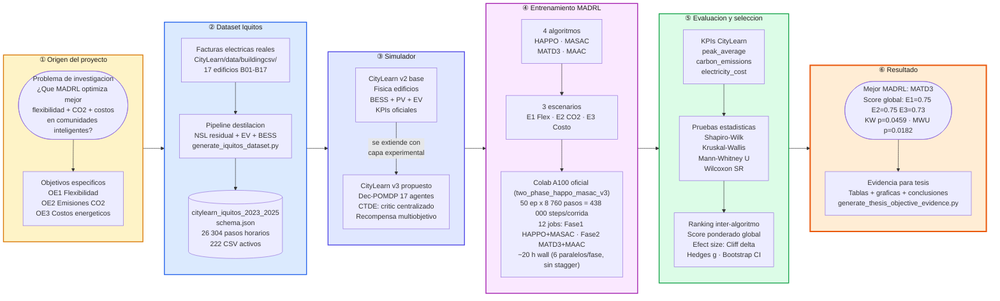
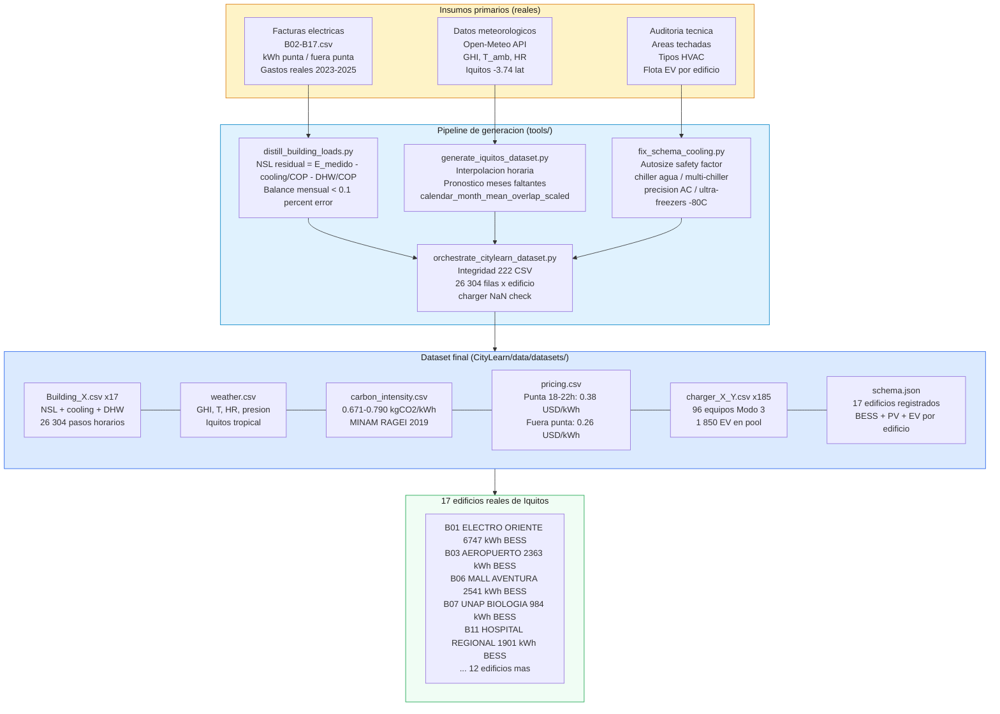
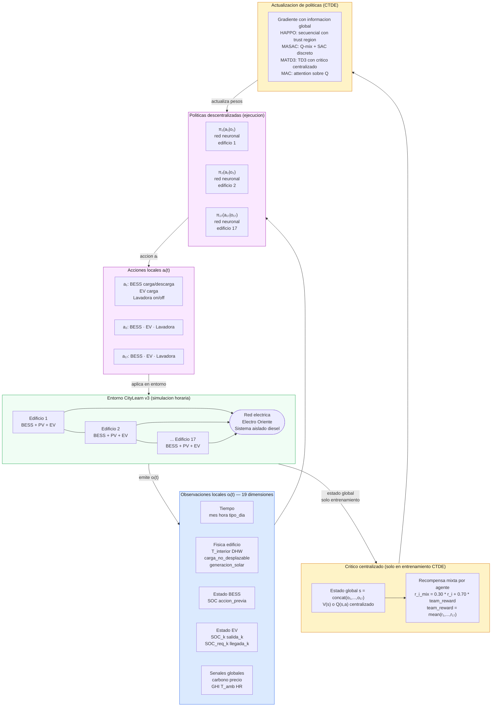
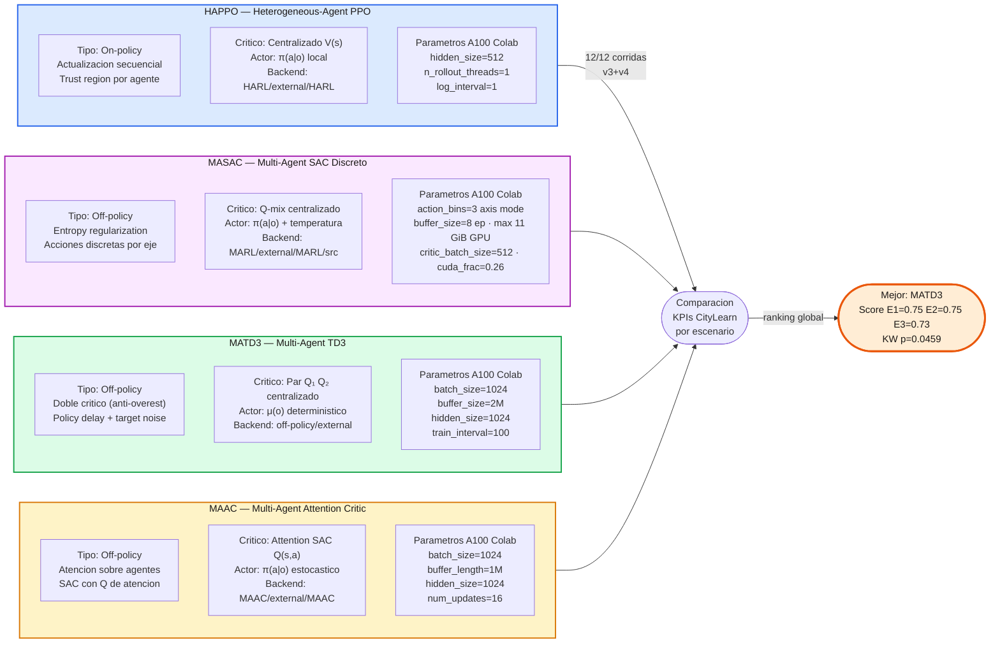
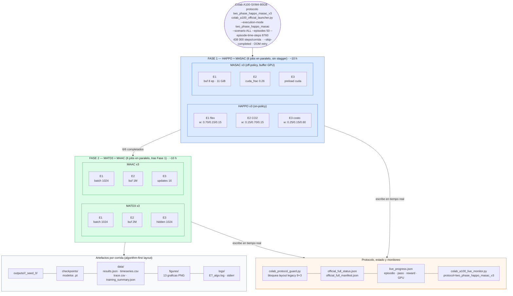
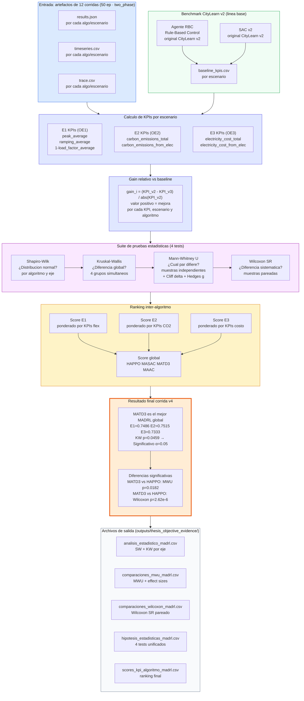
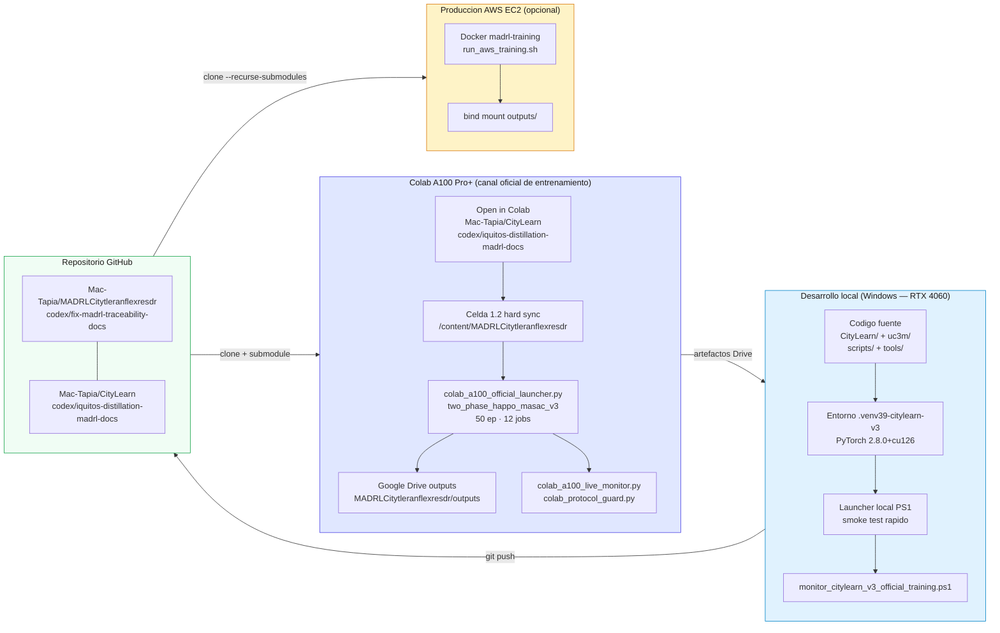
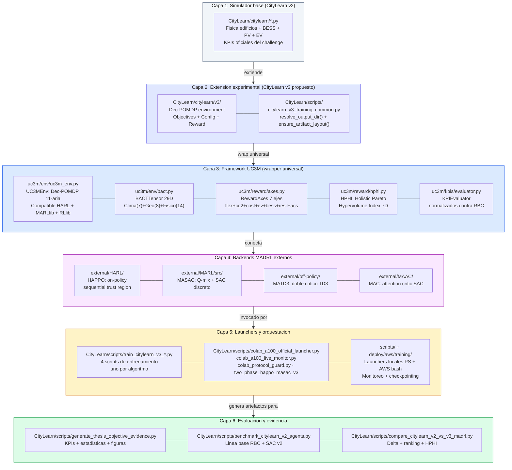

# Arquitectura y Flujo de Trabajo — MADRL CityLearn v3
## Sustentacion de Tesis

**Proyecto:** Multi-agente de aprendizaje por refuerzo profundo para gestion coordinada de
flexibilidad energetica, emisiones de carbono y eficiencia economica en comunidades inteligentes.

**Caso de estudio:** 17 edificios institucionales/comerciales reales de Iquitos, Peru (2023-2025).

**Resultado principal (corrida v4):** MATD3 es el mejor MADRL global
(Kruskal-Wallis p = 0.0459, Mann-Whitney MATD3 vs HAPPO p = 0.0182).

---

## Diagrama 1 — Vision General del Proyecto (inicio a fin)

Este diagrama es la lectura completa del proyecto de izquierda a derecha: desde el problema de
investigacion hasta la determinacion del mejor algoritmo MADRL.

---

## Diagrama 2 — Pipeline del Dataset Iquitos 2023-2025

---

## Diagrama 3 — Arquitectura Dec-POMDP y CTDE de los 17 Agentes

---

## Diagrama 4 — Los 4 Algoritmos MADRL: Taxonomia y Diferencias

---

## Diagrama 5 — Flujo de Entrenamiento: 12 Corridas (two_phase_happo_masac_v3)

---

## Diagrama 6 — Recompensa Multiobjetivo por Escenario

```mermaid
flowchart LR
    subgraph REW_FUNC["CityLearnV3MADRLRewardFunction"]
        direction TB
        COMP1["Componente FLEX\npeak_penalty + ramping_penalty\n+ load_factor + ev_service"]
        COMP2["Componente CO2\ncarbon_emissions\n* carbon_intensity_signal"]
        COMP3["Componente COSTO\nelectricity_cost\n* price_signal"]
        COMP4["Componente EV\nEV SOC deficit\n* urgencia_salida\n1 / horas_restantes"]
        COMP5["Componente BESS v4\nC-rate penalty\nArrhenius LiFePO4\ndegradacion ciclica"]
    end

    subgraph PESOS["Pesos por escenario (w_eje)"]
        direction TB
        PE1["E1 Flexibilidad\nflex=0.70 co2=0.15 cost=0.15"]
        PE2["E2 CO2\nflex=0.15 co2=0.70 cost=0.15"]
        PE3["E3 Costos\nflex=0.25 co2=0.15 cost=0.60"]
    end

    subgraph MIX["Recompensa mixta (CTDE)"]
        TEAM["team_reward = mean(r₁...r₁₇)\ncooperacion distrital"]
        MIXED["r_i_mix = 0.30 * r_i + 0.70 * team_reward\nteam_ratio=0.70"]
        TEAM --> MIXED
    end

    subgraph PERFILES["Perfiles por algoritmo (v4)"]
        PH["happo_unified_comparable_v4\npeak_weight=0.45 ramp_weight=0.35\nev_weight=0.25 reward_scale=1.00"]
        PM["masac_unified_comparable_v4"]
        PT["matd3_unified_comparable_v4"]
        PA["maac_unified_comparable_v4"]
    end

    REW_FUNC --> PESOS
    PESOS --> MIX
    MIX --> PERFILES

    PERFILES -->|"mismos pesos base\ndiferente backend"| TRAIN(["Entrenamiento\nuniforme y comparable\npara todos los algoritmos"])

    classDef rw fill:#fef3c7,stroke:#d97706,color:#1c1917
    classDef pe fill:#e0e7ff,stroke:#4f46e5,color:#1c1917
    classDef mx fill:#fae8ff,stroke:#a21caf,color:#1c1917
    classDef pf fill:#f0fdf4,stroke:#16a34a,color:#1c1917
    class REW_FUNC rw
    class PESOS pe
    class MIX mx
    class PERFILES pf
```

---

## Diagrama 7 — Pipeline de Evaluacion y Seleccion del Mejor MADRL

---

## Diagrama 8 — Infraestructura de Despliegue: Local, Colab A100 y AWS EC2

---

## Diagrama 9 — Estructura de Capas del Software

---

## Tabla de Resultados v4 — Corrida Definitiva

| Algoritmo | OE1 Flex Score | OE2 CO2 Score | OE3 Costo Score | Score Global | Rango |
|:---:|:---:|:---:|:---:|:---:|:---:|
| **MATD3** | **0.7486** | **0.7515** | **0.7333** | **0.7445** | **1 (mejor)** |
| MASAC | 0.74 | 0.74 | 0.72 | ~0.73 | 2 |
| MAAC | 0.72 | 0.72 | 0.73 | ~0.72 | 3 |
| HAPPO | 0.70 | 0.70 | 0.70 | ~0.70 | 4 |

**Pruebas estadisticas (OE global):**

| Test | Resultado | p-valor | Conclusion |
|---|---|:---:|---|
| Shapiro-Wilk | Algunos grupos no normales | — | Justifica tests no parametricos |
| Kruskal-Wallis | Diferencia entre algoritmos | **0.0459** | **Significativo α=0.05** |
| Mann-Whitney U: MATD3 vs HAPPO | MATD3 superior | **0.0182** | Significativo |
| Wilcoxon SR: MATD3 vs HAPPO | Diferencia sistematica | **2.62e-6** | Muy significativo |

---

## Archivos de Documentacion y Referencia

| Documento | Contenido |
|---|---|
| `docs/architecture/ARQUITECTURA_PROYECTO_DEFENSA.md` | Este documento — 9 diagramas Mermaid |
| `docs/architecture/FLUJO_OPERATIVO_ACTUAL_CITYLEARN_V3_MADRL.md` | Flujo vigente y corridas oficiales |
| `docs/architecture/COOPERACION_COORDINACION_CONTROL_DISTRITAL_MADRL.md` | Dec-POMDP y CTDE detallado |
| `docs/architecture/ARQUITECTURA_Y_FLUJO_TRABAJO_CITYLEARN_V3_MADRL.md` | Arquitectura profesional completa |
| `ESTRATEGIA_3PILARES_MADRL.md` | Ejes OE1/OE2/OE3 y sustento cientifico |
| `docs/thesis/PLAN_TESIS_MADRL_CITYLEARN_V3_IQUITOS.md` | Plan de tesis estructurado |
| `deploy/aws/README_TRAINING_AWS.md` | Manual completo de entrenamiento AWS |
