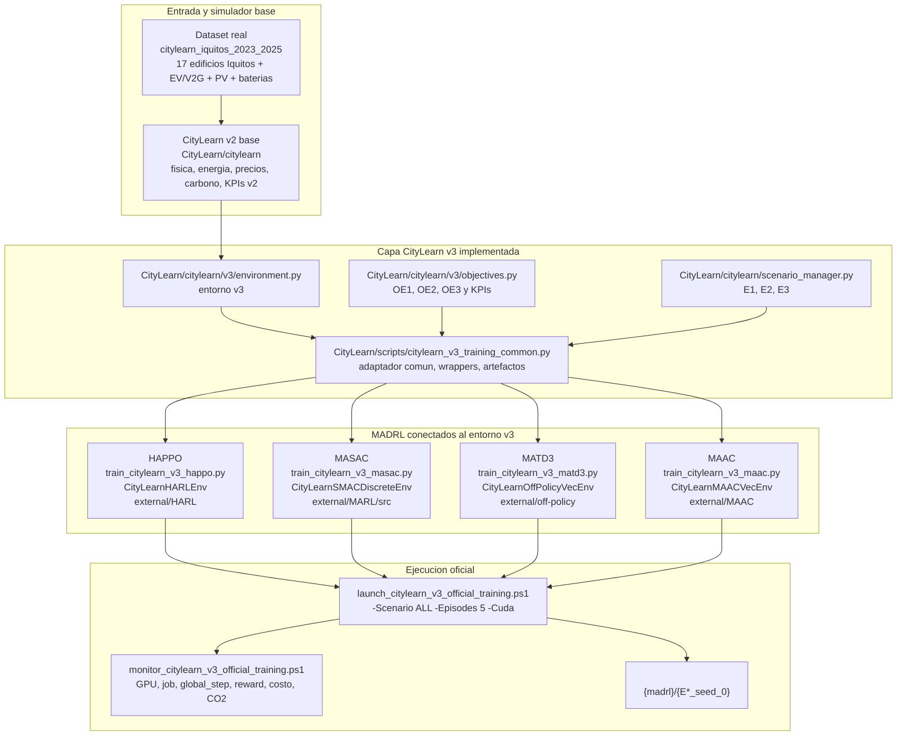
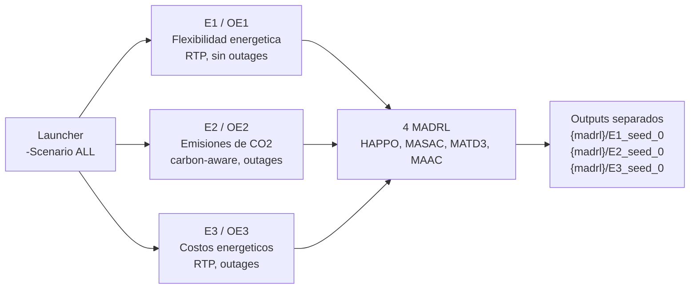
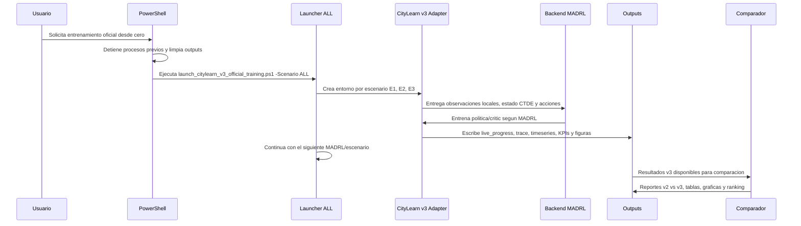
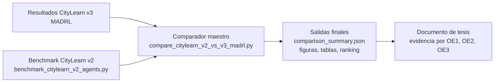
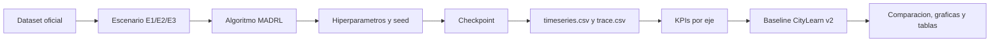

# Arquitectura profesional y flujo de trabajo CityLearn v3 MADRL

Proyecto: **Multi-agente de aprendizaje por refuerzo profundo para gestion coordinada de flexibilidad energetica, emisiones de carbono y eficiencia economica en comunidades inteligentes**.

Este documento describe la arquitectura **real implementada** en el repositorio actual. No representa una arquitectura conceptual independiente: cada bloque apunta a rutas, scripts, backends, salidas y flujos existentes en el proyecto.

Fuente operativa vigente: `docs/FLUJO_OPERATIVO_ACTUAL_CITYLEARN_V3_MADRL.md` y `docs/workflow_manifest.json`. En comandos y diagramas, `<OutputRoot>` significa la ruta registrada en `outputs/latest_visible_training_output_root.txt`.

## 0. Plano maestro de seguimiento del proyecto

Este plano es la lectura principal del proyecto. Se sigue de izquierda a derecha: empieza en el problema de tesis y el dataset, pasa por CityLearn v2, la capa CityLearn v3, los cuatro MADRL, los tres ejes, los artefactos de entrenamiento, la evaluacion, el benchmark CityLearn v2 y termina en los resultados comparativos para la tesis.

```mermaid
flowchart LR
    START([Inicio del proyecto<br/>problema de investigacion])
    PLAN["Plan de tesis y diagnostico<br/>Plan_Tesis_MADRL_Diagnostico_v17.pdf<br/>ESTRATEGIA_3PILARES_MADRL.md"]
    DATA["Dataset oficial<br/>citylearn_iquitos_2023_2025<br/>17 edificios Iquitos + EV/V2G"]
    V2["CityLearn v2 base<br/>CityLearn/citylearn<br/>simulador + KPIs v2"]
    V3["CityLearn v3 implementado<br/>CityLearn/citylearn/v3<br/>environment + objectives + config"]
    REW["Reward v3 MADRL<br/>CityLearnV3MADRLRewardFunction<br/>pesos por eje + perfil por algoritmo"]
    ADAPT["Adaptador MADRL comun<br/>citylearn_v3_training_common.py<br/>Dec-POMDP + CTDE + artefactos"]
    ALGS["4 MADRL conectados<br/>HAPPO, MASAC, MATD3, MAAC<br/>scripts train_citylearn_v3_*.py"]
    LAUNCH{"Launcher oficial<br/>-Scenario ALL<br/>12 corridas por etapas paralelas"}

    E1["OE1 / E1<br/>Flexibilidad energetica<br/>KPIs: peak, ramping, load factor,<br/>PV, bateria, EV"]
    E2["OE2 / E2<br/>Emisiones CO2<br/>KPIs: carbon_emissions,<br/>control, baseline, delta"]
    E3["OE3 / E3<br/>Costos energeticos<br/>KPIs: electricity_cost,<br/>cost_peak, price deviation"]

    TRAIN["Entrenamiento GPU<br/>PyTorch CUDA<br/>episodios + checkpoints"]
    MON["Monitor vivo<br/>status, GPU, global_step,<br/>reward, costo, CO2"]
    ART["Artefactos por corrida<br/>results.json, training_summary.json,<br/>timeseries.csv, trace.csv,<br/>figures, tables, checkpoints"]
    EVAL["Evaluacion CityLearn v3<br/>KPIs por eje + figuras<br/>objective_kpis.csv"]
    B2["Benchmark CityLearn v2<br/>benchmark_citylearn_v2_agents.py<br/>agentes originales"]
    CMP["Comparador maestro<br/>compare_citylearn_v2_vs_v3_madrl.py<br/>delta, mejora %, ranking"]
    FIN([Fin del flujo<br/>evidencia para tesis<br/>tablas + graficas + conclusiones])

    START -->|1. define alcance| PLAN
    PLAN -->|2. selecciona datos| DATA
    DATA -->|3. alimenta simulador| V2
    V2 -->|4. se conserva y extiende| V3
    V3 -->|5. expone entorno multiagente| REW
    REW -->|6. entrega recompensa especifica| ADAPT
    ADAPT -->|7. conecta wrappers| ALGS
    ALGS -->|8. invoca scripts| LAUNCH
    LAUNCH -->|9a. ejecuta eje| E1
    LAUNCH -->|9b. ejecuta eje| E2
    LAUNCH -->|9c. ejecuta eje| E3
    E1 --> TRAIN
    E2 --> TRAIN
    E3 --> TRAIN
    TRAIN -->|10. escribe progreso| MON
    TRAIN -->|11. guarda salidas| ART
    ART -->|12. calcula KPIs| EVAL
    V2 -->|baseline comparable| B2
    B2 --> CMP
    EVAL --> CMP
    CMP -->|13. resultados finales| FIN

    classDef start fill:#ecfeff,stroke:#0891b2,color:#0f172a,stroke-width:2px;
    classDef data fill:#dbeafe,stroke:#2563eb,color:#0f172a,stroke-width:2px;
    classDef core fill:#ccfbf1,stroke:#0f766e,color:#0f172a,stroke-width:2px;
    classDef madrl fill:#ede9fe,stroke:#7c3aed,color:#0f172a,stroke-width:2px;
    classDef axis fill:#dcfce7,stroke:#15803d,color:#0f172a,stroke-width:2px;
    classDef train fill:#ffedd5,stroke:#b45309,color:#0f172a,stroke-width:2px;
    classDef eval fill:#fee2e2,stroke:#b91c1c,color:#0f172a,stroke-width:2px;
    classDef finish fill:#f1f5f9,stroke:#334155,color:#0f172a,stroke-width:2px;

    class START start;
    class FIN finish;
    class PLAN,DATA data;
    class V2,V3,REW,ADAPT core;
    class ALGS,LAUNCH madrl;
    class E1,E2,E3 axis;
    class TRAIN,MON,ART train;
    class EVAL,B2,CMP eval;
```



### Seguimiento verificable por etapa

| Paso | Caja del flujo | Archivo o ruta que confirma la etapa | Resultado esperado |
|---|---|---|---|
| 1 | Plan y diagnostico | `Plan_Tesis_MADRL_Diagnostico_v17.pdf`, `ESTRATEGIA_3PILARES_MADRL.md` | Objetivos y tres ejes definidos. |
| 2 | Dataset oficial | `CityLearn/data/datasets/citylearn_iquitos_2023_2025/schema.json` | 17 edificios reales de Iquitos + EV/V2G disponibles. |
| 3 | CityLearn v2 base | `CityLearn/citylearn` | Simulador y KPIs v2 conservados. |
| 4 | CityLearn v3 | `CityLearn/citylearn/v3/objectives.py`, `CityLearn/citylearn/v3/environment.py` | Objetivos OE1/OE2/OE3 y entorno v3. |
| 5 | Reward v3 | `CityLearn/citylearn/reward_function.py` | `CityLearnV3MADRLRewardFunction` con pesos por eje y perfil por MADRL. |
| 6 | Adaptador Dec-POMDP/CTDE | `CityLearn/scripts/citylearn_v3_training_common.py` | Wrappers, estado CTDE, reward metadata, trazas y artefactos. |
| 7 | 4 MADRL | `CityLearn/scripts/train_citylearn_v3_*.py` | HAPPO, MASAC, MATD3 y MAAC conectados. |
| 8 | Launcher ALL | `CityLearn/scripts/launch_citylearn_v3_official_training.ps1` | 12 corridas: E1/E2/E3 x 4 MADRL, con etapas paralelas por algoritmo cuando `LiveOutput=false`. |
| 9 | Monitor vivo | `CityLearn/scripts/monitor_citylearn_v3_official_training.ps1` | GPU, `global_step`, rewards, pesos reward, costo, CO2 y estado por job. |
| 10 | Artefactos | `<OutputRoot>/{madrl}/{E*_seed_0}` | Checkpoints, JSON, CSV, figuras y tablas. |
| 11 | Benchmark v2 | `CityLearn/scripts/benchmark_citylearn_v2_agents.py` | Linea base con agentes CityLearn v2. |
| 12 | Comparador | `CityLearn/scripts/compare_citylearn_v2_vs_v3_madrl.py` | Delta, mejora porcentual y ranking v2 vs v3. |
| 13 | Fin | `docs/`, `outputs/comparison_citylearn_v2_vs_v3_madrl` | Evidencia final para tesis. |

## 1. Lectura del proyecto de inicio a fin

El proyecto inicia en el dataset real Iquitos 2023-2025 con 17 edificios y EV, conserva el simulador base CityLearn v2, agrega una capa CityLearn v3 para Dec-POMDP, CTDE, objetivos y artefactos, conecta cuatro backends MADRL oficiales mediante wrappers, ejecuta los tres ejes E1/E2/E3 con `-Scenario ALL`, guarda resultados por algoritmo/eje y finaliza con evaluacion, figuras, benchmark CityLearn v2 y comparador v2 vs v3.

```mermaid
flowchart LR
    A["Inicio del estudio<br/>Problema: gestion coordinada<br/>de comunidad energetica inteligente"]
    B["Dataset oficial<br/>CityLearn/data/datasets/<br/>citylearn_iquitos_2023_2025/schema.json"]
    C["Nucleo CityLearn v2<br/>CityLearn/citylearn<br/>simulador, edificios, DERs, EVs, KPIs v2"]
    D["Capa CityLearn v3<br/>CityLearn/citylearn/v3<br/>environment.py, config.py, objectives.py, backends.py"]
    E["Adaptador comun MADRL<br/>CityLearn/scripts/citylearn_v3_training_common.py"]
    F["4 scripts de entrenamiento<br/>HAPPO, MASAC, MATD3, MAAC"]
    G["Launcher oficial<br/>launch_citylearn_v3_official_training.ps1<br/>-Scenario ALL"]
    H["12 corridas por etapas<br/>E1/E2/E3 x 4 MADRL"]
    I["Artefactos por corrida<br/>results.json, timeseries.csv,<br/>trace.csv, checkpoints, figures"]
    J["Benchmark CityLearn v2<br/>benchmark_citylearn_v2_agents.py"]
    K["Comparador v2 vs v3<br/>compare_citylearn_v2_vs_v3_madrl.py"]
    L["Fin<br/>evidencia para tesis:<br/>KPIs, tablas, graficas y ranking"]

    A --> B --> C --> D --> E --> F --> G --> H --> I --> K --> L
    C --> J --> K
```



## 2. Arquitectura activa implementada



## 3. Componentes reales por capa

| Capa | Ruta real | Funcion en el proyecto |
|---|---|---|
| Dataset | `CityLearn/data/datasets/citylearn_iquitos_2023_2025/schema.json` | Entrada oficial con 17 edificios reales de Iquitos, EV/V2G, PV, baterias, precios, carbono y series necesarias. |
| Simulador base | `CityLearn/citylearn` | CityLearn v2 conservado como nucleo fisico y de evaluacion. |
| Capa v3 | `CityLearn/citylearn/v3` | Capa agregada para objetivos, entorno v3, configuracion y compatibilidad de backends. |
| Escenarios | `CityLearn/citylearn/scenario_manager.py` | Define E1, E2 y E3 usados por el launcher oficial. |
| Objetivos | `CityLearn/citylearn/v3/objectives.py` | Define OE1, OE2 y OE3, sus KPIs y metrica de proyecto por eje. |
| Adaptador comun | `CityLearn/scripts/citylearn_v3_training_common.py` | Conecta CityLearn v3 con los backends, genera trazas, figuras, tablas y reportes. |
| Launcher oficial | `CityLearn/scripts/launch_citylearn_v3_official_training.ps1` | Ejecuta los MADRL por escenario con `-Scenario ALL`. |
| Monitor | `CityLearn/scripts/monitor_citylearn_v3_official_training.ps1` | Muestra estado, matriz E1/E2/E3 x MADRL, GPU, rewards, costo, CO2 y artefactos. |
| Benchmark v2 | `CityLearn/scripts/benchmark_citylearn_v2_agents.py` | Evalua agentes originales CityLearn v2 con el mismo dataset. |
| Comparador | `CityLearn/scripts/compare_citylearn_v2_vs_v3_madrl.py` | Compara resultados CityLearn v2 vs CityLearn v3 MADRL. |

## 4. Conexion real de los 4 MADRL

| MADRL | Script activo | Wrapper CityLearn v3 | Backend activo | Salida canonica |
|---|---|---|---|---|
| HAPPO | `CityLearn/scripts/train_citylearn_v3_happo.py` | `CityLearnHARLEnv` | `external/HARL` | `outputs/.../happo/E*_seed_0` |
| MASAC | `CityLearn/scripts/train_citylearn_v3_masac.py` | `CityLearnSMACDiscreteEnv` | `external/MARL/src` | `outputs/.../masac/E*_seed_0` |
| MATD3 | `CityLearn/scripts/train_citylearn_v3_matd3.py` | `CityLearnOffPolicyVecEnv` | `external/off-policy` | `outputs/.../matd3/E*_seed_0` |
| MAAC | `CityLearn/scripts/train_citylearn_v3_maac.py` | `CityLearnMAACVecEnv` | `external/MAAC` | `outputs/.../maac/E*_seed_0` |

### Backends fijados

| Backend | Ruta | Repositorio fuente | Commit / rama |
|---|---|---|---|
| HAPPO | `external/HARL` | `https://github.com/PKU-MARL/HARL` | `b1af98b0dbab72a2eee9d160751cd09aedbb8ce2` |
| MASAC | `external/MARL` | `https://github.com/puyuan1996/MARL` | `3bda2edc73e6bc611010052c247888ad0cfc8066` |
| MATD3 fuente clonada | `external/MATD3implementation` | `https://github.com/JohannesAck/MATD3implementation` | `fd6c7d0df4fc4effd4e0fa11abdbc7d12d8f01a1` |
| MATD3 activo PyTorch | `external/off-policy` | `https://github.com/marlbenchmark/off-policy` | `release`, `41fd5eb46d12df2847e1c2e29842997ff2c24998` |
| MAAC | `external/MAAC` | `https://github.com/shariqiqbal2810/MAAC` | `6174a01251251e6778c4ada26bc8d9cd930e3856` |
| MARLlib compatibilidad | `external/MARLlib` | `https://github.com/Replicable-MARL/MARLlib` | `80e9973a430271a93c781d7422133acb1198f84b` |

Nota: `external/MARLlib` y `CityLearn/citylearn/v3/marllib_env.py` existen como compatibilidad. El launcher oficial actual de 12 corridas usa directamente los cuatro scripts `train_citylearn_v3_*.py`.

## 4b. Aportes Originales al Motor de Simulación (2026-06-13)

El fork `github.com/Mac-Tapia/CityLearn.git` incorpora cuatro extensiones originales al núcleo físico de simulación. Todos los cambios son **retrocompatibles**. Commit `54b1938e` (submodulo CityLearn).

| # | Aporte | Archivo | Método / Clase | Modelo |
| --- | ------ | ------- | -------------- | ------ |
| A1 | Degradación BESS C-rate + Arrhenius (LiFePO4) | `energy_model.py` | `Battery.degrade(temperature_celsius)` | `ΔC = base × C_rate^0.55 × exp[Ea/R × (1/T_ref−1/T)]` |
| A2 | Corrección PV temperatura tropical (IEC 61215) | `energy_model.py` | `PV.get_generation(dry_bulb_temperature, ghi)` | `T_cell = T_amb + (NOCT−20)/800×G`; `P(T) = P_STC[1+γ(T_cell−25)]` |
| A3 | KPI pico con ventana de facturación configurable | `cost_function.py` | `CostFunction.peak(billing_window_steps=1)` | Máximo rodante antes de agrupación diaria; OSINERGMIN MT-3/MT-4 |
| A4 | Intensidad de carbono dinámica diesel+PV | `energy_model.py` | `CarbonIntensityModel(base_ci=0.790, pv_factor=0.15)` | `CI(t) = 0.790 × (1−0.15×min(GHI/1000,1))` |

Documentación completa: `docs/thesis/APORTES_SIMULACION_CITYLEARN_MADRL_TESIS.md` (17 referencias, 2019–2024).

## 5. Tres ejes del proyecto

Los tres ejes estan definidos como objetivos de proyecto en `CityLearn/citylearn/v3/objectives.py` y como escenarios de ejecucion en `CityLearn/citylearn/scenario_manager.py`.

| Eje | Escenario | Objetivo | KPIs principales |
|---|---|---|---|
| OE1 | `E1` | Flexibilidad energetica: aumentar desplazamiento de cargas y aprovechar baterias, EVs y autoconsumo. | `peak_average`, `ramping_average`, `one_minus_load_factor_average`, KPIs PV, bateria y EV. |
| OE2 | `E2` | Emisiones de CO2: reducir huella ambiental y minimizar importaciones en horas de alta intensidad de carbono. | `carbon_emissions`, `carbon_emissions_control`, `carbon_emissions_baseline`, `carbon_emissions_delta`. |
| OE3 | `E3` | Costos energeticos: optimizar gasto, reducir picos y aprovechar tarifas dinamicas. | `electricity_cost`, `electricity_cost_control`, `electricity_cost_delta`, `price_signal_deviation`, KPIs de picos de costo. |



## 6. Flujo de trabajo operativo desde cero



## 7. Comando oficial de entrenamiento

El entrenamiento oficial actual debe ejecutarse con `-Scenario ALL` para cubrir los tres ejes, pero solo despues de confirmacion explicita del usuario. Para revision de archivos se usan readiness y smoke tests; no se lanza la cadena completa.

Lanzamiento visible recomendado (wrapper raiz):

```powershell
$ts = Get-Date -Format 'yyyyMMdd_HHmmss'
$root = "outputs\citylearn_v3_madrl_full_$ts"
Set-Content outputs\latest_visible_training_output_root.txt $root -Encoding UTF8

pwsh.exe -NoProfile -ExecutionPolicy Bypass `
  -File scripts\run_citylearn_v3_full_training_visible.ps1 `
  -OutputRoot $root `
  -Scenario ALL `
  -Seed 0 `
  -EpisodeTimeSteps 8760 `
  -Episodes 5 `
  -TorchThreads 8 `
  -GpuProfile local4060_fast `
  -LiveProgressInterval 1000 `
  -ArtifactProfile efficient `
  -TraceRecordInterval 10 `
  -TraceDetail compact `
  -Cuda
```

El wrapper `scripts\run_citylearn_v3_full_training_visible.ps1` invoca internamente `CityLearn\scripts\launch_citylearn_v3_official_training.ps1`. Usar `pwsh.exe` (PowerShell 7), no `powershell.exe`.

Continuar corrida interrumpida con `-SkipCompleted`:

```powershell
pwsh.exe -NoProfile -ExecutionPolicy Bypass `
  -File CityLearn\scripts\launch_citylearn_v3_official_training.ps1 `
  -Scenario ALL -Seed 0 -EpisodeTimeSteps 8760 -Episodes 5 `
  -SchemaPath CityLearn\data\datasets\citylearn_iquitos_2023_2025\schema.json `
  -OutputRoot <OutputRoot> -TorchThreads 8 -GpuProfile local4060_fast `
  -LiveProgressInterval 1000 -Cuda -SkipCompleted
```

Validacion previa sin entrenamiento:

```powershell
.\.venv39-citylearn-v3\Scripts\python.exe -B CityLearn\scripts\check_citylearn_v3_training_ready.py `
  --strict `
  --schema-path CityLearn\data\datasets\citylearn_iquitos_2023_2025\schema.json `
  --scenario E1

.\.venv39-citylearn-v3\Scripts\python.exe -B CityLearn\scripts\run_citylearn_v3_env_smoke.py `
  --schema-path CityLearn\data\datasets\citylearn_iquitos_2023_2025\schema.json `
  --scenario E1 `
  --episode-time-steps 4 `
  --steps 3
```

Monitor visual:

```powershell
powershell -NoProfile -ExecutionPolicy Bypass -File CityLearn\scripts\monitor_citylearn_v3_official_training.ps1 `
  -OutputRoot <OutputRoot> `
  -IntervalSeconds 5 `
  -LogTail 20
```

## 8. Operacion visible en VS Code

El proyecto incluye tareas de VS Code para ejecutar y monitorear el entrenamiento sin ocultar la salida en procesos silenciosos.

Ruta:

```text
Terminal > Run Task...
```

Tareas disponibles:

| Tarea VS Code | Funcion |
|---|---|
| `CityLearn v3 MADRL - entrenamiento oficial visible` | Lanza `launch_citylearn_v3_official_training.ps1` con `-Scenario ALL`, CUDA, 5 episodios, 8760 pasos y schema Iquitos. Usar solo con confirmacion. |
| `CityLearn v3 MADRL - monitor visible` | Ejecuta `monitor_citylearn_v3_official_training.ps1` en la terminal integrada. |
| `CityLearn v3 MADRL - validar contrato cooperativo CTDE` | Regenera `cooperative_ctde_validation.json` para 4 MADRL x 3 ejes. |

Las tareas estan configuradas sin `problemMatcher` para que los mensajes `INFO`, progreso, rewards, costo, CO2 y logs de checkpoints no aparezcan como falsos errores en la pestana `Problems`.

## 9. Validacion cooperativa CTDE

La validacion activa del contrato cooperativo esta implementada en:

```text
CityLearn/scripts/validate_citylearn_v3_cooperative_ctde.py
```

Comando:

```powershell
.\.venv39-citylearn-v3\Scripts\python.exe -B CityLearn\scripts\validate_citylearn_v3_cooperative_ctde.py `
  --output outputs\validation\cooperative_ctde_validation.json
```

Condiciones verificadas:

- 17 edificios/agentes por entorno.
- `reward_aggregation = team_mean`.
- Estado global CTDE con dimension igual a la suma de observaciones locales.
- Recompensa compartida identica para todos los edificios en una transicion.
- `team_reward` e `individual_reward` trazables en `infos`.
- `not_using_marl_base_weights = true`.

Salida:

```text
outputs/validation/cooperative_ctde_validation.json
```

## 10. Matriz oficial de ejecuciones

El launcher planifica 12 trabajos. Con la ruta operativa normal (`LiveOutput=false`) ejecuta escenarios en paralelo dentro de cada algoritmo; en RTX 4060 Laptop 8 GB (8188 MiB, driver 560.94) permite hasta 2 escenarios para HAPPO/MATD3 y mantiene MASAC/MAAC en 1 por seguridad de VRAM. Con `LiveOutput=true` pasa a modo secuencial para depuracion visual.

| Escenario | HAPPO | MASAC | MATD3 | MAAC |
|---|---|---|---|---|
| E1 flexibilidad | `happo/E1_seed_0` | `masac/E1_seed_0` | `matd3/E1_seed_0` | `maac/E1_seed_0` |
| E2 CO2 | `happo/E2_seed_0` | `masac/E2_seed_0` | `matd3/E2_seed_0` | `maac/E2_seed_0` |
| E3 costos | `happo/E3_seed_0` | `masac/E3_seed_0` | `matd3/E3_seed_0` | `maac/E3_seed_0` |

### Tiempos reales de entrenamiento (RTX 4060 Laptop, 5 episodios, 8760 pasos)

Medidos en corridas v3 y v4 (Torch 2.8.0+cu126, cuda_memory_fraction=0.812):

| Algoritmo | E1 | E2 | E3 | Modo | Fuente |
|---|:---:|:---:|:---:|---|---|
| HAPPO | 66.5 min | 66.15 min (paralelo c/E1) | 57.75 min | 2 paralelo → 1 sec | v4 corrida |
| MASAC | 125.88 min | 148.33 min | 135.72 min | 1 secuencial | v4 corrida |
| MATD3 | 95.13 min | 95.30 min (paralelo c/E1) | 80.70 min | 2 paralelo → 1 sec | v3 corrida |
| MAAC | 52.33 min | 51.74 min | 54.16 min | 1 secuencial | v3 corrida |

**Total corrida completa (estimado):** ~10-11 horas en RTX 4060 Laptop.

### Estado actual de corridas (2026-06-17)

| Corrida | Estado | Jobs completados |
|---|---|---|
| `outputs/citylearn_v3_madrl_full_20260613_010234` | **COMPLETADA** | 12/12 (HAPPO+MASAC preexistentes, MATD3+MAAC en esta sesion) |
| `outputs/citylearn_v3_madrl_full_20260615_074011_v4` | **COMPLETADA** | 12/12 (HAPPO, MASAC, MATD3 y MAAC en E1/E2/E3) |

La corrida v4 es el re-run definitivo con funcion de recompensa actualizada (penalidad BESS C-rate/Arrhenius + urgencia EV). Es la fuente final vigente para KPIs de tesis desde los artefactos canónicos `data/`.

## 11. Estructura de salida esperada

```text
<OutputRoot>/
  official_full_status.json
  official_full_manifest.json
  logs/
    E1_happo.log
    E1_happo.stderr.log
    E2_happo.log
    ...
  happo/
    E1_seed_0/
      data/results.json
      data/training_summary.json
      data/timeseries.csv
      data/trace.csv
      data/checkpoint_manifest.json
      data/artifact_audit.json
      checkpoints/
      figures/
        tables/
    E2_seed_0/
    E3_seed_0/
  masac/
  matd3/
  maac/
```

## 12. Artefactos por corrida

| Archivo / carpeta | Funcion |
|---|---|
| `live_progress.json` | Progreso vivo transitorio durante entrenamiento activo; se elimina al completar. |
| `data/results.json` | Resultado consolidado de la corrida. |
| `data/training_summary.json` | Resumen tecnico: algoritmo, backend, escenario, hiperparametros, artefactos y KPIs. |
| `data/timeseries.csv` | Serie temporal distrital: rewards, carga, costo, emisiones, precio e intensidad de carbono. |
| `data/trace.csv` | Traza por agente: reward, acciones, observaciones y estadisticos. |
| `data/checkpoint_manifest.json` | Manifest de checkpoints guardados. |
| `data/artifact_audit.json` | Auditoria de consistencia entre pasos esperados, episodios y trazas. |
| `figures/` | Figuras de entrenamiento, convergencia, rewards, KPIs y comparativas. |
| `figures/tables/` | Tablas CSV auxiliares para analisis y graficas. |

## 13. Evaluacion y comparacion final

El cierre del proyecto no termina al entrenar. El flujo final usa los resultados v3 y los compara con agentes CityLearn v2.



El script `benchmark_citylearn_v2_agents.py` apunta por defecto al dataset Iquitos (`citylearn_iquitos_2023_2025/schema.json`). No es necesario pasar `--schema-path`.

Comandos base:

```powershell
.\.venv39-citylearn-v3\Scripts\python.exe CityLearn\scripts\benchmark_citylearn_v2_agents.py `
  --scenario ALL `
  --episode-time-steps 8760 `
  --agents baseline hour_rbc `
  --output-dir outputs\citylearn_v2_original_benchmark
```

```powershell
.\.venv39-citylearn-v3\Scripts\python.exe CityLearn\scripts\compare_citylearn_v2_vs_v3_madrl.py `
  --v2-root outputs\citylearn_v2_original_benchmark `
  --v3-root <OutputRoot> `
  --output-dir outputs\comparison_citylearn_v2_vs_v3_madrl `
  --scenario ALL `
  --auto-benchmark-v2 `
  --v2-agents baseline hour_rbc
```

## 14. Trazabilidad cientifica

Cada resultado debe poder trazarse asi:



## 15. Componentes existentes pero no activos en el launcher oficial actual

Estos componentes existen en el repositorio, pero no son el camino activo del launcher oficial de las 12 corridas actuales:

| Componente | Ruta | Estado |
|---|---|---|
| MARLlib | `external/MARLlib` | Disponible como backend clonado y compatibilidad. |
| Adaptador MARLlib | `CityLearn/citylearn/v3/marllib_env.py` | Disponible, no invocado por `launch_citylearn_v3_official_training.ps1`. |
| MATD3implementation | `external/MATD3implementation` | Repositorio MATD3 clonado; la ruta activa de entrenamiento MATD3 Python 3.9 usa `external/off-policy`. |

## 16. Archivos de arquitectura renderizables ya generados

Generados con los scripts de la carpeta `tools/`. Regenerar con:

```powershell
C:\Python314\python.exe tools\figures\generate_architecture_pdfs.py   # PDFs (markdown -> HTML -> PDF)
C:\Python314\python.exe tools\figures\generate_architecture_pngs.py   # PNGs (infografia HTML -> screenshot)
```

| Archivo PDF | Fuente Markdown | Contenido | Tamano |
|---|---|---|---|
| `docs/architecture/ARQUITECTURA_FLUJO_CITYLEARN_V3_MADRL.pdf` | `ARQUITECTURA_Y_FLUJO_TRABAJO_CITYLEARN_V3_MADRL.md` | Arquitectura completa + plano maestro de 19 secciones. | 567 KB |
| `docs/architecture/FLUJO_OPERATIVO_ACTUAL_CITYLEARN_V3_MADRL.pdf` | `FLUJO_OPERATIVO_ACTUAL_CITYLEARN_V3_MADRL.md` | Flujo operativo vigente + estado corridas + tiempos reales. | 230 KB |
| `docs/architecture/ARQUITECTURA_OPERATIVA_ENTRENAMIENTO_VISIBLE_CITYLEARN_V3_MADRL.pdf` | `ARQUITECTURA_OPERATIVA_ENTRENAMIENTO_VISIBLE_CITYLEARN_V3_MADRL.md` | Flujo de entrenamiento visible + continuacion de corridas. | 292 KB |
| `docs/architecture/COOPERACION_COORDINACION_CONTROL_DISTRITAL_MADRL.pdf` | `COOPERACION_COORDINACION_CONTROL_DISTRITAL_MADRL.md` | Cooperacion CTDE + KPIs por escenario + Score_OG. | 282 KB |
| `docs/architecture/DATASET_CONSTRUCTION_PIPELINE.pdf` | `dataset_construction_pipeline.md` | Pipeline de construccion del dataset Iquitos 2023-2025. | 132 KB |
| `docs/architecture/PLANO_REAL_IMPLEMENTADO_CITYLEARN_V3_MADRL.pdf` | — | Plano visual estatico de la arquitectura real (version anterior). | 45 KB |
| `docs/architecture/PLANO_INTEGRADO_CITYLEARN_V3_MADRL.pdf` | — | Copia integrada del plano real (version anterior). | 45 KB |

**PNGs de infografia** generados con `tools/figures/generate_architecture_pngs.py` (Chrome headless, factor escala 2x):

| Archivo PNG | Contenido | Tamano |
|---|---|---|
| `docs/architecture/ARQUITECTURA_CITYLEARN_V3_MADRL.png` | Arquitectura completa: pipeline datos, formulacion multiagente, 4 backends, 3 ejes, estado v3/v4. | 494 KB |
| `docs/architecture/FLUJO_TRABAJO_CITYLEARN_V3_MADRL.png` | Flujo oficial: 5 pasos, matriz 12 corridas con tiempos reales y estado v4, artefactos y criterio de cierre. | 426 KB |
| `docs/architecture/PLANO_INTEGRADO_CITYLEARN_V3_MADRL.png` | Plano integrado version anterior (estatico). | — |
| `docs/architecture/PLANO_REAL_IMPLEMENTADO_CITYLEARN_V3_MADRL.png` | Plano real version anterior (estatico). | — |

## 17. Renderizado del Markdown

Este archivo esta listo para renderizar porque usa Markdown estandar y bloques Mermaid.

Opciones recomendadas:

1. GitHub: abrir el `.md` en el repositorio. GitHub renderiza Mermaid automaticamente.
2. VS Code: usar Markdown Preview con soporte Mermaid.
3. Exportar a PDF con una extension como Markdown Preview Enhanced.

Archivo fuente:

```text
docs/ARQUITECTURA_Y_FLUJO_TRABAJO_CITYLEARN_V3_MADRL.md
```

## 18. Criterio de finalizacion del proyecto

El proyecto queda completo cuando existan:

1. Corridas CityLearn v3 MADRL para E1, E2 y E3 con HAPPO, MASAC, MATD3 y MAAC.
2. Artefactos por corrida: `results.json`, `training_summary.json`, `timeseries.csv`, `trace.csv`, checkpoints, figuras y tablas.
3. Benchmark CityLearn v2 con los agentes originales disponibles.
4. Comparador maestro v2 vs v3 con delta, mejora porcentual y ranking por eje.
5. Documentacion final con arquitectura, metodologia, resultados, graficas y conclusion por OE1, OE2 y OE3.

## 19. Estado actual del proyecto (2026-06-15)

### Hardware y entorno

| Parametro | Valor |
|---|---|
| GPU | NVIDIA GeForce RTX 4060 Laptop GPU |
| VRAM | 8,188 MiB dedicados |
| Driver NVIDIA | 560.94 |
| PyTorch | 2.8.0+cu126 |
| Python | 3.9 (`.venv39-citylearn-v3`) |
| CUDA memory fraction | 0.812 |
| GPU profile activo | `local4060_fast` |

### Progreso de corridas oficiales

**Corrida v3** — `outputs/citylearn_v3_madrl_full_20260613_010234` — COMPLETADA

| Job | Estado | Duracion | Perfil reward |
|---|:---:|:---:|---|
| HAPPO/E1 | ✓ completado (preexistente) | — | v3 base |
| HAPPO/E2 | ✓ completado (preexistente) | — | v3 base |
| HAPPO/E3 | ✓ completado (preexistente) | — | v3 base |
| MASAC/E1 | ✓ completado (preexistente) | — | v3 base |
| MASAC/E2 | ✓ completado (preexistente) | — | v3 base |
| MASAC/E3 | ✓ completado (preexistente) | — | v3 base |
| MATD3/E1 | ✓ completado | 95.13 min | v3 base |
| MATD3/E2 | ✓ completado | 95.30 min | v3 base |
| MATD3/E3 | ✓ completado | 80.70 min | v3 base |
| MAAC/E1 | ✓ completado | 52.33 min | v3 base |
| MAAC/E2 | ✓ completado | 51.74 min | v3 base |
| MAAC/E3 | ✓ completado | 54.16 min | v3 base |

**Corrida v4** — `outputs/citylearn_v3_madrl_full_20260615_074011_v4` — COMPLETADA 12/12 (re-run definitivo)

| Job | Estado | Duracion | Perfil reward |
|---|:---:|:---:|---|
| HAPPO/E1 | ✓ completado | 66.5 min | v4 BESS penalty + EV urgency |
| HAPPO/E2 | ✓ completado | 66.15 min | v4 BESS penalty + EV urgency |
| HAPPO/E3 | ✓ completado | 57.75 min | v4 BESS penalty + EV urgency |
| MASAC/E1 | ✓ completado | 125.88 min | v4 BESS penalty + EV urgency |
| MASAC/E2 | ✓ completado | 148.33 min | v4 BESS penalty + EV urgency |
| MASAC/E3 | ✓ completado | 135.72 min | v4 BESS penalty + EV urgency |
| MATD3/E1 | ⟳ corriendo | — | v4 BESS penalty + EV urgency |
| MATD3/E2 | ⟳ corriendo | — | v4 BESS penalty + EV urgency |
| MATD3/E3 | ⏳ pendiente | — | v4 BESS penalty + EV urgency |
| MAAC/E1 | ⏳ pendiente | — | v4 BESS penalty + EV urgency |
| MAAC/E2 | ⏳ pendiente | — | v4 BESS penalty + EV urgency |
| MAAC/E3 | ⏳ pendiente | — | v4 BESS penalty + EV urgency |

### Proximos pasos al completar v4

1. Verificar `official_full_status.json` con `status = completed` y 12 jobs `exit_code = 0`.
2. Ejecutar benchmark CityLearn v2 (`benchmark_citylearn_v2_agents.py`).
3. Ejecutar comparador v2 vs v3 MADRL (`compare_citylearn_v2_vs_v3_madrl.py`).
4. Generar evidencia de tesis (`generate_thesis_objective_evidence.py`).
5. Auditar KPIs, estadistica y artefactos finales en `outputs/thesis_objective_evidence/`.
