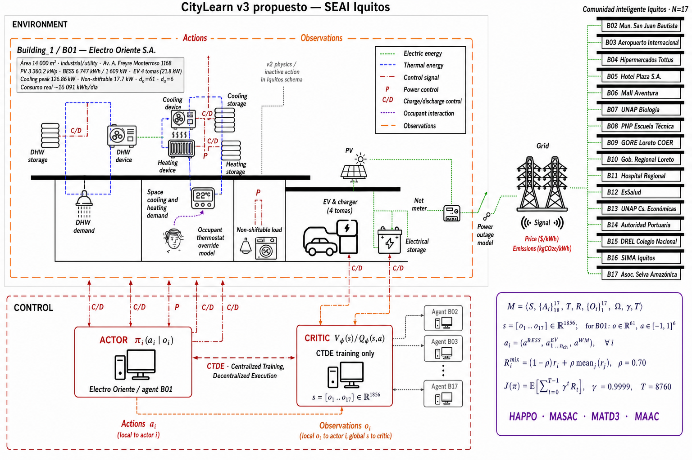

# Capítulo 2. Marco Teórico

> **Documento de tesis — borrador integral alineado para Perplexity.** Basado en la matriz bibliográfica de 50 antecedentes del Plan de Tesis UNI (organizada en Eje 1 flexibilidad, Eje 2 CO₂, Eje 3 costos y Eje transversal MADRL) y en las bases teóricas del proyecto (Dec-POMDP, CTDE, los cuatro algoritmos y sus backends reales en `external/`). Las referencias se resuelven en `Referencias_APA.md` / generadores Word sin inventar DOIs.

---

## ░░ PROMPT PARA PERPLEXITY (versión final) ░░

**Rol / Contexto:** Eres un investigador experto en MADRL y gestión energética de edificios. Pules el **Capítulo 2 (Marco teórico)** del informe doctoral UNI sobre MADRL + CityLearn v3 propuesto en el SEAI Iquitos (HAPPO/MASAC/MATD3/MAAC; ejes OE.1 flexibilidad, OE.2 CO₂, OE.3 costos).

**Objetivo del prompt:** Llevar el borrador a versión final académica en español con:
1. Estado del arte actualizado y crítico (no solo enumerativo): agrupar por ejes, contrastar métodos y resaltar la brecha que motiva la tesis.
2. **Citas APA** consistentes con `Referencias_APA.md` (sin inventar volumen/DOI).
3. Bases teóricas rigurosas: definiciones formales de Dec-POMDP y CTDE, descripción técnica precisa de HAPPO, MASAC, MATD3 y MAAC, **adecuaciones de cada backend al dominio eléctrico** (OE.1/OE.2/OE.3; wrappers del proyecto), e **integración teórica de la capa CityLearn v3 propuesto** (§2.2.5) tal como está implementada en `CityLearn/citylearn/v3/` (no afirmar que exista una CityLearn v3 oficial externa).
4. Cerrar con una **tabla de trabajos relacionados** y un párrafo explícito de *gap analysis*.

**Instrucciones específicas:** (a) verificar primeros autores reales de papers arXiv; (b) homogenizar nomenclatura (MARLlib ≠ MARL); (c) no eliminar las cifras de mejora reportadas por la literatura (~15-25 %); (d) mantener la distinción CityLearn v2 (oficial) vs CityLearn v3 propuesto (extensión experimental de tesis); (e) anclar la capa v3 a rutas reales del repositorio.

---

## 2.1 Estado del arte actualizado

La revisión sistemática del proyecto (Módulo A) comprende 50 investigaciones verificadas, organizadas en cuatro ejes alineados con los objetivos.

### 2.1.1 Eje 1 — Flexibilidad energética con MADRL

El entorno base proviene de la línea CityLearn: Vázquez-Canteli y Nagy (2019a) introducen CityLearn v1.0 como entorno OpenAI Gym para respuesta a la demanda multiedificio, mostrando que SAC supera al control basado en reglas con reducción de pico de ~20 %. Vázquez-Canteli et al. (2020) estandarizan los KPIs `peak_average`, `ramping_average` y `one_minus_load_factor_average`. Nweye et al. (2024) consolidan **CityLearn v2** integrando EV/V2G, intensidad de carbono dinámica, BESS, PV y confort, constituyendo la base tecnológica directa de CityLearn v3 propuesto. Nweye et al. (2022) identifican nueve desafíos del MARL en edificios *grid-interactive* (generalización, escalabilidad, observabilidad parcial, no-estacionariedad) que motivan la formulación Dec-POMDP. Los *CityLearn Challenges* (2020–2023) y los barrios de referencia del paquete (p. ej. Quebec, Alameda, Travis, Chittenden) forman el **ecosistema de benchmarking** de esa línea; en esta tesis se conservan en el árbol local del submódulo como contexto y reproducibilidad (Cap. 3 §3.4.6), mientras el contraste empírico propio se ejecuta sobre el SEAI Iquitos.

Aplicaciones de coordinación: Nweye et al. (2023a, MERLIN) demuestran MARL offline/transfer en **17 edificios reales**, escala equivalente al SEAI; Nweye et al. (2023b) aplican HAPPO en CityLearn a 17 edificios heterogéneos; Yao et al. (2023, LSD-MADDPG) obtienen reducciones de pico ~15 % y costo ~18 %; Xie et al. (2023) muestran que la atención en MARL supera a MADDPG en coordinación DR (~25 %); Hribar et al. (2025) mejoran la autonomía energética de distritos de energía positiva ~20 % frente a reglas.

### 2.1.2 Eje 2 — Reducción de emisiones de CO₂ con MADRL

Liu et al. (2022) aplican MADDPG en edificios PV+BESS logrando reducción de costos ~20 % y CO₂ ~15 %. Ye et al. (2025) y Ma et al. (2025) proponen MARL seguro con restricciones de carbono para redes de distribución y multi-microgrids. Sarkar et al. (2024) reducen la huella de carbono en centros de datos mediante desplazamiento temporal de carga hacia periodos de baja intensidad, técnica directamente transferible al OE.2 con el CI dinámico de Iquitos.

### 2.1.3 Eje 3 — Optimización de costos energéticos con MADRL

Yao et al. (2023) y Shojaeighadikolaei et al. (2022) reportan reducciones de costo ~18-22 % con esquemas cooperativos. Gao et al. (2023) validan **MASAC** multi-microgrid para programación colaborativa con respuesta a precios. Xiong et al. (2024) y Kim et al. (2025) aplican DRL/MARL con tarifas TOU directamente análogas a la estructura de Electro Oriente S.A. ($0.38 punta / $0.26 fuera de punta). Zhang et al. (2023) y Chen et al. (2024) abordan coordinación V2G jerárquica con restricciones SOC y degradación, pertinentes a los 185 cargadores del dataset Iquitos.

### 2.1.4 Brecha (gap analysis)

A pesar de la riqueza de antecedentes, **ningún trabajo compara HAPPO, MASAC, MATD3 y MAAC bajo condiciones idénticas** (mismo Dec-POMDP, mismo CTDE, misma función de recompensa multiobjetivo y mismo dataset) para los tres ejes simultáneamente. Además, los backends originales **no** fueron preparados ni entrenados ni aplicados *out-of-the-box* al dominio eléctrico de flexibilidad, CO₂ y costos (§2.2.4.1–2.2.4.4). La contribución central de la tesis es, por tanto, triple: (1) las **adecuaciones** de cada MADRL al problema energético SEAI; (2) la **capa CityLearn v3 propuesto** (§2.2.5) que formaliza e implementa ese contrato experimental sobre CityLearn v2; y (3) el **benchmark unificado** en el SEAI Iquitos (Caps. 4–5). `[Pendiente: añadir 2-3 referencias 2025-2026 de benchmarks comparativos de MADRL para reforzar la novedad.]`

---

## 2.2 Bases teóricas

### 2.2.1 Aprendizaje por refuerzo y multiagente

El RL se formaliza como un MDP ⟨S, A, T, R, γ⟩ (Sutton & Barto, 2018). SAC (Haarnoja et al., 2018) introduce maximización de entropía off-policy, base conceptual de MASAC y MAAC. En entornos multiagente, el aprendizaje independiente sufre **no-estacionariedad** porque la política de cada agente cambia el entorno percibido por los demás.

### 2.2.2 Dec-POMDP

El **Decentralized Partially Observable Markov Decision Process** (Oliehoek & Amato, 2016) modela la decisión cooperativa bajo observabilidad parcial como la tupla:

> **ℳ = ⟨𝒮, {𝒜ᵢ}ᵢ₌₁ᴺ, 𝒯, R, {𝒪ᵢ}ᵢ₌₁ᴺ, Ω, γ, T⟩**

donde 𝒮 es el estado global, 𝒜ᵢ las acciones locales, 𝒯 la transición, R la recompensa cooperativa común, 𝒪ᵢ las observaciones locales, Ω la función de observación, γ el descuento y T el horizonte.

**Instanciación estricta SEAI Iquitos** (`citylearn_iquitos_2023_2025`, `CityLearnEnv`, `central_agent=False`):

| Componente | Definición en el proyecto | Valor real |
|---|---|---|
| \(N=\|\mathcal{I}\|\) | Agentes = edificios institucionales/comerciales | **17** |
| \(\mathcal{S}\) | Estado CTDE = concatenación \(s=[o_1,\ldots,o_{17}]\) (`ctde_state="concatenated_local_observations"`) | \(d_s=\mathbf{1\,856}\) |
| \(\mathcal{O}_i\) | Observación local del edificio \(i\) (parcial; sin ver otros edificios) | \(d_{o_i}\in[\mathbf{54},\mathbf{327}]\) |
| \(\mathcal{A}_i\) | Acciones locales: BESS + EV por toma + lavadora | \(d_{a_i}\in[\mathbf{5},\mathbf{44}]\) |
| \(R\) | Recompensa cooperativa mixta (`CityLearnV3MADRLRewardFunction`) | \(r_{\mathrm{team}}=0{,}70\) |
| \(\gamma\) | Descuento en launchers oficiales | **0,9999** |
| \(T\) (horizonte) | Episodio anual horario | **8 760** pasos |

El **problema de formulación** que motiva Dec-POMDP (no un MDP centralizado ni 17 MDP independientes) es triple: (i) cada edificio solo observa \(o_i\) (observabilidad parcial); (ii) la calidad de la política conjunta depende del pico/rampa/emisiones/costo **distritales**, no solo del edificio; (iii) las tipologías DER son heterogéneas (\(d_{o_i}\) y \(d_{a_i}\) varían con el número de cargadores EV). La solución operativa es CTDE (§2.2.3): crítico con \(s\in\mathbb{R}^{1856}\) en entrenamiento; ejecución \(\pi_i(a_i\mid o_i)\) sin comunicación.

### 2.2.3 CTDE

El esquema **Centralized Training, Decentralized Execution** (Lowe et al., 2017) entrena un crítico centralizado con acceso al estado global s = [o₁,…,o₁₇], mientras cada actor πᵢ(aᵢ|oᵢ) ejecuta usando solo su observación local. Tras el entrenamiento, el crítico se descarta. Este esquema corrige la no-estacionariedad y es el paradigma común a los cuatro algoritmos evaluados.

La Figura 2.1 sintetiza la formalización teórica precedente: el entorno físico CityLearn v2 (edificio, DER, red y comunidad), la interfaz de control Actor–Crítico bajo CTDE y la tupla Dec-POMDP cooperativa instanciada en el SEAI Iquitos.

**Figura 2.1.** Control por edificio CityLearn v3 propuesto (simbología CityLearn v2): Electro Oriente S.A. (B01), comunidad inteligente Iquitos (B02–B17), red pública/SEAI, Actor–Crítico CTDE y formulación Dec-POMDP.

*Nota.* Adaptación de la Fig. 1 de CityLearn v2 (Nweye et al., 2024) a la capa CityLearn v3 propuesto de esta tesis. Se conserva la simbología oficial (energía eléctrica = línea verde punteada; energía térmica = azul discontinua; señal de control = rojo dash-dot con P/C/D; interacción del ocupante = morada punteada; observaciones = naranja long-dash). Building_1/B01 muestra datos reales de Electro Oriente S.A. (PV 3 360,2 kWp; BESS 6 747 kWh / 1 609 kW; 4 tomas EV; \(d_o=61\); \(d_a=6\)). La comunidad lista B02–B17 con etiquetas del dataset `citylearn_iquitos_2023_2025`. En CONTROL, el Actor \(\pi_i(a_i\mid o_i)\) ejecuta de forma descentralizada y el Crítico \(V/Q\) opera solo en entrenamiento CTDE con \(s=[o_1,\ldots,o_{17}]\in\mathbb{R}^{1856}\). Acciones MADRL activas: `electrical_storage`, `electric_vehicle_storage` y `washing_machine`; el bloque térmico v2 se mantiene como física (acciones cooling/heating/DHW inactivas en el schema Iquitos). Fuente: elaboración propia a partir de Nweye et al. (2024), Oliehoek y Amato (2016), Lowe et al. (2017) y artefactos del proyecto.

### 2.2.4 Los cuatro algoritmos MADRL

| Algoritmo | Tipo | Característica central | Crítico | Backend real del proyecto |
|---|---|---|---|---|
| **HAPPO** | On-policy | Actualización **secuencial** por agente con *trust region*; garantías de mejora monótona para agentes heterogéneos (Kuba et al., 2021; Zhong et al., 2023) | V(s) centralizado | `external/HARL` (PKU-MARL) |
| **MASAC** | Off-policy | SAC con regularización de entropía + mezcla cooperativa tipo **QMIX**; acciones discretizadas | Q-mix centralizado | `external/MARL/src` (puyuan1996) |
| **MATD3** | Off-policy | TD3 multiagente: **doble crítico** (anti-sobreestimación), *policy delay* y *target noise* | Par Q₁/Q₂ centralizado | `external/off-policy` (marlbenchmark) |
| **MAAC** | Off-policy | Actor-Attention-Critic: **atención multi-cabeza** que selecciona qué agentes observar (Iqbal & Sha, 2019) | Crítico con atención (SAC) | `external/MAAC` (shariqiqbal2810) |

- **HAPPO** (Heterogeneous-Agent PPO): primer MARL on-policy con garantías teóricas para heterogeneidad; supera a MAPPO/IPPO en ~85 % de tareas benchmark (Kuba et al., 2021).
- **MASAC**: combina la estabilidad de SAC con mezcla de valores QMIX; en este proyecto se discretiza la acción continua de CityLearn en `action_bins=3` con `discrete_action_mode=axis` para evitar el crecimiento cartesiano exponencial.
- **MATD3**: hereda de TD3 los dos críticos y el retardo de política; backend activo `external/off-policy` por compatibilidad con Python 3.9 (sustituye a `MATD3implementation`).
- **MAAC**: la atención permite coordinación selectiva entre los 17 agentes, relevante por la heterogeneidad de tipos de edificio.

#### 2.2.4.1 Premisa de adecuación: los originales no son “listos” para electricidad

Los cuatro backends se pinchan desde repositorios oficiales en `external/` (HARL, MARL/src, off-policy, MAAC). En su forma **original** fueron diseñados, validados y entrenados predominantemente en dominios de referencia multiagente (p. ej. entornos tipo SMAC/StarCraft, MPE u otros *benchmarks* de MARL), **no** como controladores de comunidad eléctrica con DER, EV/V2G y señales horarias de precio e intensidad de carbono. En consecuencia, **no** llegan preparados, ni entrenados, ni aplicados *out-of-the-box* al problema de esta tesis: **flexibilidad energética (OE.1), emisiones de CO₂ (OE.2) y costos económico-energéticos (OE.3)** sobre el SEAI Iquitos.

La contribución teórica de la tesis no consiste en reinventar HAPPO/MASAC/MATD3/MAAC, sino en **adecuarlos** —vía la capa CityLearn v3 propuesto (§2.2.5), el adaptador común `citylearn_v3_training_common.py` y wrappers tipados— a un Dec-POMDP cooperativo de 17 edificios heterogéneos, recompensa multiobjetivo unificada (`CityLearnV3MADRLRewardFunction`, perfil `unified_comparable_v4`) y evaluación con KPIs oficiales `evaluate_v2`. El Cap. 4 documenta la implementación; aquí se fija el **sustento teórico de cada adecuación**.

#### 2.2.4.2 Capa común de adecuación (los cuatro MADRL)

| Elemento de adecuación | Implementación en el proyecto | Rol frente a OE.1 / OE.2 / OE.3 |
|---|---|---|
| Contrato Dec-POMDP/CTDE | `CityLearn/citylearn/v3/`, `CityLearnV3BackendAdapter` | Observabilidad parcial por edificio; crítico con \(s\in\mathbb{R}^{1856}\) |
| Heterogeneidad \(d_{o_i},d_{a_i}\) | *Padding* / *policy mapping* a dims máximas; slice antes del `step` físico | Admite tipologías B01–B17 (54–327 obs; 5–44 act.) |
| Recompensa multiobjetivo | `CityLearnV3MADRLRewardFunction` + escenarios E1/E2/E3 | Escalariza flex/CO₂/costo (+ EV); \(r_{\mathrm{team}}=0{,}70\) |
| Dataset y física | `citylearn_iquitos_2023_2025` sobre CityLearn v2 | BESS, PV, 185 cargadores EV, TOU Electro Oriente, CI dinámico |
| Evaluación comparable | `evaluate_v2`, KPI-gains, `best_madrl` | Mide flexibilidad, CO₂ y costo frente a baseline RBC/v2 |
| Orquestación 4×3 | `train_citylearn_v3_{happo,masac,matd3,maac}.py` | 12 corridas bajo el mismo contrato experimental |

Sin esa capa, cada backend permanecería acoplado a su API de *benchmark* original y no podría optimizar simultáneamente los tres ejes eléctricos bajo condiciones idénticas.

#### 2.2.4.3 Adecuación por algoritmo (sustento en implementación)

**HAPPO → `CityLearnHARLEnv` + `external/HARL`.** El HAPPO original (Kuba et al., 2021; Zhong et al., 2023) aporta actualización secuencial con *trust region* para agentes heterogéneos, pero su stack HARL espera un `ShareVecEnv` con observaciones compartidas de juegos multiagente, no setpoints BESS/EV. La adecuación: (i) wrapper `CityLearnHARLEnv` exporta observación local continua y `share_observation_space` = estado CTDE repetido; (ii) acciones **continuas** en \([-1,1]^{d_{a_i}}\) (BESS + EV + lavadora) sin discretizar; (iii) recompensa mixta del perfil v4 sustituye la recompensa de *benchmark*; (iv) script `train_citylearn_v3_happo.py`. Teóricamente, HAPPO es el candidato on-policy a heterogeneidad tipológica del SEAI.

**MASAC → `CityLearnSMACDiscreteEnv` + `external/MARL/src`.** El MASAC/mSAC del backend asume API tipo **SMAC** (`get_obs`, `get_state`, acciones discretas, metadatos de “batalla”). CityLearn expone control continuo multidimensional. La adecuación: (i) adaptador SMAC-like con `get_state()` = \(s\) CTDE y `battle_won=False` (metadato inocuo); (ii) discretización `action_bins=3`, `discrete_action_mode=axis` (base un-eje + no-op; **no** producto cartesiano \(3^{d_{a_i}}\), inviable con \(d_{a_i}\) hasta 44); (iii) mezcla cooperativa tipo QMIX sobre la recompensa energética de equipo; (iv) `train_citylearn_v3_masac.py`. Teóricamente, MASAC aporta exploración entrópica off-policy sobre un espacio de acción energético tractable.

**MATD3 → `CityLearnOffPolicyVecEnv` + `external/off-policy`.** El repositorio autor (`external/MATD3implementation`, TF1/Python 3.6) **no** es el stack de entrenamiento: se adecúa vía backend PyTorch `marlbenchmark/off-policy` (clases `MATD3` / `R_MATD3`). La adecuación: (i) wrapper vectorizado de un hilo compatible con el *runner* off-policy; (ii) acciones **continuas** (doble crítico, *policy delay*, *target noise* sobre actuadores BESS/EV); (iii) `policy_mapping_fn` y *padding* para 17 políticas heterogéneas; (iv) `train_citylearn_v3_matd3.py`. Teóricamente, MATD3 es el candidato determinístico off-policy a control continuo distrital.

**MAAC → `CityLearnMAACVecEnv` + `external/MAAC`.** MAAC (Iqbal & Sha, 2019) introduce atención multi-cabeza en el crítico, pensada para dominios donde la relevancia entre agentes cambia; no trae de fábrica recompensa de pico/rampa/CO₂/TOU. La adecuación: (i) wrapper que expone observaciones por agente al mecanismo de atención; (ii) misma discretización eje-wise que MASAC (`bins=3`); (iii) atención sobre los 17 edificios heterogéneos bajo recompensa v4; (iv) `train_citylearn_v3_maac.py`. Teóricamente, MAAC operacionaliza coordinación **selectiva** (p. ej. hospital vs mall vs campus) sin comunicación en ejecución.

#### 2.2.4.4 Lectura hacia el problema de tesis

| Algoritmo original (dominio típico) | Adecuación clave en este proyecto | Capacidad resultante para OE.1–OE.3 |
|---|---|---|
| HAPPO / HARL (MARL heterogéneo genérico) | `CityLearnHARLEnv`; acción continua; CTDE share-obs | On-policy cooperativo sobre DER/EV heterogéneos |
| MASAC / SMAC-like | `CityLearnSMACDiscreteEnv`; bins=3 axis; Q-mix energético | Off-policy entrópico sobre control eléctrico discretizado |
| MATD3 (paper TF1 → off-policy PyTorch) | `CityLearnOffPolicyVecEnv`; backend `external/off-policy` | Off-policy determinístico continuo BESS/EV |
| MAAC (atención multiagente genérica) | `CityLearnMAACVecEnv`; atención + bins=3 | Coordinación atencional bajo flex/CO₂/costo |

En síntesis: los cuatro MADRL **originales** no resuelven por sí solos el problema eléctrico multiobjetivo; las **adecuaciones** del proyecto (wrappers + Dec-POMDP/CTDE + recompensa `unified_comparable_v4` + dataset Iquitos + `evaluate_v2`) son la condición de posibilidad teórica y operativa del cuasiexperimento 4×3 (Caps. 3–5).

### 2.2.5 CityLearn v3 propuesto — capa experimental MADRL (formalización teórica)

Esta sección integra en el marco teórico la **capa CityLearn v3 propuesto** exactamente como la documentan los skills del proyecto (`agent-skills/madrl-citylearn-thesis-plan` Módulo D; `agent-skills/madrl-citylearn-thesis-integrated`; `CityLearn/CITYLEARN_V3_MADRL.md`) y la arquitectura operativa (`docs/architecture/ARQUITECTURA_Y_FLUJO_TRABAJO_CITYLEARN_V3_MADRL.md`). **No** se afirma que exista una CityLearn v3 oficial fuera de esta tesis: v3 es la extensión experimental que conserva CityLearn v2 como verdad física y de KPIs (`evaluate_v2`).

#### Propósito teórico de la capa

CityLearn v2 (Nweye et al., 2024) provee el simulador multiedificio, DER, EV y la superficie de KPIs. La capa v3 aporta el **contrato científico** que permite: (i) formular la comunidad como Dec-POMDP cooperativo; (ii) entrenar bajo CTDE; (iii) conectar backends MADRL oficiales en `external/` sin reinventar algoritmos; (iv) escalarizar tres ejes (OE.1/OE.2/OE.3) con una recompensa multiobjetivo comparable; (v) conservar la evaluación v2. El Cap. 4 implementa este contrato; el Cap. 5 reporta los resultados de las 12 corridas canónicas.

#### Anclaje a módulos reales (`CityLearn/citylearn/v3/`)

| Módulo / clase | Ruta | Función teórica |
|---|---|---|
| Entorno v3 / fábrica Dec-POMDP | `v3/environment.py`, `make_citylearn_v3_*` | Instancia el juego parcialmente observable sobre cualquier schema CityLearn v2 |
| Objetivos OE.1–OE.3 | `v3/objectives.py` | Define ejes, KPIs y métrica de proyecto por escenario |
| Configuración | `v3/config.py` | Parámetros de escenario, CTDE y perfiles de recompensa |
| Backends / adaptadores | `v3/backends.py`, wrappers en `citylearn_v3_training_common.py` | Puente tipado hacia HAPPO/MASAC/MATD3/MAAC |
| Referencia MARLlib | `v3/marllib_env.py`, `external/MARLlib` | Compatibilidad/framework de referencia (Hu et al., 2023); **no** sustituye el launcher oficial de 12 corridas |
| Recompensa cooperativa | `CityLearnV3MADRLRewardFunction` en `reward_function.py` | Escalarización flex/CO₂/costo/EV con perfil `unified_comparable_v4` |

Wrappers por algoritmo (Cap. 4 §4.5): `CityLearnHARLEnv` (HAPPO), `CityLearnSMACDiscreteEnv` (MASAC), `CityLearnOffPolicyVecEnv` (MATD3), `CityLearnMAACVecEnv` (MAAC).

#### Sustento UC3M (7 ejes) frente a la capa v3 ejecutada (3 ejes)

El sustento formal `agent-skills/madrl-sustento-doc-capa v3/madrl-modeladomatematico.md` y el paquete `uc3m/` definen un **meta-Dec-POMDP** con operador holístico de **siete** ejes (CO₂, costo, flexibilidad, confort térmico, degradación BESS, resiliencia, ACS) y métricas HPHI/BACT. Ese material se axiomatiza en §§2.2.6–2.2.9 como **sustento teórico-arquitectural**.

La capa CityLearn v3 **ejecutada** en las 12 corridas canónicas operacionaliza **solo tres ejes** (OE.1/OE.2/OE.3) vía `CityLearnV3MADRLRewardFunction` / `v3/objectives.py`. Mapeo explícito: ejes UC3M 1–3 ↔ OE.2/OE.3/OE.1; ejes UC3M 4–7 (confort, degradación, resiliencia, ACS) **no** son resultados empíricos de esta tesis. Cap. 4 implementa el contrato de 3 ejes; Cap. 5 reporta evidencia solo sobre OE.1–OE.3.

#### Formalización Dec-POMDP en la capa v3 — distrito vs edificio

La capa materializa la tupla §2.2.2 sobre el dataset Iquitos (`citylearn_iquitos_2023_2025`). **No existe un agente-distrito** que emita setpoints: el control distrital es **emergente** de 17 políticas locales bajo recompensa mixta y crítico CTDE.

**Nivel edificio (agente \(i\))** — decisión descentralizada:

- Observación \(o_i\in\mathbb{R}^{d_{o_i}}\): calendario, meteo, carga no desplazable, térmica, PV, SoC BESS, señales de precio/CI, y **7 canales EV por cargador** (conexión, capacidad, salida, SoC requerido, SoC, llegada estimada, estado entrante).
- Acción \(a_i\in\mathbb{R}^{d_{a_i}}\): `electrical_storage` (BESS) + `electric_vehicle_storage` × \(n_i^{\mathrm{ch}}\) + `washing_machine` ⇒ \(d_{a_i}=2+n_i^{\mathrm{ch}}\) (rango real **5–44**).
- Política \(\pi_i(a_i\mid o_i)\); en ejecución **no** ve \(o_j\) ni el estado distrital concatenado.

**Nivel distrito (comunidad SEAI / critic CTDE)** — coordinación en entrenamiento y evaluación:

- Estado global \(s=[o_1,\ldots,o_{17}]\in\mathbb{R}^{1856}\) (suma exacta de \(d_{o_i}\) medidas en `CityLearnEnv`; `citylearn/dec_pomdp.py`).
- Agregados físicos usados por recompensa/KPIs: \(P^{\mathrm{com}}(t)=\sum_i P_i^{\mathrm{net}}(t)\), pico y rampa distritales, emisiones y costo agregados (`evaluate_v2`).
- \(\mathrm{team\_reward}=\mathrm{mean}(\mathrm{reward}_i)\); \(\mathrm{mixed\_reward}_i=(1-r_{\mathrm{team}})\cdot\mathrm{reward}_i+r_{\mathrm{team}}\cdot\mathrm{team\_reward}\) con \(r_{\mathrm{team}}=0{,}70\) (`unified_comparable_v4`).
- \(\gamma=0{,}9999\), \(T=8\,760\) (Colab canónica 50 episodios).

**Tabla 2.A — Dimensiones Dec-POMDP reales por edificio** (schema Iquitos + `CityLearnEnv`; tipología/DER alineados a Cap. 3 §3.4.2):

| ID | Edificio | Carg. EV \(n_i^{\mathrm{ch}}\) | \(d_{o_i}\) | \(d_{a_i}\) |
|---|---|---:|---:|---:|
| B01 | Electro Oriente S.A. | 4 | 61 | 6 |
| B02 | Munic. San Juan Bautista | 6 | 75 | 8 |
| B03 | Aeropuerto Internacional | 8 | 89 | 10 |
| B04 | Hipermercados Tottus | 6 | 75 | 8 |
| B05 | Hotel Plaza S.A. | 3 | 54 | 5 |
| B06 | Mall Aventura | 32 | 257 | 34 |
| B07 | UNAP Biología | 42 | 327 | 44 |
| B08 | PNP Escuela Técnica | 17 | 152 | 19 |
| B09 | GORE Loreto COER | 10 | 103 | 12 |
| B10 | Gobierno Regional Loreto | 6 | 75 | 8 |
| B11 | Hospital Regional | 3 | 54 | 5 |
| B12 | EsSalud | 3 | 54 | 5 |
| B13 | UNAP Cs. Económicas | 11 | 110 | 13 |
| B14 | Autoridad Portuaria | 4 | 61 | 6 |
| B15 | DREL Colegio Nacional | 8 | 89 | 10 |
| B16 | SIMA Iquitos | 11 | 110 | 13 |
| B17 | Asoc. Civil Selva Amazónica | 11 | 110 | 13 |
| **Distrito** | \(\sum_i d_{o_i}=d_s\) · \(\sum n_i^{\mathrm{ch}}\) | **185** | **1 856** | **219** |

La operacionalización por escenario (pesos flex/carbon/cost E1/E2/E3) pertenece al diseño metodológico (Cap. 3–4); la **teoría multiobjetivo** (Roijers et al., 2013; Felten et al., 2024) justifica políticas separadas bajo esos vectores sin cambiar la física v2 ni la tupla Dec-POMDP.

#### Lectura hacia Cap. 4 y Cap. 5

| Concepto teórico (Cap. 2) | Desarrollo (Cap. 4) | Evidencia empírica (Cap. 5) |
|---|---|---|
| Dec-POMDP / CTDE | §§4.3–4.5 | Cobertura 12 jobs; HAPPO KPI-gains evaluate_v2 4/4 |
| Capa v3 (3 ejes) + UC3M (7 ejes, sustento) | §§4.1, 4.3–4.4 | §§5.1–5.2 (OE→E); sin HPHI 7-D ejecutado |
| Cuatro backends MADRL | §§4.5–4.6, pasos 8–9 | §§5.3–5.5 por OE; ranking `best_madrl` 3×3 + 4/4 |
| Evaluación v2 + multi-semilla (diseño) | §§4.7–4.8, pasos 10–13 | §5.2 Shapiro→no paramétrico; smoke n=3; campaña seed=0 |

### 2.2.6 Formalización matemática del Meta-Dec-POMDP UC3M

Fuente: `agent-skills/madrl-sustento-doc-capa v3/madrl-modeladomatematico.md` (adaptado a numeración Cap. 2). El framework **Universal CityLearn v3 Modified (UC3M)** formaliza un meta-Dec-POMDP cooperativo multiobjetivo sobre el motor físico CityLearn v2/v3 y la fachada `uc3m/`. En esta tesis, la axiomatización 7-D es **sustento**; la evidencia empírica operacionaliza el subvector de tres ejes OE.1–OE.3 (§2.2.5).

#### 2.2.6.1 Tupla universal generalizada

Sea $\mathbb{B}$ el conjunto de edificaciones admisibles y $\mathcal{C}\subset\mathbb{B}$ una comunidad finita con $|\mathcal{C}|=N\in\mathbb{N}^+$. El **Meta-Dec-POMDP UC3M** es la tupla 11-aria

$$
\mathcal{M}_{\mathrm{UC3M}}=\langle\mathcal{I},\mathcal{S},\mathcal{A},\mathcal{O},\mathcal{T},\mathcal{R},\mathcal{Z},\gamma,H,b_0,\boldsymbol{\Lambda}\rangle
$$

siguiendo y extendiendo Oliehoek y Amato (2016):

- $\mathcal{I}=\{1,\ldots,N\}$ — agentes-edificio (Iquitos: $N=17$);
- $\mathcal{S}\subset\mathbb{R}^{d_s}$ — estado global CTDE; en Iquitos $d_s=1\,856=\sum_i d_{o_i}$ (oculto en ejecución);
- $\mathcal{A}=\prod_{i\in\mathcal{I}}\mathcal{A}_i$ — acciones conjuntas, $\mathcal{A}_i\subset[-1,1]^{d_{a_i}}$ con $d_{a_i}=2+n_i^{\mathrm{ch}}\in[5,44]$;
- $\mathcal{O}=\prod_{i\in\mathcal{I}}\mathcal{O}_i$ — observaciones parciales, $d_{o_i}\in[54,327]$;
- $\mathcal{T}:\mathcal{S}\times\mathcal{A}\to\Delta(\mathcal{S})$ — núcleo de transición (física CityLearn v2);
- $\mathcal{R}=(r^{(1)},\ldots,r^{(7)})$ — vector de recompensas por eje (sustento 7-D);
- $\mathcal{Z}:\mathcal{S}\times\mathcal{A}\to\Delta(\mathcal{O})$ — emisión de observaciones (parcial por edificio);
- $\gamma\in[0,1)$ — descuento (corridas canónicas: $\gamma=0{,}9999$);
- $H\in\mathbb{N}^+$ — horizonte ($H=8\,760$ h/año);
- $b_0\in\Delta(\mathcal{S})$ — distribución inicial (reset del schema Iquitos);
- $\boldsymbol{\Lambda}=(\lambda_1,\ldots,\lambda_7)\in\Delta^{6}$ — simplex de ponderaciones.

La novedad respecto al Dec-POMDP escalar (Bernstein et al., 2002; Oliehoek y Amato, 2016) es reemplazar $R$ por el vector $\mathcal{R}$ y añadir $\boldsymbol{\Lambda}$, transformando el problema en un **MO-Dec-POMDP** cooperativo. En ejecución, el perfil `unified_comparable_v4` restringe $\boldsymbol{\Lambda}$ al subsimplex de tres ejes (OE.1/OE.2/OE.3) con $r_{\mathrm{team}}=0{,}70$.

#### 2.2.6.2 Building-Asset-Climate Tensor (BACT)

**Definición 2.1 (BACT).** Para $N$ edificios,

$$
\mathcal{B}\in\mathbb{R}^{N\times K_a\times K_c\times K_b},
$$

donde $K_a$ indexa tipos de activos (PV, BESS, EV, HP, ACS, …), $K_c$ el descriptor climático del sitio y $K_b$ el descriptor constructivo. Implementación: `uc3m/env/bact.py`. El BACT es el descriptor que permite tipologías y climas heterogéneos bajo la misma tupla $\mathcal{M}_{\mathrm{UC3M}}$.

#### 2.2.6.3 Observaciones y acciones (valores reales Iquitos)

Cada agente \(i\) recibe en \(t\) el vector parcial estructurado por bloques del `schema.json` activo (41 claves base; las 7 de EV se replican por cargador):

$$
o_{i,t}=\big(o_{i,t}^{\mathrm{cal}},o_{i,t}^{\mathrm{met}},o_{i,t}^{\mathrm{ld}},o_{i,t}^{\mathrm{th}},o_{i,t}^{\mathrm{gen}},o_{i,t}^{\mathrm{stor}},o_{i,t}^{\mathrm{ev}}(n_i^{\mathrm{ch}}),o_{i,t}^{\mathrm{tar}},o_{i,t}^{\mathrm{emi}}\big)\in\mathbb{R}^{d_{o_i}},
$$

con \(d_{o_i}\in\{54,\ldots,327\}\) y \(\sum_{i=1}^{17}d_{o_i}=1\,856=d_s\) (medido en `CityLearnEnv`). Bloques: calendario (`month`, `day_type`, `hour`); meteorología y predicciones; carga no desplazable; térmica interior/setpoint; generación PV; SoC/acción BESS; **por cada cargador** estado de conexión, capacidad, salida, SoC requerido, SoC, llegada estimada e incoming; tarifa eléctrica; intensidad de carbono.

Las acciones del schema ejecutado son exactamente tres familias:

$$
a_{i,t}=\big(a_i^{\mathrm{BESS}}(t),\,a_{i,1}^{\mathrm{EV}}(t),\ldots,a_{i,n_i^{\mathrm{ch}}}^{\mathrm{EV}}(t),\,a_i^{\mathrm{WM}}(t)\big)\in[-1,1]^{d_{a_i}},\quad d_{a_i}=2+n_i^{\mathrm{ch}}\in[5,44].
$$

No se usan en las 12 corridas acciones de HP/EH/ACS como grados de libertad del agente (quedan en el sustento UC3M genérico §2.2.8). La heterogeneidad \(d_{o_i},d_{a_i}\) se gestiona por *policy mapping* / padding en wrappers Cap. 4; el crítico CTDE siempre ve \(s\in\mathbb{R}^{1856}\). Desglose edificio a edificio: Tabla 2.A (§2.2.5).

#### 2.2.6.4 Compacidad, medibilidad y núcleo factorizado

**Proposición 2.1.** $\mathcal{S}$ es compacto en $\mathbb{R}^{d_s}$ porque cada componente está físicamente acotada (temperaturas, SoC $\in[0,1]$, radiaciones, precios y factores de emisión).

**Lema 2.2.** Si cada $r^{(k)}$ es continua, la recompensa escalarizada $R=-\sum_k\lambda_k r^{(k)}$ es Borel-medible y acotada.

El núcleo se factoriza en componente exógena (clima/red) y endógena por edificio:

$$
\mathcal{T}(s'\mid s,\mathbf{a})=P_{\mathrm{ex}}(s'_{\mathrm{clim}},s'_{\mathrm{grid}}\mid s_{\mathrm{clim}},s_{\mathrm{grid}})\prod_{i=1}^{N}P_i^{\mathrm{loc}}(s_i^{\prime\mathrm{loc}}\mid s_i^{\mathrm{loc}},a_i,s'_{\mathrm{clim}}).
$$

### 2.2.7 Operador de recompensa holístico, Pareto y convergencia

#### 2.2.7.1 Operador holístico escalarizado

**Definición 2.2.** Para cada agente $i$,

$$
R_i(s,\mathbf{a})=-\sum_{k=1}^{7}\lambda_k\,\tilde r_i^{(k)}(s,\mathbf{a}),\quad\lambda_k\geq 0,\quad\sum_{k=1}^{7}\lambda_k=1,
$$

con normalización a la base RBC $\tilde r_i^{(k)}=r_i^{(k)}/r_i^{(k),\mathrm{base}}$.

**Teorema 2.3 (Consistencia).** Si cada $r^{(k)}_i$ es acotada y medible, el valor descontado $V_\pi(s_0)$ existe, es finito y $|V_\pi|\leq M/(1-\gamma)$.

**Proposición 2.4 (Lipschitz).** Si cada $r^{(k)}$ es $L_k$-Lipschitz, entonces $R$ es $L$-Lipschitz con $L=\sum_k\lambda_k L_k$.

En las 12 corridas, el operador se instancia como `CityLearnV3MADRLRewardFunction` sobre $k\in\{\mathrm{flex},\mathrm{carbon},\mathrm{cost}\}$ (más término EV), no sobre el simplex 7-D completo.

#### 2.2.7.2 Frontera de Pareto y HPHI

El problema multiobjetivo es $\min_{\pi}\mathbf{J}(\pi)=(J_1(\pi),\ldots,J_7(\pi))$. **Definición 2.3 (Pareto):** $\pi^\star\preceq_P\pi'$ si $J_k(\pi^\star)\leq J_k(\pi')$ $\forall k$ con al menos una desigualdad estricta.

**Teorema 2.5 (Existencia).** Si $\Pi$ es compacto y las $J_k$ continuas, $\mathbf{J}(\mathcal{P})\neq\emptyset$. La escalarización lineal barre la envolvente convexa al variar $\boldsymbol\lambda$ (Roijers et al., 2013).

**Definición 2.4 (HPHI).** Sea $\mathcal{F}$ una aproximación empírica de la frontera y $\mathbf{z}^{\mathrm{nadir}}$, $\mathbf{z}^{\mathrm{ideal}}$ los puntos nadir e ideal:

$$
\mathrm{HPHI}(\mathcal{F})=\frac{\mathrm{HV}(\mathcal{F};\mathbf{z}^{\mathrm{nadir}})}{\prod_{k=1}^{7}(z_k^{\mathrm{nadir}}-z_k^{\mathrm{ideal}})}\in[0,1].
$$

Implementación de referencia: `uc3m/reward/hphi.py`. **Esta tesis no ejecuta HPHI 7-D** en Cap. 5; la frontera empírica reportada es la de tres ejes OE (TOPSIS / ranking `best_madrl`).

#### 2.2.7.3 Equilibrios de Nash y no-estacionariedad CTDE

En régimen cooperativo ($R_i\equiv R$), una política conjunta $\boldsymbol\pi^\star$ es equilibrio de Nash si $V_i(\boldsymbol\pi^\star)\geq V_i(\pi_i,\boldsymbol\pi_{-i}^\star)$ $\forall\pi_i$. Bajo las hipótesis de Zhong et al. (2023) y el *Multi-Agent Advantage Decomposition* (Kuba et al., 2022), HAPPO/HATRPO garantizan mejora monótona del valor conjunto.

**Proposición 2.6 (Mitigación CTDE).** Condicionar el crítico sobre $(s,\mathbf{a})$ elimina la no-estacionariedad desde la perspectiva del optimizador (Lowe et al., 2017). Condiciones suficientes genéricas: tasas Robbins–Monro, replay/rollout adecuados, regularización entrópica (MASAC) o trust region (HAPPO), suavizado de política objetivo (MATD3) y atención selectiva (MAAC).

### 2.2.8 Modelado físico-matemático de los ejes operacionales

Los siete ejes del sustento UC3M se resumen a continuación. Solo los tres primeros se operacionalizan empíricamente (mapeo OE).

#### 2.2.8.1 Ejes ejecutados (OE.2 / OE.3 / OE.1)

**Eje UC3M-1 / OE.2 — CO₂.** Balance de emisiones:

$$
\dot E_{\mathrm{CO}_2}^{(i)}(t)=\xi_t^{\mathrm{marg}}\max(0,P_i^{\mathrm{net}}(t))-\xi_t^{\mathrm{disp}}\max(0,-P_i^{\mathrm{net}}(t))-\xi^{\mathrm{ff}}E_i^{\mathrm{ev,disp}}(t),
$$

con $P_i^{\mathrm{net}}$ del balance de Kirchhoff del edificio. En Iquitos, $\xi_t$ proviene del modelo de intensidad de carbono del dataset SEAI.

**Eje UC3M-2 / OE.3 — Costo.**

$$
\dot C^{(i)}(t)=p_t^{\mathrm{imp}}\max(0,P_i^{\mathrm{net}}(t))-p_t^{\mathrm{exp}}\max(0,-P_i^{\mathrm{net}}(t))+p^{\mathrm{pot}}\max_t P_i^{\mathrm{net}},
$$

alineado a tarifas TOU Electro Oriente ($0{,}38$ punta / $0{,}26$ fuera de punta).

**Eje UC3M-3 / OE.1 — Flexibilidad.** Con $P^{\mathrm{com}}(t)=\sum_i P_i^{\mathrm{net}}(t)$,

$$
r^{(3)}(t)=\beta_1\big(P^{\mathrm{com}}(t)-P^{\mathrm{com}}(t-1)\big)^2+\beta_2\max\big(0,P^{\mathrm{com}}(t)-P^{\mathrm{lim}}_{\mathrm{DSO}}\big)^2.
$$

KPIs CityLearn: `peak_average`, `ramping_average`, `one_minus_load_factor_average`, PAR, DPR.

#### 2.2.8.2 Ejes de sustento (no ejecutados empíricamente)

| Eje UC3M | Contenido formal | Estado en esta tesis |
|---|---|---|
| 4 — Confort | Penalización cuadrática fuera de banda; modelo adaptativo De Dear–Brager para climas tropicales | Sustento; no KPI Cap. 5 |
| 5 — Degradación BESS | Arrhenius–SEI calendaria + Peukert cíclica; SoH | Parcialmente en física v2/fork; no eje de reward de las 12 corridas |
| 6 — Resiliencia | Déficit de potencia crítica en isla; CCI, LOLP | Sustento (módulo outage CityLearn v2 disponible, no barrido Cap. 5) |
| 7 — ACS | Balance térmico del tanque + pérdidas $UA$; anti-Legionella | Sustento |

Balance de potencia (todos los ejes):

$$
P_i^{\mathrm{net}}(t)=P_i^{\mathrm{load,fix}}+P_i^{\mathrm{HP}}+P_i^{\mathrm{EH}}+P_i^{\mathrm{BESS}}+P_i^{\mathrm{EV}}-P_i^{\mathrm{PV}}-P_i^{\mathrm{wind}}.
$$

### 2.2.9 Arquitectura MARLlib-CTDE y universalidad algorítmica (sustento)

**MARLlib** (Hu et al., 2023) provee wrapper Gymnasium/PettingZoo, implementación a nivel de agente y *policy mapping*. El UC3M define un **plugin algorítmico** $\mathcal{P}=\langle\Theta,\Phi,\mathcal{L}_{\mathrm{actor}},\mathcal{L}_{\mathrm{critic}},\mathcal{U}_{\mathrm{step}},\mathcal{B}\rangle$ y afirma universalidad vía `AlgorithmFactory` (`uc3m/`).

En CTDE:

$$
\pi_i(a_i\mid o_i;\theta_i):\mathcal{O}_i\to\Delta(\mathcal{A}_i),\qquad
Q^{\mathrm{centr}}(s,a_1,\ldots,a_N;\phi)\approx\mathbb{E}\!\left[\sum_t\gamma^t R(s_t,\mathbf{a}_t)\mid s,\mathbf{a}\right].
$$

Los cuatro algoritmos de esta tesis (§2.2.4) son instancias concretas de ese contrato: HAPPO (ventaja secuencial), MASAC (entropía + mezcla), MATD3 (doble crítico + *target smoothing*), MAAC (atención multi-cabeza). El launcher oficial de las 12 corridas **no** pasa por MARLlib/`UC3MEnv`, sino por wrappers en `CityLearn/scripts/` + backends `external/`; UC3M/MARLlib permanecen como fachada de diseño y referencia teórica.

### 2.2.10 Herramientas de soporte teórico

- **MARLlib** (Hu et al., 2023): biblioteca unificada de >20 algoritmos MARL; referencia técnica de integración (no es el launcher oficial de las 12 corridas).
- **Optuna** (Akiba et al., 2019): HPO basado en TPE; previsto como mejora experimental posterior (trabajo futuro).
- **CityLearn v2** (Nweye et al., 2024): simulador base y KPIs oficiales.
- **CityLearn v3 propuesto** (§2.2.5): extensión experimental Dec-POMDP/CTDE/recompensa multiobjetivo sobre v2.
- **UC3M** (`uc3m/`, §§2.2.6–2.2.9): meta-Dec-POMDP, BACT, HPHI y ejes 1–7 como sustento; validado por `tests/uc3m/`.

### 2.2.11 Bases teóricas de los ejes ejecutados (OE.1–OE.3)

- **Flexibilidad (OE.1 / UC3M-3):** capacidad de modificar la curva de demanda vía desplazamiento de cargas, BESS, autoconsumo PV y carga/descarga EV. KPIs: `peak_average`, `ramping_average`, `one_minus_load_factor_average`, autoconsumo, autosuficiencia.
- **CO₂ (OE.2 / UC3M-1):** intensidad de carbono variable según mezcla horaria; KPIs de emisiones totales, emisiones de control vs baseline y delta.
- **Costos (OE.3 / UC3M-2):** tarifas TOU/RTP; KPIs de costo total, costo de control vs baseline y desviación frente a la señal de precio.

---

## 2.3 Trabajos relacionados (síntesis)

| Trabajo | Método | Entorno/Escala | Eje principal | Mejora reportada |
|---|---|---|---|---|
| Vázquez-Canteli & Nagy (2019a) | SAC | CityLearn v1, multiedificio | Flexibilidad | ~20 % pico |
| Nweye et al. (2023a) MERLIN | MARL offline/transfer | 17 edificios reales | Flex/ocupante | Viabilidad a escala |
| Nweye et al. (2023b) | HAPPO | CityLearn, 17 edif. heterog. | Flexibilidad | Primer HAPPO en CityLearn |
| Yao et al. (2023) | LSD-MADDPG | Comunidad PV+BESS+EV | Flex/Costo | ~15 % pico, ~18 % costo |
| Xie et al. (2023) | Attention MARL | Edificios DR | Flexibilidad | ~25 % vs MADDPG |
| Liu et al. (2022) | MADDPG | Edificios PV+BESS | CO₂/Costo | ~15 % CO₂, ~20 % costo |
| Gao et al. (2023) | MASAC | Multi-microgrid | Costo | Programación colaborativa |
| Hribar et al. (2025) | MADRL | Distritos energía positiva | CO₂/Autonomía | ~20 % |
| **Esta tesis** | **HAPPO/MASAC/MATD3/MAAC** | **CityLearn v3, 17 edif. SEAI Iquitos** | **Flex+CO₂+Costo (3 ejes)** | **Comparación unificada (Cap. 5)** |

---

### Estado del capítulo
**Completo** con **adecuaciones de HAPPO/MASAC/MATD3/MAAC** al dominio eléctrico (§§2.2.4.1–2.2.4.4: originales no listos para flex/CO₂/costo; wrappers y contrato v3), capa CityLearn v3 propuesto (§2.2.5), **tupla Dec-POMDP instanciada con valores reales SEAI** (§2.2.2 + Tabla 2.A: \(d_s=1\,856\), \(d_{o_i}\in[54,327]\), \(d_{a_i}\in[5,44]\), jerarquía distrito/edificio) y axiomatización UC3M en §§2.2.6–2.2.9 (Meta-Dec-POMDP, operador holístico/Pareto/HPHI, ejes físicos, MARLlib-CTDE), con distinción explícita 7 ejes (sustento) vs 3 ejes ejecutados (§§2.2.10–2.2.11). Referencias resueltas en generadores Word sin marcadores pendientes.
