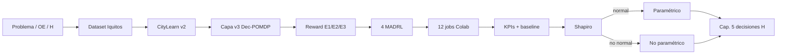

# Capítulo 4. Desarrollo de la Propuesta

> **Documento de tesis doctoral — desarrollo de la propuesta.** Traza el flujo de trabajo completo del proyecto `MADRLCitytleranflexresdr` desde el dataset Iquitos hasta la batería de pruebas paramétricas/no paramétricas. Fuentes: `docs/architecture/ARQUITECTURA_Y_FLUJO_TRABAJO_CITYLEARN_V3_MADRL.md`, `docs/architecture/FLUJO_OPERATIVO_ACTUAL_CITYLEARN_V3_MADRL.md`, `docs/workflow_manifest.json`, `CityLearn/citylearn/v3/`, `reward_function.py`, scripts `train_citylearn_v3_*.py`, `scripts/run_madrl_nonparametric_battery.py` y artefactos de la corrida canónica `madrl_v3_20260627_164047`. **No inventar datos.**

---

## 4.1 Visión del flujo de trabajo (de cero a evidencia)

La propuesta se implementa como un pipeline reproducible de trece etapas. Cada etapa deja artefactos verificables; el Capítulo 5 consume únicamente salidas de las etapas 10–13.

| Paso | Etapa del flujo | Archivo / ruta canónica | Resultado esperado |
|---:|---|---|---|
| 1 | Problema, OG/OE e hipótesis | Cap. 1; Plan de tesis | OE.1–OE.3 y H0G/H1G, HE10/HE11, HE20/HE21, HE30/HE31 formulados |
| 2 | Dataset oficial Iquitos | `CityLearn/data/datasets/citylearn_iquitos_2023_2025/` | 17 edificios, 26 304 h, DER/EV |
| 3 | Gate de calidad del dataset | `tools/dataset/generate_iquitos_dataset.py`, auditorías | 222 CSV sin NaN/Inf |
| 4 | Simulador CityLearn v2 | `CityLearn/citylearn/` | Física BESS/PV/EV + KPIs v2 |
| 5 | Capa CityLearn v3 | `CityLearn/citylearn/v3/` | Dec-POMDP, objetivos, config |
| 6 | Recompensa multiobjetivo | `CityLearnV3MADRLRewardFunction` | Pesos por escenario E1/E2/E3 |
| 7 | Adaptador CTDE común | `citylearn_v3_training_common.py` | Wrappers, trazas, figuras |
| 8 | Cuatro backends MADRL | `train_citylearn_v3_{happo,masac,matd3,maac}.py` | HAPPO, MASAC, MATD3, MAAC |
| 9 | Lanzamiento 12 corridas | `launch_citylearn_v3_official_training.ps1` (canónico local) + Colab `two_phase_happo_masac_v3`; `*_iquitos_training.ps1` retenido como legado | 4 algoritmos × 3 escenarios |
| 10 | Artefactos por job | `results.json`, `timeseries.csv`, `trace.csv`, KPIs | Evidencia primaria de entrenamiento |
| 11 | Benchmark CityLearn v2 | `benchmark_citylearn_v2_agents.py` | Baseline y hour_rBC |
| 12 | Comparación v2 vs v3 | `compare_citylearn_v2_vs_v3_madrl.py` | Deltas, ranking, `best_madrl_report.json` |
| — | Framework UC3M (`uc3m/`) | Sustento 7 ejes + `EmpiricalProtocol` (n_seeds=12); **no** canal de las 12 corridas | Diseño / tests / batería no paramétrica |
| 13 | Pruebas estadísticas | `run_madrl_nonparametric_battery.py`; carpeta `estadistica/` | Shapiro → no paramétrico → decisión de hipótesis |

### 4.1.1 Mapa de contribución por carpetas (propio vs externo)

La narrativa de implementación del repositorio `MADRLCitytleranflexresdr` se organiza por frontera de propiedad. Solo el código **propio** de la tesis se trata como aporte metodológico; los submódulos se citan como dependencias.

| Carpeta | Frontera | Rol en Cap. IV | Consumo en Cap. V |
|---|---|---|---|
| `CityLearn/` | Dependencia (fork / submódulo) | Simulador v2, capa v3, `scripts/train_citylearn_v3_*.py`, dataset Iquitos embebido | Artefactos de las 12 corridas y KPIs v2 |
| `external/` | Dependencia | Backends HARL, MARL/src, off-policy, MAAC | No se edita; solo se invoca vía wrappers |
| `uc3m/` | **Propio** (capa de diseño) | BACT, RewardAxes 7-D, HPHI, `EmpiricalProtocol`, KPIEvaluator, AlgorithmFactory | Sustento y tests; **no** canal de las 12 corridas |
| `tools/` | **Propio** | Dataset (`tools/dataset/`), eval (`tools/eval/`), thesis (`tools/thesis/`), training validators | Puente evidencia → Word / estadística |
| `scripts/` | **Propio** | Orquestación local, batería no paramétrica, selección multicriterio, guards de contexto | Runners que alimentan `outputs/` |
| `tests/` | **Propio** | `tests/uc3m/` + `tests/citylearn_v3/` (smoke de schema) | Reproducibilidad de la fachada UC3M y del schema v3 |
| `outputs/` | Artefactos | Resultados canónicos, estadística, multicriterio | Fuente primaria Cap. 5 |
| `docs/` / `docs/architecture/` | **Propio** | Arquitectura, flujo de trabajo, capítulos markdown | Trazabilidad documental |
| `deploy/` | **Propio** (ops) | Contenedores / AWS opcionales | No sustituye la corrida Colab canónica |
| `examples_madrl_v3/` | **Propio** | Notebook Colab tutorial / protocolo `two_phase_happo_masac_v3` | Procedimiento de la corrida 50 ep |
| `agent-skills/` | **Propio** (sustento) | Módulos de sustento matemático 7 ejes (referencia Cap. 2) | No ejecuta entrenamiento |

Fuentes de arquitectura: `docs/architecture/ARQUITECTURA_Y_FLUJO_TRABAJO_CITYLEARN_V3_MADRL.md`, `docs/architecture/ARQUITECTURA_PROYECTO_DEFENSA.md`, `docs/workflow_manifest.json`.



## 4.2 Construcción del entorno de simulación (pasos 2–4)

### 4.2.1 Dataset `citylearn_iquitos_2023_2025` y pipeline `tools/dataset/`

El entorno se construye desde datos primarios del SEAI (facturación, clima PVGIS/NASA POWER, tarifas TOU Electro Oriente). Cifras auditadas: **17 edificios**, **26 304 horas**, **222 CSV**, **185 cargadores EV**, BESS **26 266 kWh / 6 648 kW**, PV **48 790,9 kWp**, CI ∈ [0,6715; 0,790] kgCO₂/kWh.

La generación y auditoría viven en `tools/dataset/` (p. ej. `generate_iquitos_dataset.py` y scripts de destilación/auditoría asociados). El artefacto canónico queda bajo `CityLearn/data/datasets/citylearn_iquitos_2023_2025/` (`schema.json` + CSV por edificio/weather/carbon/pricing). El gate de calidad exige ausencia de NaN/Inf y consistencia dimensional antes de habilitar entrenamiento.

### 4.2.2 Conservación de CityLearn v2

La física de edificios, almacenamiento, PV, EV y la batería de KPIs v2 se mantienen intactas. La propuesta **extiende** el simulador; no lo sustituye. El baseline de evaluación (`baseline`, `hour_rbc`) proviene de esta capa.

Además del schema Iquitos, el fork **retiene** en `CityLearn/data/datasets/` los barrios de referencia del paquete (Quebec ×2, Alameda, Travis, Chittenden) y los challenges CityLearn 2020–2023. Su función en la propuesta es (i) conservar el árbol offline del simulador y (ii) sostener tests/integridad del submódulo; **no** constituyen corridas del diseño 4×3 ni evidencia Cap. 5. Inventario y claim-boundary: `docs/INTEGRACION_CITYLEARN_THESIS_2026-07-29.md`.

### 4.2.3 Cuatro aportes al motor (fork documentado)

| Código | Aporte | Archivo | Función en la tesis |
|---|---|---|---|
| A1 | Degradación BESS C-rate + Arrhenius | `energy_model.py` | Realismo térmico tropical |
| A2 | Corrección PV IEC 61215 | `energy_model.py` | Derating tropical 10,9–14,4 % |
| A3 | Pico con ventana de facturación | `cost_function.py` | Alineación OSINERGMIN MT-3/MT-4 |
| A4 | `CarbonIntensityModel` | `energy_model.py` | CI dinámica de red aislada |

## 4.3 Formulación Dec-POMDP y esquema CTDE (pasos 5–7)

### 4.3.1 Dec-POMDP cooperativo

> **ℳ = ⟨𝒮, {𝒜ᵢ}ᵢ₌₁¹⁷, 𝒯, R, {𝒪ᵢ}ᵢ₌₁¹⁷, Ω, γ, T⟩**

Implementación: `CityLearn/citylearn/dec_pomdp.py` (`CityLearnDecPOMDPEnv.state` = concatenación local), fábrica `citylearn/v3/` (`ctde_state` / `concatenated_local_observations_for_ctde` en `v3/backends.py`), adaptador `CityLearn/scripts/citylearn_v3_training_common.py`. Valores medidos con `CityLearnEnv(schema Iquitos, central_agent=False)` — desglose por edificio en Tabla 2.A (Cap. 2).

- **N = 17** agentes-edificio.
- **𝒮**: estado global CTDE \(s=[o_1,\ldots,o_{17}]\); dimensión medida **1 856** (\(=\sum_i d_{o_i}\)); solo crítico en entrenamiento.
- **𝒪ᵢ**: observación local heterogénea (**54–327** dims; 7 canales EV × \(n_i^{\mathrm{ch}}\) + bloque fijo del schema).
- **𝒜ᵢ**: `electrical_storage` + `electric_vehicle_storage`×\(n_i^{\mathrm{ch}}\) + `washing_machine` ⇒ \(d_{a_i}=2+n_i^{\mathrm{ch}}\) ∈ **[5, 44]** (suma distrital **219**).
- **R**: `CityLearnV3MADRLRewardFunction` con `team_reward_ratio` \(r_{\mathrm{team}}=0{,}70\) ⇒ \(\mathrm{mixed}_i=(1-r_{\mathrm{team}})\mathrm{reward}_i+r_{\mathrm{team}}\cdot\mathrm{mean}_j(\mathrm{reward}_j)\) (canal canónico de las 12 corridas; no el fallback `reward_aggregation="mixed"` de `DecPOMDPEnv`).
- **γ = 0,9999**; **T = 8 760** pasos/episodio.
- Observabilidad parcial estricta: cada edificio observa solo \(o_i\). El **distrito** no es un agente: entra por el crítico CTDE (\(s\)) y por la mezcla cooperativa / KPIs `evaluate_v2` agregados.

### 4.3.2 CTDE

- Entrenamiento centralizado: crítico con \(s\in\mathbb{R}^{1856}\) (o info conjunta según backend).
- Ejecución descentralizada: política πᵢ(aᵢ|oᵢ) local, sin comunicación entre edificios.
- Post-entrenamiento: solo persisten las políticas locales.

## 4.4 Función de recompensa multiobjetivo (paso 6)

Clase `CityLearnV3MADRLRewardFunction`:

> **rewardᵢ(t) = reward_scale · [ w_flex·flexᵢ + w_carbon·carbonᵢ + w_cost·costᵢ + w_ev·evᵢ ]**

Agregación cooperativa: `team_reward_ratio = 0,70`.

### 4.4.1 Pesos por escenario (operacionalización OE → E)

| Escenario | Objetivo | flex | carbon | cost | KPI primario |
|---|---|:---:|:---:|:---:|---|
| **E1** | OE.1 Flexibilidad | **0,70** | 0,15 | 0,15 | `peak_average` / flex_composite |
| **E2** | OE.2 CO₂ | 0,15 | **0,70** | 0,15 | `carbon_emissions_total` |
| **E3** | OE.3 Costos | 0,25 | 0,15 | **0,60** | `electricity_cost_total` |

### 4.4.2 Perfil unificado de comparabilidad

Todos los algoritmos usan el perfil `*_unified_comparable_v4` (`team_reward_ratio=0,70`, `peak_weight=0,45`, `ramp_weight=0,35`, `ev_weight=0,25`) para que las diferencias atribuibles a la VI (algoritmo) no se confundan con cambios de recompensa.

## 4.5 Algoritmos MADRL, wrappers e hiperparámetros (pasos 7–8)

> **Sustento teórico (Cap. 2 §2.2.4 / Word §2.2.10):** los backends originales en `external/` no vienen preparados para electricidad (flexibilidad, CO₂, costos). Esta sección implementa las **adecuaciones** (wrappers + adaptador común + recompensa v4) que el marco teórico justifica.

| Algoritmo | Wrapper | Backend | Paradigma | Acción |
|---|---|---|---|---|
| HAPPO | `CityLearnHARLEnv` | `external/HARL` | on-policy CTDE | continua |
| MASAC | `CityLearnSMACDiscreteEnv` | `external/MARL/src` | entropy-regularized | discreta (bins=3) |
| MATD3 | `CityLearnOffPolicyVecEnv` | `external/off-policy` | off-policy determinístico | continua |
| MAAC | `CityLearnMAACVecEnv` | `external/MAAC` | attention-critic CTDE | discreta (bins=3) |

### 4.5.1 Hiperparámetros canónicos (corrida Colab, 50 episodios)

Fuente: notebook `madrl_citylearn_v3_tutorial.ipynb`, celda 6.1 (`HYPERPARAMS`), protocolo `two_phase_happo_masac_v3`.

| Parámetro | HAPPO | MASAC | MATD3 | MAAC |
|---|:---:|:---:|:---:|:---:|
| Episodios × pasos | 50 × 8 760 | 50 × 8 760 | 50 × 8 760 | 50 × 8 760 |
| `gamma` | 0,9999 | 0,9999 | 0,9999 | 0,9999 |
| `hidden_size` | [512, 512] | rnn 64 / qmix 32 | 768 | 768 |
| Buffer | on-policy | 2 ep (CPU) | 2 000 000 | 1 000 000 |
| Batch | rollout | 512 | 1 024 | 512 |
| LR actor/crítico | 1e-4 / 5e-4 | 3e-4 / 5e-4 | 3e-4 / 3e-4 | 3e-4 / 1e-3 |

La corrida local v4 (5 episodios, RTX 4060 8 GB) valida el pipeline; **no** sustituye la corrida canónica Colab `madrl_v3_20260627_164047`.

## 4.6 Matriz experimental de 12 corridas y orquestación (paso 9)

|  | HAPPO | MASAC | MATD3 | MAAC |
|---|:---:|:---:|:---:|:---:|
| **E1** (OE.1) | happo/E1 | masac/E1 | matd3/E1 | maac/E1 |
| **E2** (OE.2) | happo/E2 | masac/E2 | matd3/E2 | maac/E2 |
| **E3** (OE.3) | happo/E3 | masac/E3 | matd3/E3 | maac/E3 |

Artefactos por job: `results.json`, `training_summary.json`, `timeseries.csv`, `trace.csv`, `core_kpis.csv`, `figures/` (13 PNG), checkpoints.

### 4.6.1 Scripts de orquestación

| Vía | Script / protocolo | Uso |
|---|---|---|
| Canónica Colab 50 ep | `examples_madrl_v3/madrl_citylearn_v3_tutorial.ipynb` + `colab_a100_official_launcher.py` (`two_phase_happo_masac_v3`) | Corrida doctoral `madrl_v3_20260627_164047` |
| Local oficial | `CityLearn/scripts/launch_citylearn_v3_official_training.ps1` | Pipeline local / validación |
| Legado Iquitos | `*_iquitos_training.ps1` | Retenido; no sustituye la vía canónica |
| Validación ligera de jobs | `tools/training/validate_launch_config.py` | Comprueba 12 jobs 4×3 e hiperparámetros (no entrena) |

Cada algoritmo se invoca mediante `CityLearn/scripts/train_citylearn_v3_{happo,masac,matd3,maac}.py` sobre el adaptador común `citylearn_v3_training_common.py`. Los backends residen en `external/`; los wrappers CityLearn v3 son el único puente de observación/acción.

## 4.7 Evaluación, baseline, ranking y puente multicriterio (pasos 10–12)

1. **KPIs v2** vía `env.evaluate_v2()` normalizados frente a baseline (valores < 1 favorecen al MADRL cuando la métrica es “menor = mejor”).
2. **Ganancias relativas orientadas (KPI-gains):** un valor positivo favorece al MADRL frente al baseline; unidad primaria de las hipótesis HE10–HE31.
3. **Score de escenario** (igual peso E1–E3) y `best_madrl_report.json` para ranking descriptivo integrado.
4. Persistencia Drive: [carpeta canónica](https://drive.google.com/drive/folders/1ihH6RqL2KpevfCQEUXj7PP1aS2QYssAX).

### 4.7.1 Puente multicriterio (metodología; resultados en Cap. 5)

Tras el ranking KPI-gains, `scripts/run_madrl_multicriteria_selection.py` y `tools/thesis/madrl_algorithm_analysis.py` formalizan la selección multiobjetivo (TOPSIS/AHP y perfiles de aprendizaje). Los artefactos metodológicos y figuras viven en `outputs/madrl_multicriteria_selection/` (incl. `figures/`). **Este capítulo no reporta tablas numéricas de ranking ni figuras de Pareto como evidencia de hipótesis**: esas salidas se interpretan en el Capítulo 5. Aquí solo se fija el contrato de implementación (entradas desde jobs 4×3, pesos iguales ⅓·⅓·⅓ por defecto, salida reproducible bajo `outputs/`).

## 4.8 Protocolo de pruebas paramétricas y no paramétricas (paso 13)

El contraste de hipótesis (α = 0,05) sigue una **puerta paramétrica** y una **ruta no paramétrica**. Scripts de ejecución (venv `.venv39-citylearn-v3`, orden obligatorio):

1. `tools/eval/run_colab_drive_statistical_analysis.py` — descriptivo episódico + suite KPI-gains (Shapiro → KW → MWU → Wilcoxon) vía `CityLearn/scripts/generate_thesis_objective_evidence.py`.
2. `tools/eval/run_problem_objective_hypothesis_statistical_analysis.py` — decisiones PE/OE/HE y PG/OG/HG.
3. `scripts/run_madrl_nonparametric_battery.py --allow-episode-fallback --complementary` — batería metodológica OE/OG (en esta corrida: unidad episodio por 1 semilla; no sustituye n=12 semillas).
4. `scripts/run_madrl_multicriteria_selection.py` y `tools/thesis/madrl_algorithm_analysis.py` — TOPSIS/AHP y métricas de aprendizaje.
5. Catalizadores Word: `tools/thesis/run_thesis_word_pipeline.py` → `generate_tesis_doctoral_final_docx.py` (leen Cap. 5 desde `tools/thesis/thesis_doctoral_sections.py` + CSVs de `estadistica/`).

Artefactos: `outputs/madrl_v3_20260627_164047/resumen_comparativo/estadistica/`, `outputs/madrl_nonparametric_battery/`, `outputs/madrl_multicriteria_selection/`.

### 4.8.1 Puerta paramétrica (Shapiro–Wilk + homogeneidad)

| Prueba | Hipótesis nula de la prueba | Decisión de ruta |
|---|---|---|
| **Shapiro–Wilk** (por algoritmo) | Los KPI-gains / métricas episódicas siguen distribución normal | Si se rechaza en ≥1 grupo → **no** aplicar ANOVA/t |
| **Fligner–Killeen / Brown–Forsythe** | Homogeneidad de varianzas | Informa sensibilidad; no habilita ANOVA si falla Shapiro |

En la corrida canónica, Shapiro–Wilk **rechaza normalidad** en MASAC, MATD3 y MAAC en OE.1–OE.3 y en el agregado ALL. Por tanto, **las pruebas paramétricas (ANOVA de un factor, t de Student) quedan deshabilitadas** y se reportan solo como contraste de supuestos, no como base de decisión.

### 4.8.2 Batería no paramétrica (decisión de hipótesis)

| Alcance | Pruebas | Rol |
|---|---|---|
| Por OE (E1/E2/E3) | Kruskal–Wallis + ε²; Mann–Whitney U (Holm); Wilcoxon signed-rank; Cliff’s δ | Diferencias entre algoritmos e impacto vs cero (baseline) |
| Pareado por KPI | Friedman + Kendall W; post hoc Wilcoxon (Holm) | Sensibilidad a la dependencia entre KPIs del mismo escenario |
| Global (OG) | Friedman / KW sobre score E1–E3; TOPSIS (pesos ⅓,⅓,⅓) | H0G/H1G y ranking multiobjetivo |

### 4.8.3 Regla de decisión doctoral (HE / HG)

Para cada objetivo específico se exige **evidencia conjunta** de impacto y de diferencia entre algoritmos:

1. **Impacto MADRL vs baseline:** Wilcoxon de una muestra (ganancias ≠ 0) con Holm, o mediana de KPI-gains favorable y significativa.
2. **Diferencia entre algoritmos:** Kruskal–Wallis o Friedman significativos (α = 0,05) y, de ser el caso, post hoc significativo.
3. **Líder descriptivo:** mediana de ganancia (o score de escenario) para identificar el algoritmo de mejor desempeño, **sin** confundir liderazgo descriptivo con rechazo de H₀.

Si (1) o (2) fallan, se **no rechaza** la hipótesis nula específica (HE10, HE20, HE30) y no se respalda la alternativa (HE11, HE21, HE31).

### 4.8.4 Diseño multi-semilla (implementado; campaña canónica seed=0)

El protocolo empírico `EmpiricalProtocol` en `uc3m/multicriteria/scenarios.py` fija **`n_seeds=12`** (semillas 0…11) como unidad canónica de análisis para la batería no paramétrica. El runner `scripts/run_madrl_nonparametric_battery.py` carga:

1. `--run-root` con jobs `{ALGO}/{E*}_seed_{k}/data/results.json` (preferido), o
2. CSV con columna `seed`, o
3. `--allow-episode-fallback` (unidad episodio; no canónico), o
4. `--smoke` / `--illustrative-only` (validación de pipeline con datos sintéticos).

**Estado ejecutado en esta tesis:** (i) campaña Colab/Drive canónica con **seed=0** (12 jobs); (ii) smoke ilustrativo `n_seeds=3` → `outputs/madrl_nonparametric_battery_smoke_n3/`; (iii) batería episódica complementaria con HAPPO → `outputs/madrl_nonparametric_battery/`. **No** existen 12 semillas entrenadas reales bajo `outputs/_drive_madrl`; no se inventan. Cap. 5 reporta seed=0 + diseño/smoke; no afirma robustez multi-semilla entrenada.

### 4.8.5 UC3M 7 ejes vs recompensa ejecutada (3 ejes) y fachada BACT

El paquete `uc3m/` y el sustento `agent-skills/madrl-sustento-doc-capa v3/` formalizan siete ejes (flexibilidad, CO₂, costo, EV, BESS, resiliencia, ACS) sobre el tensor de contexto BACT (`uc3m/env/bact.py`) y métricas HPHI (`uc3m/reward/hphi.py`). Las 12 corridas usan **solo** `CityLearnV3MADRLRewardFunction` (OE.1/OE.2/OE.3 + término EV). Cap. 2 §§2.2.5–2.2.9 axiomatizan el Meta-Dec-POMDP y el mapeo 7→3; aquí no se repite la axiomatización 7-D. La fachada `UC3MEnv` / `AlgorithmFactory` es infraestructura genérica validada por `tests/uc3m/`; el entrenamiento reportado no pasa por esa fachada.

## 4.9 Correspondencia problemas → objetivos → hipótesis → ruta estadística

### 4.9.1 Problema general, objetivo general e hipótesis general

**Problema general (PG).** ¿En qué medida los algoritmos de aprendizaje por refuerzo profundo multiagente (MADRLs) impactan en la gestión coordinada de la flexibilidad energética, las emisiones de CO₂ y los costos energéticos en comunidades inteligentes de la ciudad de Iquitos, y cuál de los algoritmos presenta el mejor desempeño a nivel global?

OG. - Determinar el impacto de los algoritmos aprendizaje por refuerzo profundo multiagente (MADRLs) en la gestión coordinada de la flexibilidad energética, las emisiones de CO₂ y los costos energéticos en comunidades inteligentes de la ciudad de Iquitos, e identificar cuál de los algoritmos presenta el mejor desempeño a nivel global.

**Hipótesis general.**

H0G.-El algoritmo MADRL no impacta de manera estadísticamente significativa y diferenciada en la gestión coordinada de la flexibilidad energética, las emisiones de CO₂ y los costos energéticos en comunidades inteligentes de la ciudad de Iquitos, y no existen diferencias significativas en el desempeño global de los algoritmos.

H1G.- El algoritmo MADRL impacta de manera estadísticamente significativa y diferenciada en la gestión coordinada de la flexibilidad energética, las emisiones de CO₂ y los costos energéticos en comunidades inteligentes de la ciudad de Iquitos, y el desempeño global difiere entre los algoritmos.

**Ruta estadística OG.** Integración E1+E2+E3; score de escenario con igual peso; Wilcoxon vs baseline; Friedman pareado; Kendall W; Kruskal–Wallis de sensibilidad; TOPSIS.

### 4.9.2 OE.1 — Flexibilidad energética (E1)

OE.1: Determinar el impacto de los algoritmos MADRLs en la flexibilidad energética en comunidades inteligentes de la ciudad de Iquitos e identificar cuál de los algoritmos presenta el mejor desempeño en el escenario E1.

HE10.- El algoritmo MADRL no impacta de manera estadísticamente significativa en la flexibilidad energética en comunidades inteligentes de la ciudad de Iquitos, y no existen diferencias significativas entre los algoritmos evaluados en el escenario E1.

HE11.- El algoritmo MADRL impacta de manera estadísticamente significativa en la flexibilidad energética en comunidades inteligentes de la ciudad de Iquitos, y existen diferencias significativas entre los algoritmos evaluados en el escenario E1.

**Ruta.** Filtro E1; KPI-gains de flexibilidad; Shapiro; Wilcoxon vs cero; Friedman/KW; Holm.

### 4.9.3 OE.2 — Emisiones de CO₂ (E2)

OE.2: Determinar el impacto de los algoritmos MADRLs en las emisiones de CO₂ en comunidades inteligentes de la ciudad de Iquitos e identificar cuál de los algoritmos presenta el mejor desempeño en el escenario E2.

HE20.- El algoritmo MADRL no impacta de manera estadísticamente significativa en las emisiones de CO₂ en comunidades inteligentes de la ciudad de Iquitos, y no existen diferencias significativas entre los algoritmos evaluados en el escenario E2.

HE21.- El algoritmo MADRL impacta de manera estadísticamente significativa en las emisiones de CO₂ en comunidades inteligentes de la ciudad de Iquitos, y existen diferencias significativas entre los algoritmos evaluados en el escenario E2.

**Ruta.** Filtro E2; KPI-gains de carbono; misma batería.

### 4.9.4 OE.3 — Costos energéticos (E3)

OE.3: Determinar el impacto de los algoritmos MADRLs en los costos energéticos en comunidades inteligentes de la ciudad de Iquitos e identificar cuál de los algoritmos presenta el mejor desempeño en el escenario E3.

HE30.-El algoritmo MADRL no impacta de manera estadísticamente significativa en los costos energéticos en comunidades inteligentes de la ciudad de Iquitos, y no existen diferencias significativas entre los algoritmos evaluados en el escenario E3.

HE31.-El algoritmo MADRL impacta de manera estadísticamente significativa en los costos energéticos en comunidades inteligentes de la ciudad de Iquitos, y existen diferencias significativas entre los algoritmos evaluados en el escenario E3.

**Ruta.** Filtro E3; KPI-gains de costo; misma batería.

### 4.9.5 Matriz de consistencia (diseño → evidencia)

| Alcance | Problema | Objetivo | H₀ / H₁ | Escenario | Instrumentos |
|---|---|---|---|---|---|
| General | PG | OG | H0G / H1G | E1–E3 | `best_madrl_report.json`, Friedman/KW, TOPSIS |
| Específico 1 | PE.1 | OE.1 | HE10 / HE11 | E1 | KPI-gains flex; SW; KW; Wilcoxon |
| Específico 2 | PE.2 | OE.2 | HE20 / HE21 | E2 | KPI-gains CO₂; SW; KW; Wilcoxon |
| Específico 3 | PE.3 | OE.3 | HE30 / HE31 | E3 | KPI-gains costo; SW; KW; Wilcoxon |

Fuente de decisión Cap. 5: `outputs/madrl_v3_20260627_164047/resumen_comparativo/estadistica/problemas_objetivos_hipotesis/`.

## 4.10 Implementación, entorno de cómputo y reproducibilidad

- **Stack:** Python 3.9 (`.venv39-citylearn-v3`), PyTorch 2.8.0+cu126, CUDA 12.6; activación vía `scripts/activate_citylearn_v3.ps1` (`PYTHONPATH` = raíz del repo + `CityLearn/`).
- **Validación local:** RTX 4060 Laptop 8 GB, 5 episodios (pipeline).
- **Corrida canónica:** Google Colab Pro+ High-RAM; protocolo `two_phase_happo_masac_v3`; objetivo 50 episodios × 8 760 pasos; artefactos en Drive bajo `madrl_v3_20260627_164047`.
- **Guardas de proyecto:** `scripts/verify_project_context.ps1` (frontera `D:\MADRLCitytleranflexresdr`); heartbeats, reanudación por checkpoint, filtros de tensores finitos, auditoría `episodes_recorded`.
- **Word / tesis:** pipeline `tools/thesis/run_thesis_word_pipeline.py` sobre los tres canones; Cap. IV se redacta en markdown (`docs/tesis_capitulos/Capitulo_4_Desarrollo_Propuesta.md`) y se integra al Word canónico mediante parches `tools/thesis/` (sin regeneración destructiva por defecto).
- **Ops opcional:** `deploy/` (Docker/AWS) no sustituye la evidencia Colab; se documenta solo como vía de despliegue.

## 4.11 Validación implementada (tests UC3M + schema CityLearn v3)

Esta sección registra la **validación de software** de la fachada UC3M y del schema CityLearn v3. No sustituye las 12 corridas de entrenamiento ni las pruebas estadísticas Cap. 5; acredita que la capa de diseño y el contrato de datos son ejecutables y reproducibles en el venv del proyecto.

### 4.11.1 Comando y entorno (2026-07-29)

```text
.\.venv39-citylearn-v3\Scripts\python.exe -B -m pytest tests/uc3m/ tests/citylearn_v3/ -v --tb=line
```

Entorno: Python 3.9.25, pytest 8.4.2, raíz `D:\MADRLCitytleranflexresdr`, contexto verificado con `scripts/verify_project_context.ps1`.

### 4.11.2 Resumen de resultados

| Suite | Archivos / alcance | Resultado | Duración |
|---|---|---|---|
| `tests/uc3m/` | factory, BACT, calibración, adapters, ingestion, HPHI, KPIEvaluator, multicriteria, reward axes, UC3MEnv, universality | **180 passed** | (incluido en total) |
| `tests/citylearn_v3/` | `test_schema_smoke.py` (schema Iquitos / v3) | **4 passed** | (incluido en total) |
| **Total** | 184 ítems recolectados | **184 passed**, 1 warning | **91,09 s** |

Advertencia no bloqueante: `RuntimeWarning` de SciPy en `test_full_methodology_battery_smoke` (estimación de p-valor con `distribution='t'` y g.l. indefinidos); el test pasó.

Interpretación para reproducibilidad: la fachada UC3M (BACT, ejes de recompensa, HPHI, protocolo empírico, evaluador de KPIs y factory de algoritmos) y el smoke del schema CityLearn v3 son **verdes** en la máquina de redacción de la tesis. El canal de las 12 corridas sigue siendo `CityLearn/scripts/train_citylearn_v3_*.py` + backends `external/`; UC3M permanece como capa de diseño y batería metodológica.

### 4.11.3 Validación ligera de orquestación (opcional)

Se ejecutó además `tools/training/validate_launch_config.py`. Comprobaciones **PASS**: construcción de **12 jobs** (4 algoritmos × 3 escenarios), hiperparámetros por algoritmo tras el patch de fase, y dry-run de *dynamic backfill* (scheduler `rc=0`, 12 jobs, cap de concurrencia ≤ 6, primeros 6 = fase 1 HAPPO+MASAC). La resolución auto de `happo_n_rollout_threads` se aplica también cuando el validador invoca el backfill sin pasar por `main()`.

No se reentrenaron las 12 corridas MADRL (coste Colab/A100; evidencia canónica ya en `outputs/` / Drive). No se reejecutó la batería estadística completa Cap. 5 (fuera del alcance de este capítulo de implementación).

## 4.12 Síntesis del capítulo

El Capítulo 4 fija la **propuesta ejecutable**: dataset real → CityLearn v2/v3 → Dec-POMDP/CTDE → recompensa por OE → 12 corridas MADRL → KPIs/baseline → puerta Shapiro → batería no paramétrica → decisión de H0G/H1G y HE10–HE31, con mapa de carpetas (propio vs externo) y validación de software UC3M/schema v3 ejecutada el 2026-07-29.

**Coherencia vertical con Caps. 2 y 5.** La formalización teórica de la capa CityLearn v3 propuesto vive en Cap. 2 §2.2.5 (skills Módulo D + rutas `CityLearn/citylearn/v3/`). Cada paso 1–13 de este capítulo se consume en Cap. 5 §5.0 (mapa paso→sección→artefacto) y en §§5.1–5.7 (cobertura, Shapiro→no paramétrico, OE.1–OE.3, OG). El Capítulo 5 no introduce etapas nuevas: solo reporta evidencia de las etapas 10–13 y el cumplimiento de objetivos.

---

### Estado del capítulo
**Completo y alineado al flujo de trabajo 1–13**, con mapa de carpetas, diseño multi-semilla (`n_seeds=12`), distinción UC3M 7 ejes (sustento) vs 3 ejes ejecutados, y sección 4.11 de validación implementada (184 tests passed, 2026-07-29). Pendiente menor: desglose exacto de las 1 856 dimensiones de estado global. Reentrenamiento 12×50 ep y batería estadística completa permanecen en Cap. 5 / corrida canónica previa.
